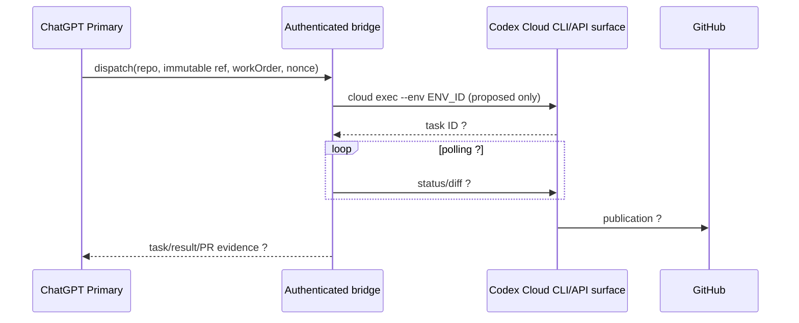
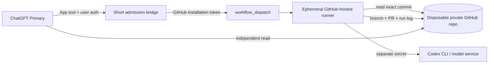
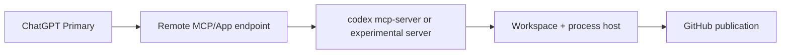
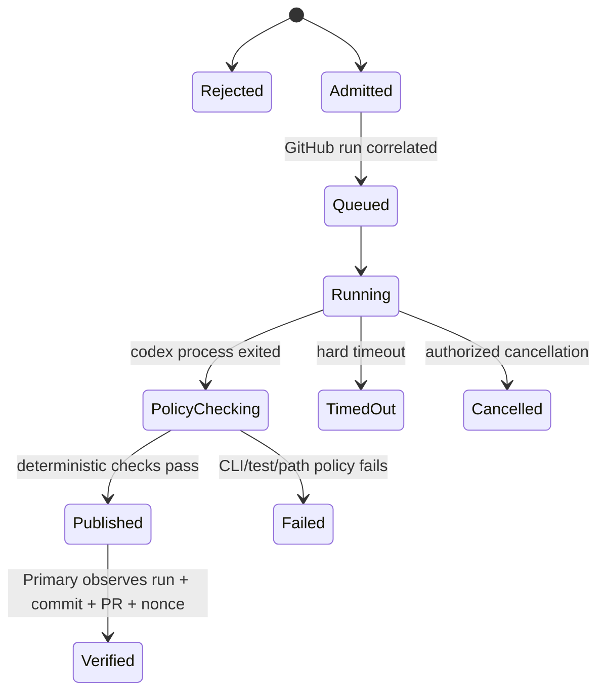

# P-CODEX-PHONE Phase 2｜Codex Dispatch Experiment Design

- Date: 2026-09-15
- Scope: research / architecture / test design only
- Repository baseline observed: local `work` snapshot at `342cd75`
- Evidence cut-off: 2026-09-15
- Safety status: **no dispatch, login, credential access, repository creation, deployment, runner provisioning, or infrastructure mutation was performed**

## 1. Executive recommendation

**Phase 3 should test one path only: a narrowly authenticated ChatGPT App tool that admits a repository-local Work Order and starts an on-demand GitHub-hosted Actions job; that ephemeral job runs `codex exec`, tests the deterministic change, and publishes a branch/PR to a disposable private repository.**

This is **Track B**, not a native Codex Cloud task. It is the smallest candidate whose complete control plane can be made observable in GitHub and which does not assume a desktop, Docker host, local server, daemon, or always-on machine. The bridge should perform admission only; it must not run Codex. GitHub Actions supplies an ephemeral execution host. For the first experiment, GitHub is also the job ledger and evidence surface, so Supabase is unnecessary. Netlify may host the short-lived ChatGPT App/MCP HTTP bridge if its current runtime and outbound-call limits are confirmed, but it is not suitable as the coding runner.

The preference is evidence-driven rather than a claim that all necessary capability already exists:

| Judgment | Result |
| --- | --- |
| **Technical Best, ignoring Claire's installed environment** | **Track A: supported native Codex Cloud task API**, *if* OpenAI confirms supported service authentication, stable task/environment lifecycle, structured status/results, and publication behavior. That would remove the custom runner and much of its credential/process authority. Those conditions are currently **Unknown**, and the observed CLI surface is `[EXPERIMENTAL]`. |
| **Environment Fit** | **Track B: ChatGPT App → thin admission bridge → GitHub Actions → `codex exec` → GitHub PR.** It uses iPad-reachable managed services and GitHub-visible evidence; the compute is on-demand rather than under Claire's desk. |
| Track C | `codex mcp-server` does not remove the execution-host, lifecycle, authentication, or publication problems. Do not use it in Phase 3. |

### Direct answer to the Work Order's final question

> Given the actual iPad-first environment and currently available GitHub / Netlify / Supabase / ChatGPT capabilities, what is the smallest, safest Phase 3 experiment that can produce hard evidence that ChatGPT Primary can dispatch work to Codex without Claire acting as the message relay?

Have Claire perform a **one-time authorization/setup gate**, then let ChatGPT Primary call one allow-listed `dispatch_codex_work_order` tool. The tool validates an immutable repository/ref and Work Order path, creates a nonce, and invokes one manually approved GitHub Actions workflow in a disposable private repository. An ephemeral GitHub-hosted runner checks out that exact SHA, runs `codex exec` with separate Codex and GitHub credentials, runs one deterministic check, pushes a unique branch, and opens a PR containing the nonce and workflow-run URL. Primary then reads the workflow run and PR directly from GitHub. Claire does not copy the Work Order, start the job, relay completion, or click Create PR.

This proposal is **Plausible, not Confirmed** until Phase 3 proves ChatGPT can call the bridge, the selected Codex authentication works non-interactively on a fresh runner, the bridge can dispatch the workflow, and the runner can publish with the intended least privilege.

## 2. Evidence base, assumptions, and gaps

### 2.1 Evidence classification

This report uses the Work Order definitions:

- **Confirmed** — repository evidence or directly observed/reproducible CLI/product evidence.
- **Plausible** — a conventional architecture inference with at least one untested boundary.
- **Unsupported** — current evidence does not justify the claim or the surface does not fit the boundary.
- **Unknown** — evidence is missing.

Product concepts remain separate throughout:

| Concept | Meaning in this report |
| --- | --- |
| Codex native Cloud task | A task owned by the Codex product/cloud environment. |
| Responses API/model request | An API inference request; not automatically a native Codex task. |
| Codex CLI session | A process launched by `codex exec` in a workspace. |
| SDK wrapper | Code that starts or observes an API/CLI operation; not a new execution plane. |
| MCP/server process | A hosted protocol/tool endpoint that still needs transport, auth, and lifecycle. |
| ChatGPT App/Plugin call | Primary's external tool invocation; it is admission, not Codex execution by itself. |

### 2.2 Confirmed baseline

1. **Confirmed (repository observation):** GitHub is the current durable Work Order, code, PR, and review boundary. Existing product flow has demonstrated Codex workspace execution, local commits, and a human-triggered Create PR, while also showing that workspace GitHub CLI authority and product publication authority differ.
2. **Confirmed (Phase 1 summary in the governing Work Order):** `codex-cli 0.144.0-alpha.4` exposed `codex cloud exec --env <ENV_ID> [QUERY]`, cloud task commands, `codex exec`, and `codex mcp-server`; cloud/server surfaces were experimental or unverified end to end.
3. **Confirmed (repository evidence):** a GitHub-hosted Actions runner has already served as an iPad-first remote execution surface in this repository. This does not confirm Codex CLI authentication or execution inside Actions.
4. **Confirmed (repository evidence):** Claire's real local environment is iPad + Working Copy + Textastic; no desktop, Docker host, local daemon, or always-on machine may be assumed.
5. **Confirmed (this workspace):** the Phase 1 report requested from PR #29 is absent from this snapshot. The local `codex` executable is also absent, so this phase could not reproduce its `--help` output. Network access to GitHub/official documentation was blocked with HTTP 403/401. The Phase 1 findings above are therefore used only at the strength stated in the Work Order, not silently promoted.

### 2.3 Important assumptions to test, not adopt

| Assumption | Status | Phase 3 implication |
| --- | --- | --- |
| ChatGPT Primary can invoke a newly authorized App tool without Claire relaying each call. | Unknown | Must be proved by an App call carrying a caller-generated nonce. |
| A Netlify Function can host the short admission call with suitable App authentication. | Plausible | Confirm supported ChatGPT App transport/auth and runtime limits before choosing it. |
| GitHub API `workflow_dispatch` can be invoked with a narrow installation token/PAT. | Plausible | Prove on only the disposable repository; do not use Claire's broad personal token. |
| `codex exec` accepts an approved non-interactive Codex credential in a clean ephemeral runner. | Unknown in this environment | This is a go/no-go preflight; never scrape an interactive session store. |
| The CLI can emit JSONL/final output and a meaningful exit code. | Confirmed only by Phase 1 summary | Pin and capture the exact CLI version and help in Phase 3 evidence. |
| `codex exec` will itself commit/push/open a PR. | Unsupported as a required behavior | The harness, not the model, must deterministically validate and publish. |
| ChatGPT's existing GitHub connection exposes Actions dispatch. | Unknown and should not be assumed | The proposed App tool supplies this missing verb. |
| Supabase or Netlify can host the Codex process. | Unsupported for this design | Edge/serverless request runtimes are admission/control surfaces, not general coding sandboxes. |

## 3. Candidate topologies

### Track A — native Codex Cloud dispatch



Question marks are intentional evidence gaps. A bridge that shells out to an experimental CLI still needs a managed execution host and long-running job supervision; it is not magically serverless.

### Track B — managed ephemeral `codex exec` runner



There is no persistent compute. Netlify can be considered for `B`; GitHub Actions supplies `R`; Supabase is omitted unless later concurrency/audit requirements outgrow GitHub's records.

### Track C — MCP/server insertion



Track C adds protocol and hosting boundaries but does not eliminate `W`. Unless the server has a supported remote transport, service authentication, job persistence, cancellation, isolation, and publication contract, it is more machinery than Track B.

## 4. Track A design — native Codex Cloud dispatch

### 4.1 Experiment question

Can an **external trusted bridge**, using a supported non-human/service authentication mode, create a native Codex Cloud task bound to an explicitly identified repository/environment, receive a stable task ID, observe terminal status and diff/result, and locate a GitHub-published result?

The smallest experiment must not begin until OpenAI documentation/support confirms the invocation is permitted. An experimental command existing in help is insufficient evidence of a stable integration contract.

### 4.2 Known/unknown contract

| Boundary | Classification | Required evidence |
| --- | --- | --- |
| Command `codex cloud exec --env <ENV_ID> [QUERY]` exists in observed version | Confirmed by Phase 1 runtime evidence | Re-capture pinned version and `--help` during authorized Phase 3 preflight. |
| Authentication/entitlement | Unknown | Supported service/non-interactive auth instructions; account/workspace entitlement; revocation path. Interactive ChatGPT login copied from a machine is not acceptable. |
| Environment ID acquisition | Unknown | Supported list/create/select flow, stable identifier semantics, ownership and deletion lifecycle. |
| Repository/environment binding | Unknown | Proof of repository identity, installation authorization, baseline ref/SHA, and whether environments are reusable or task-scoped. |
| Task creation response/task ID extraction | Unknown | Machine-readable output or documented stable parsing contract; stdout prose is not sufficient. |
| Status/polling | Unknown | Enumerated states, retry guidance, terminal failures, rate limits, cancellation, and a task-ID query. |
| Diff/result retrieval | Unknown | Stable structured command/API, final response location, logs, patch/diff identity and retention. |
| Completion signal | Unknown | Polling/webhook/event contract; a sleeping HTTP request is not acceptable. |
| GitHub publication | Unknown | Whether Codex commits, pushes, or opens/updates a PR without a human UI action; exact GitHub principal and permissions. |
| Stability/support | Unsupported as production boundary today | `[EXPERIMENTAL]` means the PoC may explore it, but no production dependency should be approved without a supported contract. |

### 4.3 Minimum authorized probe design (not executed)

1. Use a disposable private repository at immutable SHA `<SOURCE_SHA>` and a pre-created isolated Codex environment `<CODEX_ENV_ID>`.
2. Run the CLI on an ephemeral managed host under `<CODEX_AUTH_BOUNDARY>`, never inside a Netlify/Supabase request handler.
3. Submit a prompt containing only repository, SHA, Work Order path, and nonce; capture stdout, stderr, exit code, duration, CLI version, and any task ID.
4. Terminate the caller process after task creation. From a fresh process, attempt documented status/result retrieval by task ID. This distinguishes durable Cloud task state from a merely attached CLI process.
5. Observe GitHub independently for a branch/commit/PR whose metadata includes the nonce and source SHA.
6. Test one invalid environment, one unauthorized repository, cancellation, and timeout. Do not guess undocumented endpoints if any step lacks a supported command.

### 4.4 Illustrative command and state machine

The following is a **non-executed sketch**; flags/output formats beyond the observed command must be verified:

```sh
# Proposed only. Do not run until auth and output contracts are documented.
export CODEX_AUTH_BOUNDARY='<CREDENTIAL_SOURCE_UNKNOWN>'

codex cloud exec \
  --env '<CODEX_ENV_ID>' \
  'Repository: <DISPOSABLE_PRIVATE_REPO>
   Source SHA: <SOURCE_SHA>
   Work Order: agent-work/work-orders/synthetic-dispatch.md
   Dispatch nonce: <NONCE>
   Do not touch any other repository.' \
  >cloud-create.stdout 2>cloud-create.stderr

# Exact structured task-ID/status/diff commands are <UNKNOWN>; never parse an
# undocumented URL or scrape a private product session to fill this gap.
```

```text
ADMITTED → SUBMITTING → ACCEPTED(task_id) → QUEUED/RUNNING
    ├─→ SUCCEEDED(result_ref, diff_ref, publication_ref?)
    ├─→ FAILED(error_class)
    ├─→ CANCELLED
    └─→ TIMED_OUT
```

No state may be inferred solely from bridge HTTP success. `ACCEPTED` requires a durable task ID; `SUCCEEDED` requires a terminal provider state plus independently visible evidence.

### 4.5 Judgment

- **Technical Best:** yes, conditionally. A stable first-party task API with service auth, webhook/status, managed workspace, and GitHub publication would minimize custom process/sandbox code.
- **Environment Fit:** poor/unknown today. A CLI-only experimental caller still needs new managed compute and secrets, and the required remote task/publication contracts are unverified. Do not select it for the first live PoC unless documentation resolves every go/no-go item first.

## 5. Track B design — managed `codex exec` runner

### 5.1 Responsibility split

| Component | Responsibility | Must not do |
| --- | --- | --- |
| ChatGPT App tool | Present a narrow dispatch verb and authenticated caller identity. | Carry raw credentials or arbitrary shell commands. |
| Admission bridge | Validate repository/ref/path/nonce; enforce allow-list/idempotency/rate limit; dispatch workflow; return receipt. | Clone repos, run Codex, wait synchronously for completion, or mint broad credentials. |
| GitHub Actions | Queue an on-demand isolated job; expose run identity/logs; provide scoped secrets. | Accept arbitrary repository/command input. |
| Runner harness | Checkout exact SHA, validate Work Order, invoke pinned `codex exec`, enforce timeout, test output, publish. | Give Codex unrestricted host/root/cloud authority. |
| Codex CLI | Perform the constrained coding task in the checkout. | Decide credential scope or self-attest success. |
| GitHub | Durable input, run state, commit, PR, and review evidence. | Treat a model final message as proof. |

### 5.2 Execution host and lifecycle

An on-demand GitHub-hosted runner is sufficient; **an always-on host is not required**. Each admitted job should:

1. start from a clean hosted VM;
2. check out the allow-listed repository at exact `<SOURCE_SHA>` into a fresh directory;
3. verify the Work Order is a regular tracked Markdown file under `agent-work/work-orders/`, with no path traversal or symlink escape;
4. create unique branch `codex-dispatch/<NONCE>`;
5. install a pinned, checksum/lockfile-controlled CLI version;
6. run `codex exec` as an unprivileged process with a hard timeout and the smallest sandbox/approval mode supported for workspace writes and tests;
7. save structured CLI output and a redacted runner summary;
8. independently enforce changed-path and deterministic-test policy;
9. commit/push/open the PR in harness code only after policy passes; and
10. upload safe artifacts, revoke ephemeral tokens automatically, and let GitHub destroy the VM.

The model must not receive Docker socket access, cloud metadata credentials, repository-owner tokens, unrelated repository checkout, or `--dangerously-bypass-approvals-and-sandbox`.

### 5.3 Admission schema

```json
{
  "$id": "DispatchCodexWorkOrderRequest",
  "type": "object",
  "additionalProperties": false,
  "required": ["repository", "sourceSha", "workOrderPath", "nonce"],
  "properties": {
    "repository": { "const": "<DISPOSABLE_OWNER>/<DISPOSABLE_REPO>" },
    "sourceSha": { "type": "string", "pattern": "^[0-9a-f]{40}$" },
    "workOrderPath": {
      "const": "agent-work/work-orders/synthetic-dispatch.md"
    },
    "nonce": { "type": "string", "pattern": "^p3-[a-z0-9-]{8,40}$" },
    "dryRun": { "const": false }
  }
}
```

```json
{
  "dispatchId": "<SERVER_GENERATED_ID>",
  "nonce": "<NONCE>",
  "admission": "accepted",
  "repository": "<OWNER>/<REPO>",
  "sourceSha": "<40_HEX_SHA>",
  "githubRunUrl": "<GITHUB_RUN_URL>",
  "completion": "poll_gitHub_run_and_pr",
  "codexExecuted": false
}
```

The final field prevents an HTTP 202 from being mistaken for successful Codex execution.

### 5.4 Illustrative bridge pseudo-code

```ts
// Illustrative only; not deployable code.
async function dispatchCodexWorkOrder(request: Request) {
  const caller = await authenticateChatGPTApp(request, '<CHATGPT_TO_BRIDGE_AUTH>');
  requireAuthorizedCaller(caller, '<AUTHORIZED_CLAIRE_OR_PROJECT_ID>');

  const input = validateClosedSchema(await request.json());
  requireExactAllowList(input.repository, input.workOrderPath);
  await verifyCommitAndTrackedWorkOrder(input.repository, input.sourceSha, input.workOrderPath);
  await rejectReplayOrConcurrentNonce(input.nonce);

  const installationToken = await mintRepositoryScopedGitHubToken({
    installation: '<GITHUB_APP_INSTALLATION_ID>',
    repository: input.repository,
    permissions: ['actions:write', 'contents:read']
  });

  const run = await github.workflowDispatch({
    token: installationToken,
    repository: input.repository,
    workflow: 'synthetic-codex-dispatch.yml',
    ref: '<PROTECTED_DEFAULT_BRANCH>',
    inputs: {
      source_sha: input.sourceSha,
      work_order_path: input.workOrderPath,
      dispatch_nonce: input.nonce
    }
  });

  return acceptedReceipt(run); // Never wait for Codex in this HTTP request.
}
```

If GitHub does not return a run ID directly from the chosen dispatch endpoint, the bridge must correlate a server-generated nonce to a subsequently discovered workflow run via a documented GitHub mechanism; it must not fabricate a run URL.

### 5.5 Illustrative workflow/runner sequence

```yaml
# Illustrative only; deliberately incomplete and MUST NOT be deployed in Phase 2.
name: Synthetic Codex dispatch
on:
  workflow_dispatch:
    inputs:
      source_sha: { required: true, type: string }
      work_order_path: { required: true, type: string }
      dispatch_nonce: { required: true, type: string }
permissions:
  contents: write
  pull-requests: write
concurrency:
  group: codex-synthetic-dispatch
  cancel-in-progress: false
jobs:
  run:
    runs-on: ubuntu-latest
    timeout-minutes: 15
    steps:
      # Pin actions to reviewed commit SHAs in the real PoC.
      - uses: actions/checkout@<PINNED_SHA>
        with: { ref: "${{ inputs.source_sha }}", persist-credentials: false }
      - run: ./harness/validate-closed-inputs.sh
      - run: ./harness/install-pinned-codex.sh
      - name: Run constrained Codex CLI
        env:
          CODEX_AUTH_BOUNDARY: "${{ secrets.CODEX_POC_AUTH }}"
        run: |
          timeout 8m codex exec --json \
            "Read ${{ inputs.work_order_path }} at source SHA ${{ inputs.source_sha }}. \
             Dispatch nonce: ${{ inputs.dispatch_nonce }}. Obey its exact synthetic scope." \
            > codex.jsonl
      - run: ./harness/verify-only-expected-change-and-test.sh
      - run: ./harness/publish-with-short-lived-token.sh
```

Exact CLI flags, package name, auth variable, sandbox behavior, and JSONL event schema are `<VERIFY_AGAINST_PINNED_CLI>`. The real workflow must pass the prompt through a file or safely quoted argument and reject newline/control-character injection.

### 5.6 Status, timeout, cancellation, and structured results



- Bridge receipt is evidence of **admission only**.
- GitHub run start is evidence that **managed execution began**.
- JSONL process-start/turn events plus exit code show that the pinned CLI ran, subject to log redaction.
- Test output and changed-path check show what the workspace produced.
- Git commit and PR created by the harness show publication.
- A matching nonce and source SHA across request receipt, run, commit/PR, and artifact provide correlation.
- Cancellation must use a separate authorized tool/action or GitHub UI/API; process timeout must result in no push.

### 5.7 Credentials and process authority

Codex authentication and GitHub publication must be different credentials. Prefer GitHub OIDC or a GitHub App installation token minted just in time; if the platform requires a stored fine-grained token for the PoC, scope it to the disposable repository, expire it quickly, and do not expose it to fork-triggered runs. The Codex credential should authorize only the approved experimental billing/project boundary. ChatGPT-to-bridge authentication should identify the authorized user/project and protect against replay; it is not either downstream credential.

Runner steps receiving GitHub publication authority should run **after** Codex and should not export that token into the Codex process environment. Treat all model/Work Order output as untrusted input. Disable fork/PR automatic execution and third-party Actions not pinned to a commit.

### 5.8 Failure and cleanup risks

| Risk/failure | Control/evidence |
| --- | --- |
| Duplicate App retries create duplicate jobs | nonce uniqueness and one active concurrency group; duplicate returns original receipt. |
| Wrong/stale baseline | exact 40-hex SHA and verification before dispatch and checkout. |
| Work Order prompt injection asks for wider action | fixed synthetic Work Order, expected-path allow-list, no publication until harness policy passes. |
| CLI hangs or loses network | job/process timeout; no push; terminal failure summary. |
| Secret printed by process | do not pass publication token to Codex; GitHub masking plus explicit redaction scan; immediately revoke on suspected leak. |
| Compromised dependency/action | pinned hashes/versions, checksum/lockfile, minimal steps. |
| Branch collision or stale retry | nonce branch; server-side replay record; delete on cleanup. |
| Runner writes unexpected files | `git diff --name-only` allow-list and deterministic content/test assertions. |
| PR exists without Codex actually running | require correlated JSONL event/exit evidence and run step identity, not PR alone. |
| Codex ran but no publication | preserve safe CLI/test artifact and terminal run failure; this is a useful partial result, not success. |

### 5.9 Judgment

- **Technical Best:** second to a stable native Cloud task API because this team owns the runner, policies, dependencies, and publication logic.
- **Environment Fit:** best current candidate. All per-dispatch compute is managed/on-demand, GitHub is already the durable boundary, and Claire's iPad only performs one-time authorization and later functional acceptance.

## 6. Track C assessment — MCP and experimental servers

`codex mcp-server` is **not a material simplification for this experiment**.

| Question | Current assessment |
| --- | --- |
| What transport does it expose, and is that transport remotely reachable from ChatGPT? | Unknown. A local stdio-oriented MCP process would require another remotely hosted gateway and does not become a ChatGPT App by existing. |
| Where does it run? | It still requires a persistent or per-job process host with Codex auth and workspace access. |
| How is ChatGPT-to-server auth performed? | Unknown; MCP tool schema is not an authentication system. |
| Does it provide durable jobs after caller disconnect? | Unknown. |
| Does it isolate concurrent workspaces, enforce timeouts, or clean them up? | Unsupported by available evidence. |
| Does it commit/push/open PRs with a separate GitHub principal? | Unsupported by available evidence. |
| Do app-server/exec-server/remote-control experimental surfaces define a stable public production boundary? | Unsupported; Phase 1 explicitly did not establish this. |

An MCP server could later be the *presentation protocol* for the narrow Track B admission API. It should expose domain tools such as `dispatch_codex_work_order`, `get_dispatch_status`, and `cancel_dispatch`, not remotely expose a raw shell or a generic Codex process. That still leaves the bridge and runner unchanged. Therefore Track C is not a Phase 3 candidate.

## 7. Infrastructure and environment-fit matrix

| Candidate/component | New infrastructure requirement | Persistent? | iPad/managed fit | Burden and likely failures | Can Netlify/Supabase own it? | Managed alternative |
| --- | --- | --- | --- | --- | --- | --- |
| Track A bridge + CLI caller | **Yes**, unless a supported direct ChatGPT/Codex tool appears | At least an available job worker; not necessarily 24/7 | Medium/unknown | experimental CLI changes, auth expiry, lost task correlation | Netlify/Supabase may admit; neither should supervise a long CLI job | Managed job/container platform; native API would eliminate caller host |
| Track B admission bridge | **Yes: one small authenticated App endpoint** | Logically available, physically serverless/on-demand | High | auth/config drift, dispatch retry/correlation | Netlify Function is plausible; Supabase Edge Function also plausible. Choose one, not both. | A managed ChatGPT App/MCP host or GitHub App service |
| Track B execution | **Yes: one locked workflow and harness in the disposable private repo** | No; GitHub-hosted runners are per job | High | queue delay, minutes/cost, dependency/network/CLI failure | No. Netlify/Supabase request runtimes should not run the coding process. | Another ephemeral managed job/container service |
| Optional job database | No for first PoC | N/A | Avoid needless complexity | reconciliation and data-retention burden | Supabase can own this later if multiple jobs/webhooks need durable state | GitHub run/PR plus bridge nonce store for first PoC |
| Persistent Linux VM | No for recommended PoC | 24/7 if chosen | Poor | patching, monitoring, disk/workspace cleanup, daemon and credential custody | No | GitHub-hosted runner/on-demand container |
| Track C gateway/server | **Yes**, plus runner/host remains | Usually persistent or managed on-demand | Low today | transport/auth/lifecycle/version gaps | Could host gateway only, not eliminate compute | Do not add in Phase 3 |

### Existing-service reality

- **GitHub:** the only current service suited to repository checkout, queued execution through Actions, immutable run logs, commit, and PR evidence. Actions workflow and secrets for Codex are still **new Phase 3 infrastructure/configuration**, even though GitHub itself already exists.
- **Netlify:** plausible owner of a quick admission endpoint/App transport. It should return after dispatch, not wait for an agent. Current plan-specific runtime limits and authentication integration must be checked before authorization.
- **Supabase:** could later hold job/idempotency records or expose an Edge admission endpoint. It adds a database and RLS/service-role boundary the one-job PoC does not need. It cannot be treated as a general subprocess runner.
- **ChatGPT:** has connected product capabilities, but no direct Codex dispatch tool was observed. A newly installed/authorized App tool is required; a prompt cannot manufacture tool access.
- **DigitalOcean Plugin clue:** not an installed or verified capability. A droplet would add persistent host administration and broad credential custody. It is not the smallest PoC and should not be selected merely because a directory listing describes it.

## 8. Credential and trust-boundary matrix

| Boundary | Proposed credential/principal | Minimum authority | Storage/lifetime | Explicitly forbidden |
| --- | --- | --- | --- | --- |
| ChatGPT → bridge | `<CHATGPT_TO_BRIDGE_AUTH>` using supported App OAuth/user identity or equivalent | invoke only dispatch/status for the one allow-listed experiment | provider secret store/session; revocable | shared URL secret in prompt/repo; treating arbitrary Internet caller as Claire |
| Bridge → GitHub admission | GitHub App installation token preferred | disposable repo metadata/read plus Actions workflow dispatch; no org-wide access | private key in bridge secret store; installation token minted short-lived | Claire's broad classic PAT; credential committed to public repo |
| Runner → Codex | `<CODEX_AUTH_BOUNDARY>` approved non-interactive credential | only approved experimental project/account and capped spend | GitHub Actions secret/environment, exposed only to Codex step; revoke after PoC | copying browser/session auth, universal key, logging token |
| Runner checkout | default `GITHUB_TOKEN` or installation token | contents read at exact SHA | ephemeral Actions token | `persist-credentials: true` into workspace when not needed |
| Harness → GitHub publication | separate short-lived GitHub token/principal | contents write + pull requests write on disposable repo only | injected only after Codex exits; short-lived | passing publication token to Codex/model process |
| Primary → GitHub verification | existing GitHub connection/read access | read run, artifacts, commit, diff, PR | existing managed connector | trusting bridge/model summary instead of repository evidence |

Cost/spend limits, repository allow-list, single-concurrency policy, revocation owner, and audit retention are part of authorization—not implementation trivia.

## 9. Recommended first live PoC

### 9.1 Exactly one candidate

**Candidate P3-B1: ChatGPT App → admission bridge → GitHub Actions ephemeral `codex exec` runner → PR.**

Do not run Track A in parallel. Doing both would make success attribution ambiguous and double the credential/infrastructure surface.

### 9.2 Is a private repository required?

It is not technically required to hide a harmless text change, because GitHub encrypted secrets need not be committed. It is nevertheless **required by this proposed first PoC policy** because runner logs, prompts, failure artifacts, branch protection experiments, and accidental output are more likely to expose operational detail than the deterministic payload itself. A new disposable private repo gives a narrow GitHub App installation boundary and unambiguous cleanup. It must be created only after Claire authorizes Phase 3.

The repository should contain no Nook code/data and no copied credential/configuration. Its only content should be:

```text
README.md
dispatch-target.txt                # initially: dispatch-pending
agent-work/work-orders/synthetic-dispatch.md
.github/workflows/synthetic-codex-dispatch.yml
harness/                            # closed validation/publication scripts
```

### 9.3 Synthetic Work Order

```markdown
# Synthetic dispatch P3-B1

Change exactly `dispatch-target.txt` from:
`dispatch-pending`
to:
`dispatch-complete:<DISPATCH_NONCE>`

Run:
`test "$(cat dispatch-target.txt)" = "dispatch-complete:<DISPATCH_NONCE>"`

Do not change any other file. Do not access external services, create infrastructure,
or publish. The trusted harness owns commit/push/PR publication.
```

The harness should reject any diff outside `dispatch-target.txt`, assert the exact one-line content, run the exact shell test, and create commit subject `test: complete synthetic dispatch <NONCE>`.

### 9.4 Minimum infrastructure

1. One disposable private GitHub repository.
2. One pinned GitHub Actions workflow plus a small closed runner harness.
3. One authenticated ChatGPT App/MCP tool endpoint hosted on an approved managed function service (prefer existing Netlify only if its supported App/auth/runtime fit is confirmed).
4. One repository-scoped GitHub App installation; a short-expiry fine-grained PAT is a less desirable PoC fallback.
5. One approved, capped Codex non-interactive credential stored in the private repository's Actions secret/environment.
6. A minimal nonce/idempotency store. Prefer provider-native atomic storage or GitHub dispatch correlation; do not add Supabase solely for a single happy-path record.

No persistent VM, local machine, Docker daemon, queue service, database, or always-on runner is required.

### 9.5 Exact Claire setup/authorization checklist

Claire remains the authorization gate but not per-task operational middleware:

- [ ] Approve the P3-B1 scope, maximum one concurrent run, maximum duration (15 minutes), and spend ceiling.
- [ ] Approve creation of one disposable private repository and its deletion/retention date.
- [ ] Review the synthetic Work Order and expected one-file diff.
- [ ] Authorize installation of a repository-scoped GitHub App with only the listed dispatch/read/publication permissions; if a PAT fallback is proposed, approve its exact repo, scopes, owner, and expiry.
- [ ] Authorize creation of a dedicated Codex/API experimental project or equivalent billing/auth boundary, with the smallest supported non-interactive scope and spend cap. **Do not send its value in chat.**
- [ ] Place/approve placement of `CODEX_POC_AUTH` in the private repository/environment secret store and bridge credentials in the bridge provider secret store. An authorized UI may require Claire's login/MFA; no agent should inspect the value.
- [ ] Approve deployment/installation of the single ChatGPT App tool and its user/project authentication binding.
- [ ] In ChatGPT, complete the one-time App authorization/consent screen and confirm the displayed tool scope/target repository.
- [ ] Approve the workflow/harness source and pinning before enabling the tool.
- [ ] After Primary reports independently verified evidence, decide functional acceptance and authorize credential revocation/repo cleanup.

Claire should **not** paste a dispatch prompt into Codex, click Run workflow, create/update a Codex task, click Create PR, copy status messages, or operate a shell during the measured happy path. If any occurs, the experiment has not answered the research question.

## 10. Success/failure evidence contract

### 10.1 Correlation envelope

The same server-generated or Primary-requested nonce, repository, source SHA, and Work Order path must appear in:

1. ChatGPT tool call/receipt (with no secrets);
2. bridge audit/admission record;
3. GitHub workflow inputs/run summary;
4. safe Codex JSONL artifact or normalized event summary;
5. commit subject/trailer; and
6. PR body and source-SHA statement.

### 10.2 Success criteria — all required

1. Claire performs no per-dispatch relay or GitHub/Codex publication click after one-time authorization.
2. Primary invokes the App tool with the exact repository, SHA, Work Order, and nonce.
3. The bridge rejects all fields outside the closed schema and returns a correlated admission receipt.
4. A GitHub workflow starts from that invocation, on the expected repository/ref, under the expected principal.
5. Evidence shows the pinned `codex exec` process started and exited successfully on a fresh ephemeral runner; a generic script-only edit does not satisfy this.
6. The independent harness records the expected one-file diff and passing deterministic check.
7. The harness creates one commit and one PR from the nonce branch; PR base/head SHA, changed file, exact content, check result, and workflow URL are GitHub-visible.
8. Primary independently reads the GitHub run/commit/diff/PR and matches the full correlation envelope.
9. No secret appears in logs/artifacts/diff, and no unapproved repository/service is touched.
10. Cleanup/revocation can be completed according to plan.

This differentiates three claims:

```text
bridge accepted request
≠ runner started
≠ Codex executed and produced the GitHub-verifiable result
```

### 10.3 Required negative/failure cases

Run only after the happy path and within the same authorization:

| Case | Expected result |
| --- | --- |
| Unknown repository or Work Order path | bridge rejects before GitHub dispatch. |
| Non-40-hex/stale SHA | bridge rejects or runner fails closed before Codex. |
| Replay same nonce | no second workflow/PR; original receipt returned or explicit conflict. |
| Work Order attempts second-file change | harness blocks commit/push and run fails. |
| Invalid/revoked Codex credential | CLI step fails, no publication token exposed, no PR. |
| Timeout/cancel | child process terminates, no push, terminal state visible. |
| Invalid GitHub publication authority | Codex/test evidence may exist, publication fails distinctly; never report overall success. |
| Tool caller lacks App authorization | bridge rejects without revealing allow-list or credential state. |

### 10.4 Evidence retention

Retain safe, redacted metadata long enough for Primary QC: workflow run ID/URL, timestamps, actor/principal, source SHA, CLI version/digest, command shape without credential, exit code, normalized event types, diff, test output, commit SHA, PR URL, and cleanup record. Do not retain chain-of-thought, raw environment dumps, bearer headers, or secret-bearing CLI configuration.

## 11. Security, rollback, and cleanup plan

### Before enablement

- Threat-model the Work Order as untrusted repository content.
- Pin dependencies and Actions by immutable digest/SHA.
- Disable automatic execution from pushes/PRs/forks; admit only authenticated tool dispatch.
- Configure one job, one repo, one path, one branch prefix, one concurrency slot, and hard time/spend caps.
- Keep publication credentials out of the Codex process and workspace credential helpers.
- Confirm logs/artifacts do not include environment listings or auth configuration.

### Immediate rollback triggers

Unexpected changed paths, an unrecognized principal, duplicate jobs, secret-like output, unbounded process behavior, access to another repository, or inability to cancel requires: cancel run, disable App tool/workflow, revoke bridge/GitHub/Codex credentials, preserve only redacted evidence, and do not retry until root cause review.

### Normal cleanup

1. Close without merge (or merge only if the experiment explicitly wants that evidence) and delete nonce branch.
2. Disable/remove App installation from ChatGPT.
3. Disable the workflow and uninstall the GitHub App from the disposable repository.
4. Revoke/delete the Codex PoC credential/project access and bridge secrets.
5. Delete redacted artifacts according to retention decision.
6. Delete the disposable private repository after evidence is captured, or archive it for a pre-approved limited period.
7. Record revocation timestamps and any provider resources that could not be deleted.

## 12. Technical Best versus Environment Fit

### Technical Best

A supported first-party Codex Cloud task API would be architecturally preferable because the provider could own workspace isolation, job durability, status/cancellation, and Codex authentication. It becomes the recommendation only if it supplies documented service auth, environment/repository binding, structured task/status/result contracts, and programmatic publication or a clean handoff to a separate GitHub publisher. The observed experimental CLI is not that proof.

### Environment Fit

Track B best respects Claire's real environment. GitHub Actions is ephemeral managed compute; GitHub holds both the Work Order and independently reviewable evidence; the App bridge is a short control-plane function; and Primary can initiate/verify through connected cloud capabilities. Netlify may host the bridge, while Supabase is deliberately omitted rather than forced into a job-queue role. Nothing requires Claire to maintain a machine or relay each message.

The trade-off is ownership: Phase 3 introduces a small but real execution system. Its workflow, harness, App endpoint, three credential boundaries, pinning, cost controls, and cleanup all require review. Calling it “just a workflow” would understate its authority.

## 13. Open questions / blockers before Phase 3

### Go/no-go blockers

1. **ChatGPT App reachability/auth:** What supported App/MCP transport is available to this ChatGPT context, and can it enforce Claire/project identity rather than a bearer URL?
2. **Codex CLI service authentication:** What is the officially supported non-interactive credential for a clean GitHub-hosted runner, what account/project/billing scope does it carry, and can it be capped/revoked independently?
3. **Exact CLI contract:** Which stable Codex CLI version/package/digest and sandbox flags will be pinned? What JSONL events and exit semantics are documented?
4. **GitHub dispatch correlation:** Does the chosen GitHub API return or permit reliable discovery of the created run ID using the nonce, without race-prone “latest run” logic?
5. **GitHub App permissions:** Can one installation/principal both dispatch and later publish with the required repo-only granularity, or should admission and publication be separate installations/tokens?
6. **Secret isolation:** Can the workflow ensure the Codex child process cannot read the later publication credential, including inherited environment and Git credential helpers?
7. **Private repository creation/owner:** Which account/organization owns the disposable repo, who may view Actions logs, and who is responsible for deletion?

### Non-blocking design questions

- Can Primary's existing GitHub connection read Actions run details/artifacts, or will the App need a read-only `get_dispatch_status` tool?
- Does Netlify support the chosen ChatGPT App auth/streaming requirements on Claire's plan? If not, which managed App host replaces it?
- Is provider-native idempotency adequate, or is a tiny durable nonce record required? Supabase should be added only if this is demonstrated.
- Should publication use a GitHub App installation token minted via OIDC, a separate App, or the workflow `GITHUB_TOKEN`? Test the narrowest supported option.
- What retention duration is sufficient for Primary review without keeping prompts/logs indefinitely?

### Track A questions to preserve for later

- Is `codex cloud exec` now supported beyond `[EXPERIMENTAL]` for external automation?
- How are environment IDs created, bound, rotated, and deleted?
- Are create/status/diff/result/cancel machine-readable and stable?
- Can a native task publish or update a GitHub PR without a human Codex UI action, and under which principal?
- Is there a webhook/event rather than polling?

Until these are answered with current official documentation or an authorized probe, Track A remains a technically attractive hypothesis, not an implementation plan.

## 14. Phase 3 decision record

| Item requested by Completion Contract | Answer |
| --- | --- |
| Recommended Phase 3 candidate | **P3-B1: authenticated ChatGPT App admission → GitHub Actions ephemeral runner → pinned `codex exec` → harness-created GitHub PR.** |
| New infrastructure required | Disposable private repo; one locked workflow/harness; one authenticated App bridge endpoint; repo-scoped GitHub App/credentials; dedicated capped Codex auth boundary. No persistent host, Docker server, Supabase database, or queue. |
| Claire authorization/setup | One-time approval of repo, tool/App, permissions, budgets, credentials through provider secret UIs, and cleanup; no per-task relay/clicks in the measured path. |
| Primary evidence | Tool receipt + GitHub run + safe CLI event/exit evidence + exact test/diff + harness commit/PR, all correlated by nonce and source SHA. |
| Unresolved blockers | Supported ChatGPT App auth/reachability; clean-runner Codex auth; pinned CLI/JSONL/sandbox contract; reliable workflow-run correlation; narrow GitHub publication authority; secret isolation. |

## 15. Reference points for Phase 3 verification

These are starting points, not evidence that this workspace successfully reached them on 2026-09-15. Phase 3 must re-open current official documentation and record versions/dates before implementation:

- OpenAI Codex CLI/non-interactive documentation: `https://developers.openai.com/codex/cli/`
- OpenAI Codex authentication documentation: `https://developers.openai.com/codex/auth/`
- OpenAI Apps SDK/MCP documentation: `https://developers.openai.com/apps-sdk/`
- GitHub Actions manual workflow documentation: `https://docs.github.com/actions/managing-workflow-runs/manually-running-a-workflow`
- GitHub workflow token permissions: `https://docs.github.com/actions/security-for-github-actions/security-guides/automatic-token-authentication`
- GitHub App installation authentication: `https://docs.github.com/apps/creating-github-apps/authenticating-with-a-github-app/authenticating-as-a-github-app-installation`
- GitHub-hosted runner documentation: `https://docs.github.com/actions/using-github-hosted-runners/about-github-hosted-runners`
- Netlify Functions limits: `https://docs.netlify.com/build/functions/overview/#limitations`
- Supabase Edge Functions limits: `https://supabase.com/docs/guides/functions/limits`

## 16. Research integrity note

No illustrative command, schema, workflow, server, authentication flow, or dispatch in this report was executed or deployed. Placeholders deliberately preserve evidence gaps:

```text
<CREDENTIAL_SOURCE_UNKNOWN>
<CODEX_ENV_ID>
<CODEX_AUTH_BOUNDARY>
<GITHUB_AUTH_BOUNDARY>
<CHATGPT_TO_BRIDGE_AUTH>
<COMPLETION_SIGNAL_TBD>
```

The missing Phase 1 report and unavailable network/CLI are material limitations, recorded rather than repaired through credential access, new login, undocumented endpoint use, or invented claims.
