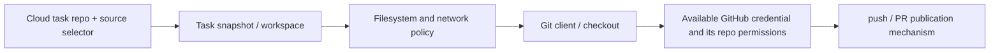
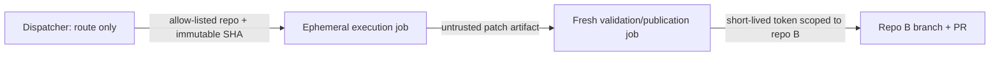

# P-CODEX-PHONE Phase 2.6｜Codex GitHub / Repository Boundary Reconnaissance

- Date: 2026-09-15
- Scope: research / reconnaissance only; no implementation
- Runtime observed: Codex CLI `0.144.0-alpha.4`, Cloud-task snapshot branch `work`
- Safety status: no credential was created, obtained, or expanded; no second private repository was cloned; no target repository was mutated

## 1. Executive verdict

The boundary is not one boundary. It is the composition of **task selection and publication**, **filesystem/sandbox**, and **GitHub authorization**:



**Overall verdict — Confirmed/Plausible mix:** the observed Codex Cloud product is operationally a **single selected-repository snapshot plus selected-source publication flow**, but the repository selector is not proven to be a kernel-like filesystem hard boundary. The current workspace has exactly one checkout, one synthetic local branch (`work`), no remote, and no GitHub CLI login. Thus this task cannot autonomously fetch, push, or open a PR in a second repository through ordinary Git/GitHub commands. Existing repository evidence also says Cloud publication occurs through the product's separate **Create PR** boundary, rather than proving a general-purpose GitHub credential inside the shell.

A public repository may be readable from a Cloud task only if that task's network/sandbox policy permits outbound Git traffic; authentication is normally unnecessary. That is **Plausible, not Confirmed here**: the safe documentation lookup and network probe failed, and no public clone was needed to answer the architecture question. A private repository additionally requires explicit authorization exposed to the runtime; no such authority was observed. The selected-repository connector/task authorization must not be treated as an ambient cross-repository token.

By contrast, `codex exec` is a process on a caller-controlled runner. Its `--cd` selects the working root, while `--add-dir` explicitly adds writable directories. If the runner checks out multiple repositories and permits them through filesystem/sandbox policy, one invocation can operate on them. GitHub read/write power then comes from the runner's Git credential/helper/token or a publication harness—not from `codex exec` merely knowing a repository name.

**Architecture recommendation:** use **per-repository phone/dispatch** for Phase 3 and the next production-shaped step. It aligns task, checkout, default repository token, evidence, and PR in one least-privilege boundary. Preserve a central dispatcher as a later routing/control-plane option, but have it mint short-lived, allow-listed, per-job GitHub App installation tokens (or dispatch into target-repository workflows) rather than hold a broad PAT.

## 2. Method and evidence limitations

### Read-first coverage

Read in the task snapshot:

- `agent-work/README.md`;
- all four required Phase 1/2/2.5 Work Orders;
- `agent-work/reports/2026-09-15-p-codex-phone-primary-qc-phase3-implementation-plan.md`;
- `agent-work/experience/codex-cloud-workspace.md`.

`playground.md` was absent. The snapshot contained no Phase 1, Phase 2, or Phase 2.5 report other than the named Primary QC report; the corresponding Work Orders were available. Their missing reports were not reconstructed from memory.

### Direct observations

| Observation | Status | Meaning |
| --- | --- | --- |
| `git branch -avv` showed only `work`; `git remote -v` was empty | **Confirmed** | This Cloud task received a snapshot-like checkout, not a conventional clone with `origin` and remote-tracking refs. |
| `/workspace` contained only `/workspace/ai-playground/.git` | **Confirmed** | No second repository was pre-checked out in this task. |
| `gh auth status` reported no GitHub login; no credential helper was configured; no GitHub token-named environment variable was observed | **Confirmed** | No ordinary shell-visible GitHub publication authority was found. This does not inspect or disprove a provider-internal Create PR capability. |
| Codex CLI was available at `/opt/codex/bin/codex`, version `0.144.0-alpha.4` | **Confirmed** | Runtime help could be inspected even though `codex` was not on `PATH`. |
| `codex exec --help` defines `-C/--cd` as the working root and `--add-dir` as additional writable directories | **Confirmed** | The CLI models filesystem roots, not a fixed GitHub repository identity. |
| Current task collaboration primitives share the same checkout/filesystem and do not accept a repository argument | **Confirmed for this runtime contract** | A native subtask is not a cross-repository task-creation API. This is not a universal promise about every Codex product surface. |

### Documentation reachability

The current OpenAI Codex manual helper failed with DNS `EAI_AGAIN`; direct requests to official OpenAI and GitHub documentation returned HTTP 403 through this environment, and the web search provider returned 401. Therefore no claim based only on remembered provider documentation is upgraded to Confirmed. The following current official references remain the correct pages to re-check when reachable:

- OpenAI: `https://developers.openai.com/codex/cloud/environments/`
- OpenAI: `https://developers.openai.com/codex/cli/reference/`
- OpenAI: `https://developers.openai.com/codex/github-action/`
- GitHub: `https://docs.github.com/en/actions/security-for-github-actions/security-guides/automatic-token-authentication`
- GitHub: `https://docs.github.com/en/apps/creating-github-apps/authenticating-with-a-github-app/making-authenticated-api-requests-with-a-github-app-in-a-github-actions-workflow`

Repository-local experience is useful dated evidence, not a substitute for current provider documentation. In particular, it records that Cloud workspaces may lack remotes, snapshots have time boundaries, local commits and GitHub-visible commits differ, and Create PR is a separate publication boundary.

## 3. Codex Cloud Task repository and branch boundary

### 3.1 Selector versus runtime hard boundary

| Claim | Status | Judgment |
| --- | --- | --- |
| Repo/source selection determines the initial task snapshot and normal Create PR target | **Confirmed** | Repository experience and this workspace directly show snapshot-oriented selection/publication. |
| The selector cryptographically or filesystem-enforces that no other repo can ever be read | **Unknown** | Neither runtime evidence nor reachable official docs establish this. |
| The product should be treated operationally as single-repo for Work Order design | **Confirmed** | Only the selected snapshot and product publication path are evidenced. Cross-repo shell capability must be separately authorized and tested. |
| It is strictly single-branch at the Git object/worktree level | **Unsupported** | Ordinary local checkout can switch to any commit/ref already present, subject to working-tree safety. This snapshot simply has no other local refs. |

Thus “single-repo/single-branch” needs precision:

- **Yes operationally:** one selected repo/source snapshot, one normal product PR destination, no evidenced cross-repo authority.
- **No as a proven Git hard limit:** local commits are possible; an existing commit can be checked out; additional refs/remotes depend on the actual snapshot, network, and credentials.
- **Unknown at provider internals:** how the snapshot and Create PR publication identity are implemented.

### 3.2 Public second repository

Reading a public Git repository normally needs network reachability, not GitHub authentication. In a Cloud task, however, outbound access is an independent environment policy. Consequently:

- `git clone https://github.com/OWNER/PUBLIC.git` is only an **illustrative command**;
- its success in a generic shell does not prove Cloud Task support;
- if network is enabled and the sandbox allows the destination, read-only clone is **Plausible**;
- it is **not Confirmed** in this task because network/documentation access failed and no clone proof was performed.

Simultaneously retaining two checkouts is likewise **Plausible** if filesystem and network policy allow it, but not a documented/observed Cloud guarantee here.

### 3.3 Private second repository

**Unsupported in the observed task.** A private clone requires a credential authorized to that repository (for example a narrowly scoped GitHub App installation token, fine-grained token, deploy key, SSH identity, or an explicitly supported provider connector mechanism). No such shell-visible credential exists here. Authorization to create a task from `ai-playground` is not evidence of runtime authorization to `codex-dispatch-sandbox` or any other private repository.

The prohibited private-repo probe was not attempted. Whether Codex Cloud can deliberately inject separately authorized second-repo access remains **Unknown** pending official documentation and an authorized disposable test.

### 3.4 Other branches and commits

Within a checkout, Git can create a branch or detach/check out an object already present. Codex has also created a local commit in the selected workspace. Those are **Confirmed generic/local capabilities**. In this snapshot, another remote branch cannot be fetched because there is no remote and network/credential capability is not established. Therefore:

- create/switch a local branch or commit: **Confirmed**, subject to Work Order and worktree safety;
- check out another already-present commit: **Plausible** and ordinary Git behavior, not live-probed here;
- fetch another branch from GitHub: **Unsupported in this workspace as configured**;
- make that branch the Cloud UI PR source/target: **Unknown**, because product publication mapping is separate from local branch names.

## 4. Native task / subtask workspace boundary

The current native collaboration API creates a subtask with task text and context-forking options. It exposes no repository, branch, worktree, remote, credential, or destination-PR parameter. The runtime contract explicitly makes agents share the same directory/filesystem, so a spawned subtask sees the parent's checkout and edits.

| Question | Status | Answer |
| --- | --- | --- |
| Does a subtask carry an independently selectable repo identity? | **Confirmed (no, for current primitives)** | No repo selector exists. |
| Does a subtask receive an isolated worktree/branch? | **Confirmed (no, for current runtime)** | It shares the filesystem; concurrent edits would require coordination. |
| Is there a native primitive here to launch a new Cloud task against repo B? | **Confirmed (no exposed primitive)** | None is exposed in this session. |
| Might another private/product API support it? | **Unknown** | Private task databases, transcripts, and install caches were deliberately not inspected. |

Subagents can run Git commands in the shared filesystem only under the same process/sandbox/credential boundary. Delegation does not mint GitHub authority.

## 5. `codex exec` filesystem and repository boundary

`codex exec` is materially different from a Cloud Task selector. Runtime help says:

```text
-C, --cd <DIR>       Tell the agent to use the specified directory as its working root
    --add-dir <DIR>  Additional directories that should be writable alongside the primary workspace
```

It also exposes `read-only`, `workspace-write`, and `danger-full-access` sandbox modes. Therefore `--cd` is a working root, not a GitHub authorization grant and not proof of an immutable single-repo binding.

### Multi-repository runner

If a CI runner has, for example, `/work/repo-a` and `/work/repo-b` already checked out, a safely configured invocation can be rooted in A and explicitly allow B:

```bash
# Illustrative only
codex exec -C /work/repo-a --add-dir /work/repo-b \
  --sandbox workspace-write "Read repo A and produce the allow-listed change in repo B"
```

This capability is **Confirmed at the CLI filesystem-contract level**. End-to-end behavior across two repos is **Plausible** until a disposable runner test verifies sandbox traversal, instruction discovery, symlinks, and output handling. Multiple sequential `codex exec -C ...` invocations are an even clearer isolation pattern than one invocation spanning both roots.

If runner network policy permits and a credential is available, the agent can invoke ordinary `git clone`, `fetch`, or `push`; that statement is **Plausible architecture**, not a special Codex entitlement. The process inherits authority made available through its environment, Git credential helper, SSH agent/key, filesystem, wrapper, or a provider/action input. Codex itself does not turn an OpenAI API key into GitHub access.

`openai/codex-action` is expected to wrap Codex on the runner, not expand GitHub repository authority. However, because its current official documentation/source was unreachable, the exact action inputs, working-directory behavior, credential handling, and version-specific restrictions remain **Unknown** and must be re-reviewed before Phase 3 implementation.

## 6. GitHub credential / authorization boundary

### 6.1 Checkout is not publication

These states are independent:

| State | What it proves | What it does not prove |
| --- | --- | --- |
| Files exist in workspace | Filesystem read access | Fetch, push, or PR authority |
| `.git` objects/refs exist | Local Git operations are possible | Network access or remote permission |
| Remote is configured | A destination URL is known | Credential or authorization |
| Credential exists | Authentication may be possible | Permission to this repo/action |
| Push succeeds | Write to the specified ref | Permission to create a PR or merge |
| PR succeeds | API/repository policy allowed creation | Merge/deploy authority |

The current workspace is the clearest example: it has a valid Git worktree and local commits, but no remote or `gh` login.

### 6.2 Actions default token

GitHub documents `GITHUB_TOKEN` as the workflow run's repository token. The conservative architectural rule is that it is **current-repository scoped**, with permissions further narrowed by workflow/job `permissions` and repository/organization policy. Because official docs were unreachable in this run, this is marked **Plausible/current design assumption** rather than freshly Confirmed.

It must not be assumed to checkout or push a different private repository. Cross-private-repository work normally needs explicit authority such as:

- a short-lived GitHub App installation access token installed only on allow-listed repositories;
- a fine-grained PAT limited to selected repositories and permissions;
- a target-specific deploy key for narrow Git transport;
- or dispatch into a target repository workflow so its own `GITHUB_TOKEN` performs same-repo publication.

A broad classic PAT is an architecture cost and risk: long-lived custody, larger blast radius, rotation/revocation burden, audit ambiguity, and accidental exposure to model-controlled steps.

### 6.3 Safe read-A/write-B pattern

Preferred isolation:



- Execution job: read-only checkout authority; no publication token; OpenAI credential only at the Codex step.
- Validation job: fresh checkout, no OpenAI secret, deterministic path/content/policy checks.
- Publication job: short-lived repo-B-only token with `contents`/PR permissions and no access to repo A beyond the validated artifact.

For a central dispatcher, a GitHub App installed on an explicit repository allow-list is the least-privilege GitHub-native candidate. Mint one installation token per job/repository and expire it quickly. Whether token minting is performed by GitHub's official action, an admission service, or a target workflow is an implementation decision requiring authorized design review.

## 7. Public/private and read/write decision matrix

| Operation after Cloud task starts | Public repo B | Private repo B |
| --- | --- | --- |
| Read already-present files | **Confirmed** if present | **Confirmed** if present; presence itself implies prior provisioning, not GitHub authority |
| Clone/fetch over network | **Plausible** if outbound network permits | **Unsupported here**; requires explicit repo-B credential plus network |
| Modify local checkout | **Plausible** if sandbox permits destination | **Plausible** if provisioned and sandbox permits; no GitHub effect |
| Commit locally | **Plausible** with Git identity/worktree | **Plausible** with Git identity/worktree |
| Push | **Unsupported here**; needs write credential even if repo is public | **Unsupported here**; needs explicit private repo write credential |
| Open PR | **Unsupported here** outside selected product publication flow | **Unsupported here**; needs API/product publication authority and repo policy allowance |

“Public” changes authentication for reading, not authorization for writing.

## 8. Can Codex autonomously select/open another repository?

- **Cloud product selection:** no exposed in-task native primitive can retarget the task to a different repository. **Confirmed for this runtime.**
- **Shell-level public clone:** potentially yes if policy permits; **Plausible**, not proven.
- **Shell-level private clone:** only with a separately supplied credential; **Unsupported here**.
- **Filesystem navigation in `codex exec`:** yes for allowed roots; **Confirmed by CLI contract**.
- **GitHub publication:** only with product publication support or an authorized credential/harness; **Unsupported cross-repo here**.

The agent may choose a pathname or execute Git only within the authorities the host supplies. “Autonomous reasoning” is not autonomous authorization.

## 9. Architecture comparison

| Dimension | Per-repository phone | Central dispatcher / hub |
| --- | --- | --- |
| Least privilege | **Strong:** target workflow/token naturally local | Harder: needs routing plus explicit cross-repo/read-write authority |
| Setup | Repeated lightweight onboarding | Higher initial platform/setup cost |
| Maintenance | Workflow/policy updates across repos; mitigate with pinned reusable workflow/template | Central logic easier to update, but token broker and isolation become critical infrastructure |
| Evidence locality | **Strong:** Issue/run/commit/PR all in target repo | Correlation spans dispatcher, runner, and target repo |
| Blast radius | One onboarded repo/run | Potentially every installed/allow-listed target |
| Credential custody | Target repo Actions boundary | App key/token minting service or equivalent central trust anchor |
| Per-job isolation | Natural with ephemeral target runner | Must be designed and verified |
| iPad-first fit | **Strong:** GitHub Issues/Actions/PR UI, no Claire-owned host | Also possible after setup, but admin/credential operations are heavier |
| Future escalation | Target Issue/PR comments are durable local channel | Central queue can unify routing/status, at greater complexity |

### Recommendation

For Phase 3/near Phase 4, choose **per-repository phone**:

```text
Primary → target repo Issue → target repo Actions → Codex → validation → same repo PR
```

This is the only pattern aligned with the abilities already evidenced in the repository: GitHub as durable dispatch/evidence surface, ephemeral Actions as planned execution, and same-repository publication. It does not require Cloud Task cross-repo behavior.

Central dispatch remains feasible, but is **Plausible, not yet validated**. Introduce it only when the cost of onboarding/maintaining several target repos exceeds the security and operational cost of a router/token broker. The minimal safe evolution is not a broad token: use a small dispatcher with a target-repository allow-list and either (1) dispatch target-owned workflows, or (2) mint short-lived GitHub App installation tokens scoped to exactly one target repo and job. Keep model execution separate from token minting/publication.

## 10. Security and least privilege implications

1. Never expose a repo-B write token to a model step merely because repo-A must be read.
2. Disable persisted checkout credentials where the model does not need them.
3. Pin Actions and record Codex CLI/Action versions.
4. Validate immutable source SHA, target repo allow-list, Work Order path, changed paths, patch content, artifact hash, and correlation ID before publication.
5. Use fresh jobs for validation/publication; do not trust Codex's prose as evidence.
6. Prefer target-owned `GITHUB_TOKEN` publication. Use a GitHub App installation token only when crossing repositories is an accepted requirement.
7. Avoid a long-lived, multi-repository PAT. If unavoidable, record it as architecture debt with rotation, secret scope, logging, and revocation controls.
8. Treat PR creation, merge, workflow execution, and deployment as separate permissions and gates.

## 11. Exact unknowns and blockers requiring authorized live probe

The following cannot be upgraded to Confirmed from this run:

1. Whether a current Codex Cloud Task permits a read-only clone of a second public repository during agent execution, and in which setup/agent network phase.
2. Whether Cloud supports an officially documented mechanism to grant a task access to a second private repository without retargeting/recreating the task.
3. Whether two simultaneous checkouts are retained and writable under current Cloud sandbox policy.
4. How a locally checked-out alternate branch maps, if at all, to the selected-source Create PR UI.
5. Whether the Cloud Create PR mechanism can ever target a repository other than the task-selected repository.
6. Current `openai/codex-action` working-directory, checkout, sandbox, and credential-inheritance behavior at the exact pinned revision proposed for Phase 3.
7. Exact repository/organization settings that permit a same-repo Actions token to push a branch and create a PR in the planned sandbox.
8. End-to-end multi-root `codex exec` behavior with two disposable public/test repositories and deliberately segregated credentials.
9. GitHub App installation-token minting, allow-list enforcement, and repo-A-read/repo-B-write isolation in an ephemeral runner.

## 12. Suggested next experiments

No live experiment is required before adopting per-repo dispatch. If stronger evidence is later needed, use staged, explicitly authorized tests:

1. **Safe public-read Cloud probe:** in a disposable task with network policy recorded, clone a tiny allow-listed public repository read-only, capture command/error and verify no credentials are present.
2. **Alternate-branch Cloud probe:** use a disposable selected repo with two harmless branches; test fetch/checkout and observe Create PR target mapping without touching another repo.
3. **Multi-root exec probe:** on an ephemeral runner, pre-checkout two disposable public repos; use read-only A plus writable B, no GitHub write token, and verify sandbox boundaries.
4. **Authorized private cross-repo probe only if central dispatch is approved:** install a test GitHub App on two disposable repos, mint per-repo short-lived tokens in separate jobs, prove repo-A read and repo-B publication plus negative tests. Never reuse production/private repositories as the capability proof.

## 13. Mandatory direct answers

1. **Codex Cloud Task 是否實質上是 single-repo / single-branch workspace？** 以 Work Order、snapshot 與正常 Create PR flow 而言，**實質 single-repo、single-selected-source**（Confirmed）；但不是已證明不可 local branch/commit 的 Git hard boundary，provider-level hard isolation 仍 Unknown。
2. **啟動後能否自行讀第二個 public repo？** 若 outbound network 與 sandbox 允許，shell clone/read 是 Plausible；本次未證實，不能把一般 Git 能力冒充 Cloud Task guarantee。
3. **能否自行讀第二個 private repo？credential 從哪裡來？** 本 workspace 不能（Unsupported）。若未來可以，credential 必須由 runtime/runner 明確提供，例如 repo-scoped GitHub App installation token、fine-grained token、deploy key，或 provider 明確支援的 connector；不會由 Codex 推理自行產生。
4. **能否自行修改 / push / PR 到第二個 repo？** Local modify 取決於 filesystem/sandbox；push/PR 在本 Cloud task **Unsupported**。它們需要第二 repo write/API authority及 policy allowance；selected-repo Create PR 不證明 cross-repo publication。
5. **同一 Task 能否 checkout / operate another branch / commit？** Local commit 已 Confirmed；已存在 object/ref 的 local checkout 為 Plausible。此 snapshot 無 remote/其他 refs，故 remote fetch/checkout Unsupported as configured；UI publication mapping Unknown。
6. **`codex exec` 是否能在同一 runner 操作多個已 checkout repo？** CLI filesystem contract 支持 `--cd` + `--add-dir`（Confirmed）；完整雙 repo 行為仍宜以 disposable runner probe Confirm。
7. **若 runner 有適當 GitHub credential，`codex exec` 是否可自行 clone target repo？** Plausible/expected：它可執行 Git，前提是 network、sandbox、credential、repo permission 全部允許。能力來自 runner，不是 Codex Cloud selector。
8. **目前最小權限、最符合 iPad-first 的架構？** **Per-repository phone**：target Issue/trigger → target Actions → Codex → independently validated same-repo PR。
9. **未來 central dispatcher 的最小新增 credential / infrastructure？** 首選 dispatcher 只路由到 target-owned workflows；若必須直接跨 repo，新增一個 allow-listed GitHub App/token-minting boundary，按 job/repo 取得短效 installation token，加 ephemeral runner、fresh validation/publication job 與 correlation ledger。不要先上 broad PAT。
10. **哪些結論需 live authorized probe 才能升級 Confirmed？** Cloud public clone/network phase、Cloud second-private-repo mechanism、multi-checkout、alternate-branch/Create-PR mapping、cross-repo Create PR、pinned Codex Action behavior、Actions publication settings、multi-root exec isolation，以及 GitHub App per-repo token segregation。

## 14. Final decision

Do not design P-CODEX-PHONE around an assumed ability for a selected Codex Cloud Task to roam across repositories. The evidence supports a selected snapshot plus separate publication boundary, not ambient GitHub authority. Proceed with a per-repository dispatch experiment; defer central routing until an actual multi-repository demand justifies explicit GitHub App/token-broker infrastructure and authorized live probes.
