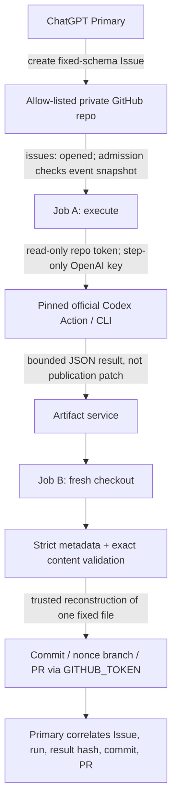

# P-CODEX-PHONE Phase 2.5｜Primary Draft Architecture 對抗式驗證

- Date: 2026-09-15
- Reviewer role: Codex / independent adversarial reviewer
- Review target: `agent-work/reports/2026-09-15-p-codex-phone-primary-qc-phase3-implementation-plan.md`
- Scope: research / architecture review only
- Overall decision: **REVISE**
- Implementation status: **DO NOT IMPLEMENT**

## 1. Executive verdict

Primary 選擇 GitHub-hosted ephemeral execution、拒絕 persistent VM、將 model execution 與 publication authority 分開，方向正確；但 Draft 把幾個「可行的設計推論」寫得太接近「已證實的 provider contract」。目前不能直接進 Phase 3 implementation。

我的結論是 **REVISE**，不是 NO-GO：

1. **GitHub Issue 暫時保留為第一個 dispatch primitive，但只是一個 conditional candidate。** Repository allow-list 很容易；「只有預期的 Primary 可以 dispatch」則尚未被證明。`sender/login` 或 `github.actor` 只能證明 GitHub identity，不能證明是這一次 ChatGPT Primary request，也不能區分 Claire、connector 或同 identity 的其他 session。
2. **保留兩 Job 隔離，但撤回「raw patch handoff」設計。** Job A 應只交付 bounded result envelope；Job B 在 fresh checkout 上自行重建唯一允許的 `dispatch-target.txt`，而不是套用 model 產生的 patch。兩個 Job 是 least-privilege control，不是完整 security boundary。
3. **先做 capability/settings probe，再寫正式 harness。** 必須確認 connector 對新 private repo 的 Issue write/read 能力、official Action 的 immutable interface/auth/output/sandbox contract，以及該 repo 是否允許 workflow `GITHUB_TOKEN` 建 branch/PR。這些現在仍是 Unknown。

Synthetic task 對 isolation 與 autonomous dispatch/publication 的 first proof **適當**，但對「Codex genuinely executed」偏弱：期望結果完全可由 deterministic harness 生成。因此成功聲明必須限縮為「受 pin 的 Codex Action step 被執行且產出符合 contract 的結果」，不能宣稱已證明 model reasoning、general work execution，或 secure autonomous collaboration。

## 2. Review scope、方法與 evidence limitation

### 2.1 已讀 repository evidence

- `agent-work/README.md`
- `agent-work/work-orders/2026-09-15-codex-external-dispatch-recon.md`
- `agent-work/work-orders/2026-09-15-codex-dispatch-experiment-design.md`
- Primary Draft（本報告 review target）
- Phase 2.5 Work Order

Task snapshot **沒有** Phase 1 / Phase 2 的 GitHub-visible report：Draft 所稱 Phase 2 report `agent-work/reports/2026-09-15-codex-dispatch-experiment-design.md` 不在 working tree，Draft 指定的 commit `884344524ff174fc402881ad865c3e55642c2c15` 也不在本地 object database。故本報告只把兩份 Work Order 與 Primary Draft 當作可讀 repository evidence，不會把不存在的 report 內容從記憶補回。

### 2.2 Provider evidence limitation

本次嘗試依 OpenAI docs skill 取得 current Codex manual，實際失敗於 DNS：

```text
getaddrinfo EAI_AGAIN developers.openai.com
```

可用工具也沒有暴露 OpenAI Developer Docs MCP；官方-domain web lookup 回傳 `401 Unauthorized`。因此本次無法獨立讀取 OpenAI 或 GitHub 的 current provider documentation，也沒有執行任何 live provider probe。

Primary Draft 提供的官方起點仍值得 Phase 3 gate 前核對：

- OpenAI Codex GitHub Action: <https://developers.openai.com/codex/github-action/>
- OpenAI Codex authentication: <https://developers.openai.com/codex/auth/>
- OpenAI Codex non-interactive mode: <https://developers.openai.com/codex/noninteractive/>
- GitHub `issues` event: <https://docs.github.com/actions/using-workflows/events-that-trigger-workflows#issues>
- GitHub workflow permissions: <https://docs.github.com/actions/using-jobs/assigning-permissions-to-jobs>
- GitHub automatic token authentication: <https://docs.github.com/actions/security-for-github-actions/security-guides/automatic-token-authentication>
- GitHub Actions repository settings: <https://docs.github.com/repositories/managing-your-repositorys-settings-and-features/managing-repository-settings/managing-github-actions-settings-for-a-repository>

下面凡無法由 snapshot/runtime 直接證實的 provider behavior，均降級為 **Plausible** 或 **Unknown**，不因 Draft 引用了 URL 就升格為 Confirmed。

## 3. What the Primary got right

1. **環境適配正確。** iPad-first、無 daemon/desktop/Docker 的限制下，GitHub-hosted runner 比 Claire-owned VM 小且可逆。
2. **沒有把 ChatGPT session credential 當 CI credential。** 將 OpenAI Platform billing/auth 與 ChatGPT subscription/connector 分開，是必要的 trust boundary。
3. **Codex 不應擁有 publication authority。** Model-generated workspace state 必須先經 deterministic policy，再由 harness publish。
4. **不用先造 Netlify/Supabase bridge。** 在 dispatch-only PoC 中，只要 Issue mutation capability 被實測成立，custom admission service 會先增加 caller auth、token custody、replay store 與 maintenance，卻不增加 first proof 的核心證據。
5. **限制 envelope 是對的。** 不接受 arbitrary prompt、shell、repo URL、branch 或 path，顯著縮小 injection surface。
6. **證據不是 PR 或 model prose。** Issue、run、Action/CLI version、artifact identity、commit、PR 的 correlation 思路正確。
7. **built-in `GITHUB_TOKEN` 應先於 PAT/App。** Disposable single-repo PoC 不應預先引入長期 credential 或 App lifecycle。

## 4. What the Primary got wrong / overstated / left unknown

### 4.1 Identity gate 被高估

`github.actor == <Claire login>`（或 event payload 的 sender）最多是 account identity gate，不是 Primary-origin proof。若 connector 與 Claire 共用同一 GitHub identity，Claire 本人、其他 OAuth surface、遭竊 session 或另一個 ChatGPT thread 都可能通過。Private repo 降低 attack population，但不創造 caller attestation。

第一個 PoC 可明確接受這個弱點，前提是把 claim 寫成「由預先授權 GitHub account 建立的 Issue」；若 research claim 必須證明特定 Primary instance/source，Issue route **Unsupported**，需 dedicated bridge 的獨立 caller credential/attestation。

### 4.2 Issue correlation 不是 causation proof

Issue number、nonce、SHA 與 run ID 可以形成一致的 audit chain，但 nonce 是 Issue body 內的 claim；它不能獨立證明 nonce 由 Primary 產生或 Claire 沒有 relay。Phase 3 還需要 Primary tool-call record（若 connector surface 可觀察）、時間戳與 Claire 的「未操作」test protocol。即使如此，仍是 experiment evidence，不是 cryptographic proof。

### 4.3 `opened` filter 不等於 admission control

Repository/event filter 決定 workflow 是否建立 run；title/actor/schema 的 job-level `if` 或 parser 只會使 run/job skip/fail。這仍可安全 fail closed，但「unauthorized Issue 不會觸發 workflow」是錯誤描述。若 untrusted users 有 Issue write，他們可製造 run/notification/queue noise。

Issue edit 在只訂閱 `opened` 時不應重新 dispatch；但是 parser 必須只讀 event payload snapshot，不能稍後用 API 重讀可變 body，否則會有 validation/use 間的 TOCTOU。任何將 `${{ github.event.issue.body }}` 直接插入 `run:` shell 的做法都應拒絕。

### 4.4 Duplicate/replay 尚無 durable rule

`Issue number + nonce` 只是 key，不是 idempotency mechanism。Workflow rerun、相同 nonce 的第二個 Issue、publication 成功但 summary 失敗，以及 concurrent runs 都要有 deterministic state rule。`concurrency` 只能控制同時執行，不能當永久 replay database。

最小方案是以 immutable publication namespace 作 ledger：branch `dispatch/<nonce>`、commit/PR marker 與 source SHA 必須一致；已存在且一致則 no-op/report duplicate，不一致則 fail closed。若 `nonce` secrecy 不重要，使用 canonicalized envelope hash 比「random-looking nonce」更能防 accidental duplicate；Issue number仍保留作 audit ID。

### 4.5 Job A 並非「沒有 GitHub credential」

若 Job A 要 checkout private repo，它通常需要可讀 repository 的 token。即使不把 token 顯式放進 Codex step，workflow runtime/action context、checkout credential、process inheritance 與 third-party Action implementation仍需逐項驗證。較準確的 guarantee 是：

> Job A 可能具有 ephemeral repository read credential，但不具有 GitHub write/publication permission。

`persist-credentials: false` 能避免 credential 留在 Git config，不能證明其他 action/runtime context 絕對不可取得 token。Job A 的 explicit permissions 應只有 `contents: read`，其他全部 `none`，且 Codex step 不要接收整個 `github` context。

### 4.6 Raw patch 破壞了隔離目的

Artifact transport integrity 只回答「下載的是 Job A 上傳的 bytes」，不回答「bytes 安全」。Raw patch 可包含 validation script/workflow 修改、symlink/path trick、binary/oversized payload，或利用 patch/apply tooling edge case。Job B 在驗證前套用它，已讓 untrusted input 影響 trusted publisher。

因 expected output 完全 deterministic，Job B 不應 apply raw patch。Job A 只上傳一個有 size limit 的 JSON result envelope（nonce、source SHA、candidate target bytes 的 base64/hash、Action version、exit status）；Job B strict parse，驗證 metadata/digest/size/UTF-8/exact expected content，然後在 fresh checkout 中由 trusted code 寫入固定 regular file。Patch 可以另作不可執行 evidence，但不是 publication input。

### 4.7 Secret absence 無法由 output scan 證明

GitHub exact-secret masking 不涵蓋 derived/encoded/fragmented values。Model/action 如可 network egress，也可能不經 repo artifact/log 洩漏。第一個 PoC 可降低風險：dedicated low-value/revocable project key、step-only secret mapping、不 dump env、不保存 raw home directory、artifact allow-list、最小 retention；但不能聲稱「驗證 no secret leaked everywhere」。官方 Action 是否限制 network、是否把 final output/log 上傳、是否有 telemetry，仍須 current docs/source review。

### 4.8 Official Action 與 publication behavior 尚未獨立證實

在本 snapshot 可確認的只有 Primary Draft 的 claim 與 URLs。Action 是否 official、非互動適用性、API key env/input 名稱、sandbox mapping、approval behavior、outputs、JSONL/final message/exit code，以及 pin 如何同時固定 CLI version，均待確認。GitHub repo 是否允許 Actions create PR 亦是 per-repository setting，不可在 implementation 前假設。

## 5. Capability evidence table

| Claim | Classification | 可支持的 evidence / 缺口 |
| --- | --- | --- |
| GitHub 是既有 durable collaboration boundary | **Confirmed** | Repository history、Work Orders 與目前 collaboration procedure 可見。 |
| Primary 當前 connector 可建立 Issue | **Plausible** | Primary Draft 回報已觀察到該 tool；本 reviewer 沒有該 connector callable surface，也無 live probe evidence。 |
| Connector 可讀寫新 private repo | **Unknown** | 尚未建立/授權 sandbox；installation scope 未驗證。 |
| Exact private repo 可限制 trigger scope | **Confirmed**（architecture property） | Workflow 存在於單一 repo，event scope 在該 repo；仍不等於 caller identity assurance。 |
| Exact dispatcher 可由 actor check 安全辨識 | **Unsupported**（對 Primary-origin claim） | Actor 只能辨識 GitHub account，不能區分 Primary/Claire/其他同 identity caller。 |
| `issues: opened` 可建立 Actions run | **Plausible** | 一般 provider mechanism，current docs/live repo 未在本次可達。 |
| Issue edit 不會重新 dispatch | **Plausible** | 僅在只訂閱 `opened` 且不重讀 mutable Issue 的設計下成立。 |
| Issue metadata 足以形成 correlation chain | **Confirmed**（schema property） | Issue number + envelope + recorded run/commit/PR 可被串接。 |
| Correlation chain 證明 Primary causation | **Unsupported** | 缺獨立 caller attestation/tool-call evidence。 |
| Official `openai/codex-action` 存在且適合 CI | **Unknown**（本次 independent review） | Primary 提供官方 URL；本次官方 docs/source 皆不可達。 |
| OpenAI Platform API key 是該 Action 支援的 CI credential | **Unknown** | Draft claim 合理但未能獨立驗證 exact interface/project controls。 |
| Codex 可 workspace-write 且不持有 GitHub write token | **Plausible** | 可用 job permissions 設計；Action/context/token exposure 需 source review/probe。 |
| Action 可穩定輸出 patch/JSONL/final/exit code | **Unknown** | Exact output contract 未取得。 |
| Separate jobs 可隔離 job-scoped secrets/permissions | **Plausible** | GitHub model 支持此設計；同 repo/admin/workflow trust domain，不是硬 security boundary。 |
| Artifact 可安全承載 arbitrary raw patch 到 publisher | **Unsupported** | Transport integrity 不會使 producer-controlled patch 變可信。 |
| `GITHUB_TOKEN` 可 push branch | **Plausible** | 需 `contents: write` 與 repo policy live probe。 |
| `GITHUB_TOKEN` 可建立 PR | **Unknown** | 需 `pull-requests: write` 且 repo Actions setting 允許 create PR。 |
| GitHub App/PAT 是 first PoC 必需 | **Unsupported** | 尚未證明 built-in token 不足；先不建立。 |
| Issue route 比 bridge 更適合 dispatch-only first PoC | **Plausible** | 少一個 service/credential；取決於 connector private-repo mutation probe 與接受弱 caller identity。 |
| Issue route 支援未來安全的 resume conversation | **Unknown** | Comments/state machine/authorization/correlation 尚未設計與實測。 |

## 6. Issue-trigger verdict

### Verdict: **Keep Issue trigger — conditional on three probes**

保留原因不是它在抽象上比 bridge 更安全，而是它最符合現有 iPad/GitHub mutation surface，且 first PoC 不需新 server。條件是 Phase 3 claim 接受 account-level attribution，而非 Primary cryptographic identity。

Implementation 前必須證實：

1. Primary connector 對 **指定 private repo** 能 create/read Issue，且 repository owner/installation scope 符合預期；
2. `issues: opened` workflow 的 event payload、workflow source/default-branch semantics 與 rerun behavior，符合 parser/idempotency design；
3. repo collaborator/Issue creation policy 足夠窄，或明確接受任何可開 Issue 的同帳號/協作者都可造成 rejected run。

### Recommended dispatch data placement

- **Title**：固定常數，例如 `[CODEX-DISPATCH v1]`；不要把 nonce 或 command 當 shell/input source。
- **Issue body**：由 fixed Issue form/template 產生、strict parser 接收的 bounded envelope。Template 改善 UX，不是 security control；server-side parser 才是 gate。
- **Repository file**：固定 Work Order 與 allow-list；Issue 只能引用唯一 literal path，甚至可完全省略 path。
- **Label**：只作人類狀態顯示，不作初始 authentication；如果 label 可被一般 author 控制或需另一個 bot 加上，會增加 race/state。

Illustrative, non-executed schema：

```yaml
dispatch_version: 1
source_sha: "0123456789abcdef0123456789abcdef01234567"
nonce: "p3-<128-bit lowercase hex>"
```

`work_order_path` 可移除，因 Phase 3 只有一個 compile-time constant。Parser 應限制 byte size、UTF-8、exact keys/order-independent canonicalization、no duplicate YAML keys、no anchors/tags、no control characters。更簡單的是 fixed fenced JSON + schema parser，避免 YAML implicit types與 duplicate-key差異。

### 是否有更簡單的 GitHub-native trigger？

- `workflow_dispatch`：如果 Primary connector 未暴露 fresh dispatch verb，就不是可用選項。
- `repository_dispatch`：仍需一個能呼叫 API 的 credential/tool，沒有比較簡單。
- push dispatch file：需要 contents write，權限與 accidental code mutation風險比 Issue 大。
- Issue comment/label：增加可變狀態、race 與重放面。

因此本 snapshot 沒有已證實更簡單且 Primary 可用的 trigger；這是 **Unknown pending connector capability inventory**，不是永遠沒有。

## 7. Codex GitHub Action / auth verdict

**Verdict: Unknown pending exact official contract; do not substitute guesswork.**

Phase 3 gate 要從 official docs **以及 pinned Action source (`action.yml`/implementation)** 記錄：

1. repository owner 與 official status；
2. immutable Action commit SHA、其 dependency/pinning strategy 與實際 CLI version；
3. required API key input/env name、是否僅支援 Platform API key、organization/project選擇方式；
4. non-interactive approval default、sandbox values、network policy、workspace/root behavior；
5. action process 可見的 environment/context/GitHub token；
6. exact outputs（output file、final message、events/JSONL、exit status）與 size/encoding；
7. failure exit behavior、timeout/cancellation、log/redaction/telemetry；
8. hosted runner support與任何 dangerous bypass requirement。

若 safe workspace write 需要 danger-full-access / approval bypass、若 secret 必須暴露於整個 job、或沒有 machine-verifiable output/exit contract，則 **NO-GO for this Action path**；先評估 pinned `codex exec` directly，不能用 broad credential 補洞。

API key 應是 dedicated/revocable experiment credential candidate，但「capped」不可先寫死：Claire 必須查看 Platform 當下是否真的提供 enforceable project budget/usage limit。Alert 或 soft monthly budget 不應描述成 hard cap。

## 8. Two-job isolation verdict

### Verdict: **Keep, but revise the handoff**

兩 Job 必須保留，因為它至少讓 OpenAI secret 與 GitHub write authority不在同一 job。但它們仍共享 repository workflow/admin trust、artifact service 與 GitHub control plane；惡意 maintainer 可改 default-branch workflow。對 disposable synthetic PoC 足夠，對 hostile-repository/production threat model 不足。

### Concrete recommended isolation pattern

**Workflow/top-level**

```yaml
# Illustrative only; not a deployable workflow.
permissions: {}
```

**Job A — execute**

- `permissions: { contents: read }`; no `issues`, `actions`, `checks`, `pull-requests`, `id-token` write;
- exact source SHA checkout; `persist-credentials: false`;
- validate immutable event payload before checkout/model invocation;
- OpenAI secret mapped only to pinned Codex step, not job-wide `env`;
- no caches; fixed timeout; one run concurrency;
- produce only bounded JSON result + optional non-authoritative textual evidence;
- upload one allow-listed artifact with short retention; record returned artifact ID/digest when provider supports it.

**Job B — validate/publish**

- fresh runner and exact source SHA checkout;
- `permissions: { contents: write, pull-requests: write }`; no OpenAI secret reference and no environment containing it;
- download artifact by exact name/run, reject extra files, links, archives beyond byte/count limit;
- parse JSON as data; never `source`, `eval`, shell-interpolate, execute, or apply producer paths/patch;
- match source SHA, nonce, Issue/run identity, expected result hash and exact target bytes;
- verify fresh tree and fixed target are regular files beneath workspace;
- trusted harness writes exactly `dispatch-target.txt`, checks `git diff --name-only` and exact bytes;
- refuse existing branch/marker mismatch; consistent existing publication becomes duplicate/no-op;
- commit/push/open PR only after deterministic checks.

Environment protection with mandatory human reviewer would break the no-per-dispatch-relay happy path。可使用 environment 作 secret scoping only if it does not add a live approval; separate workflow/reusable workflow does not automatically improve isolation if the untrusted job can influence its ref/inputs. OIDC 對 OpenAI auth 是否可用目前 Unknown，且不是 first PoC 必需。

## 9. Publication credential recommendation

先用 job-scoped built-in `GITHUB_TOKEN`：

```yaml
# Illustrative only.
permissions:
  contents: write
  pull-requests: write
```

這是預期最小 publication permissions；`issues: write` 非必要，status 可放 job summary。不要給 `actions: write`、`workflows: write`、`secrets`、`id-token: write` 或 repository administration。

在 private sandbox repo 中確認：

- workflow permissions 設定不是 read-only；
- repository setting 允許 GitHub Actions create pull requests；
- branch protection/ruleset 允許 bot 建立 nonce branch，而不需 bypass；
- PR 建立方式不要求 PAT/App；
- branch name、commit message、PR body 全由 trusted code從 validated canonical fields組成。

如果 built-in token 被 policy 阻擋，first response 是記錄 **Partial/Failed evidence** 並檢查能否調整 disposable repo 的 narrow setting；不是立即建立 PAT。只有確有必要且 Claire另行同意，才評估 installation-scoped GitHub App token。Classic/fine-grained PAT 都不應是 first candidate。

## 10. Revised Claire one-time setup checklist

### Phase 3 implementation 前 Claire 真正需要做的事

1. **Architecture/risk consent**：接受 disposable private repo、one-file synthetic scope、account-level（非 Primary-exclusive）Issue attribution、資料/retention/cleanup與預期成本。
2. **GitHub ownership consent**：以 browser login/MFA 建立 private repo，或明確授權有能力的 Agent 建立；確認 privacy、collaborators、Actions policy、default branch/ruleset。Agent 可準備設定清單，但不能代替 provider/account consent。
3. **Connector authorization**：在 GitHub/ChatGPT UI 將該 exact private repo 加入 connector installation scope；Primary隨後做 read/create-Issue capability probe。這通常需要 browser login，可能需要 MFA/organization approval。
4. **OpenAI billing/project gate（只在 harness QC 後）**：若尚無合適 isolated project，建立/選擇 dedicated Platform project，確認 billing、rate/budget behavior與誰可 revoke；建立 dedicated API key。這是 provider consent與秘密生成，Agent 不應代做。
5. **Secret storage**：透過 GitHub UI將 key存為 exact repository/environment secret；不得貼進 chat。若 environment 需要 reviewer approval，必須關閉 per-run approval或承認它破壞 measured path。
6. **Repository Actions settings**：在 GitHub settings 明確允許所需 Actions、設定 workflow token permissions，並在確認風險後允許 Actions create PR；必要時 MFA/admin approval。不要開啟「approve PR」能力。
7. **Review authorization**：Primary先完成 immutable pins/permissions/parser/handoff review；Claire批准 exactly one measured live run、spend window與cleanup/retention plan。

### 可移除或修正的 Draft 項目

- Claire 不必操作 shell、建立 VM、Netlify/Supabase、GitHub App/PAT。
- 「Codex task/workspace access path confirmed for preparation」不是 live architecture requirement；它只是現行 P3-PREP implementation relay 的作業方式，不能混入 measured proof。
- 「lowest practical spend limit」必須改成「確認 provider實際提供的是 hard cap、rate limit、alert或僅 budget display」，不能假稱一定可 enforce cap。
- Final functional acceptance/cleanup 是 Phase 3 live run 後，不是 implementation begin blocker；但 cleanup plan與owner必須事先同意。

## 11. Failure-mode review

| Failure | Expected safe behavior | Phase 3 test priority |
| --- | --- | --- |
| Unauthorized user開 syntactically valid Issue | Run可能被建立，但 admission job在任何 checkout/secret/model step前依 repo+actor allow-list拒絕；記錄 rejected，不洩漏 schema細節/secret。注意同 GitHub identity 冒用無法辨識。 | **Must before live**（可用不符合 actor 的 fixture/unit test；不必真的邀請陌生人） |
| Duplicate/replayed Issue或 workflow rerun | Canonical key命中既有 branch/PR；一致則 deterministic no-op，不一致 fail closed；不得第二次呼叫 Codex或覆寫 branch。 | **Must** |
| Malformed nonce/SHA/path | Strict schema/length/charset；SHA須等於允許 baseline並存在；固定 Work Order path最好不作輸入；Codex不啟動。 | **Must** |
| Codex key invalid/revoked | Job A non-zero/timeout；不上傳 success envelope；Job B不啟動或 fail closed；無 publication。 | **Must narrow live failure after happy path** |
| Codex改第二個 file | Job A可記錄 candidate diff，但 result contract拒絕 extra paths；Job B不 apply，無 publication。 | **Must** |
| Patch修改 validation/publishing code | 永不 apply raw patch；extra path拒絕。Current running workflow也只能來自 reviewed source SHA/default-branch policy。 | **Must** |
| Artifact missing | Job B fail before checkout mutation/publication；summary標明 artifact unavailable。 | **Must unit/integration fixture** |
| Artifact tampered/corrupt | Exact artifact identity/digest（若可用）+ strict JSON/hash/size驗證失敗；無 publication。Producer惡意仍由 semantic validation處理。 | **Must fixture** |
| Publication permission unavailable | Validation結果保留為 safe evidence，push/PR failure使 run Partial/Failed；不增加 credential、不手動 click PR。 | **Must capability probe** |
| PR blocked by repo policy | Branch若已 push，不宣稱 success；記錄 orphan branch並 cleanup；不繞過 policy。 | **Must capability probe** |
| Runner timeout | Platform/job timeout取消；無 Job B publication；rerun遵循同 idempotency key，不自動無限 retry。 | **Should**（縮短 timeout fixture） |
| Secret-like content出現在 output/log | 不 publish raw output；exact secret由 provider masking；fail scan只是 detection，不是 guarantee；立即 revoke、restrict evidence、記 incident。 | **Should**（使用 fake canary，不可用真 secret做 leakage test） |
| Issue成功但 Actions未開始 | Primary以 issue number/time window查 run；分類 Failed/Unknown，不由 Claire手動 Run workflow補成 success。檢查 workflow是否在 required default branch與 Actions policy。 | **Must live acceptance case** |
| Actions開始但無可信 Codex evidence | 即使 target/PR正確也分類 Partial/Failed；需 pinned step identity、exit status、bounded output/hash與run/job logs。 | **Must live acceptance case** |

第一個 live proof 不需真的模擬 account compromise、artifact-service compromise、GitHub control-plane compromise或網路 exfiltration。這些應列 threat limitations，而不是拿真 credential做破壞測試。

## 12. First PoC scope judgment

### Verdict: appropriate for plumbing, too weak for general Codex capability

PoC 可證明：

1. Primary connector 能建立 admission record；
2. GitHub event能自動啟動 managed run；
3. pinned Codex step被調用並回傳機器可讀 result；
4. producer沒有 publication authority；
5.獨立 job只 publish deterministic expected file；
6.無 Claire per-dispatch click；
7. Primary能把 evidence chain相關聯。

PoC **不能**證明：只有 Codex 能完成變更、model reasoned correctly、arbitrary Work Order安全、caller是唯一 Primary、no secret exfiltration、或 architecture已適合 production。

為避免 harness自己產生正確內容、Codex失敗卻仍過關，Job B 必須要求 Job A 的 successful Action exit與candidate hash/content contract；但即使如此，措辭只能是「Codex Action executed」，不是不可偽造的 model cognition proof。

## 13. Bidirectional-evolution implication

- **不是 dead-end，但也不是免費的 Phase 4。** Issue number天然可當 conversation/correlation anchor。
- Issues/comments/status 可能承載 `Decision Required`，前提是未來定義 actor authorization、message schema、sequence/version、single-writer state machine、edit/delete policy、replay、resume token與誰可重新啟動 execution。任意 comment直接餵給 model會重開 prompt-injection surface。
- 現在先建 App/MCP bridge不會明顯降低已知 migration cost，反而先承擔 auth/service/storage。未來若要求 Primary-specific identity、低延遲 callback、multi-repo routing、cancel/resume或secret command channel，再以本 PoC evidence決定 bridge。
- Issue資料模型應保持 transport-neutral：canonical dispatch/result envelope 不綁定 Issue markdown parsing細節，未來 bridge可沿用 schema。

## 14. Recommended Phase 3 architecture



與 Primary Draft 的明確差異：

1. Issue gate只宣稱 GitHub-account attribution，不宣稱 exact Primary identity。
2. Issue body移除可變 Work Order path；固定 path在 reviewed workflow/harness中。
3. Job A承認需要 ephemeral read token，但明確無 write authority。
4. Job A → Job B 不傳 raw patch作 publication input；傳 bounded result，Job B deterministic reconstruct fixed file。
5. Durable idempotency以 canonical dispatch key + branch/PR marker實作，不只寫「Issue number + nonce」。
6. Official Action/auth/output與 PR settings 先 probe，尚未證實前不可進 implementation。

Netlify、Supabase、persistent VM、PAT與GitHub App仍不在 first PoC topology。

## 15. Exact blockers before implementation

以下未解前，不應交付 P3-PREP implementation Work Order：

1. **Recover/review missing evidence**：取得 Phase 1/2 GitHub-visible reports或明確接受它們不參與決策；目前 Draft引用的 Phase 2 report/commit不可達。
2. **Current official contract review**：保存 official Codex Action SHA/source、CLI version、API-key interface、outputs、sandbox/approval/network/log behavior的 dated evidence。
3. **Connector capability probe**：Primary對 proposed private repo能 create/read Issue；記錄 tool identity與是否能觀察 tool-call provenance。
4. **Identity claim decision**：Claire/Primary明確接受 account-level actor gate；若要求 Primary-exclusive authorization，停止 Issue design並回 dedicated bridge研究。
5. **GitHub event semantics check**：確認 workflow source/default branch、event payload snapshot、actor/sender、rerun与 `GITHUB_SHA` behavior，並據此寫 exact-SHA rule。
6. **Publication settings probe**：確認 disposable repo的 workflow token可 `contents: write` + `pull-requests: write`並允許 create PR；不以 broader credential預解。
7. **Handoff redesign accepted**：不 apply raw patch；決定 bounded result schema、artifact size/digest與 trusted reconstruction。
8. **Idempotency contract accepted**：canonical key、existing branch/PR consistent/inconsistent behavior、concurrency、partial publication cleanup。
9. **Secret/cost wording corrected**：確認實際 budget/rate/cap controls、redaction與revocation；不承諾不可證明的 hard cap/no leak。
10. **Acceptance claims frozen**：成功只證明 dispatch plumbing + pinned Codex execution evidence + deterministic publication，不外推 general autonomous coding/security。

## 16. Go / Revise / No-Go decision

### **REVISE**

不接受 Primary Draft 原樣進 Phase 3 implementation；接受經上述修改後的 Issue-first candidate進入 **pre-implementation capability verification**。

### 三個最重要的確認或漏洞

1. **確認**：Issue是目前最小、最符合 iPad/GitHub boundary 的 first dispatch candidate；沒有證據支持先建 App/MCP bridge。
2. **漏洞**：GitHub actor/Issue correlation不能證明 exact Primary origin；Draft的 authorization/causation claim過強。
3. **漏洞與修正**：兩 Job值得保留，但 raw patch handoff讓 untrusted model output先影響 publisher；必須改為 bounded data + trusted one-file reconstruction。

### 最終 required answers

- **GitHub Issue 是否保留為第一個 dispatch primitive？** 是，**conditional keep**；private-repo connector與account-level identity assumption需先實測/接受。
- **兩 Job 隔離是否保留？** 是；但視為 least-privilege layer，不是 complete security boundary，且禁止 raw patch publication input。
- **Claire 在 Phase 3 前真正需要做什麼？** 批准風險/claim、private repo與retention；完成必要 GitHub/ChatGPT connector browser authorization；在 harness QC後完成 Platform billing/project/key與GitHub secret gate；確認 Actions/PR settings；批准一次 live run。她不需 CLI、VM、bridge、PAT/App或逐次 relay。
- **Unresolved evidence gaps**：missing Phase reports/commit；current official Codex Action/auth/output/sandbox contract；connector private-repo capability與provenance；GitHub Issue/default-branch/rerun payload semantics；artifact digest behavior；`GITHUB_TOKEN` branch/PR setting；Platform是否有 enforceable hard spend cap；Action log/network/secret exposure；Codex execution evidence能否比「step invoked」更強。

在這些 gaps 被 provider evidence或bounded probe關閉前，狀態不是 GO。
