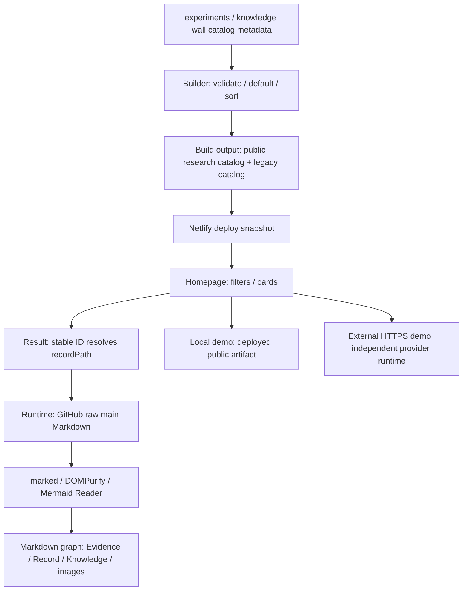

# Public Research Presentation Architecture Review

- Work Order: `2026-10-09-public-research-presentation-architecture-review`
- Result: **Completed — Executor Completion**；Architecture Accepted / Primary Technical QC / Production Verified / Browser Verified 均未宣稱完成。
- Review date: 2026-10-09（Asia/Taipei）
- Repository: `claire-nook/ai-playground`
- Reviewed baseline: GitHub-visible `main` at **`7ca08d25454e6e2a6396651810e2a3473418cb2b`**。
- 唯一交付變更：本 Report。所有修正均為 recommendation，沒有實作或 Architecture Decision。

## Executive Assessment｜整體判斷

現有架構已能用輕量、可重讀的方式連接 Research Record、Catalog 與公開閱讀介面；問題不在缺少一套全新資訊模型。獨立盤點得到 **24 份 metadata、24 個 ID、23 個不同 `recordPath`：Experiment 18、Commentary 6、Technical Note 0、Knowledge 0**。隔離執行現行 Builder 成功；沒有 duplicate ID、缺失 Record 或缺失站內 Live Demo 入口。這證明 baseline source 可產生完整 Catalog，不證明目前 Netlify production 已部署這 24 個項目。

最需要處理的是**已保存的研究能否被可靠理解與追溯**。Native Reader 的現行 Evidence / Unknown 段落與同文件已完成的 M3 相互矛盾；Maintenance / Detail 的獨立 Findings 雖存在，Record 入口只有 code span；Reader 有些 URL 類型會離開可讀路徑。這些不能靠增加 `evidencePath`、換首頁版面或再寫一份泛用 Contract 自動修好。

建議先修正已確認的內容／導覽問題，再在**既有 Publication Contract** 補一小段 presentation responsibility、link convention 與版本邊界。新接手 AI 已有 Publication routing，無須把所有研究與 Presentation 規則升格成 startup 必讀。若未來實際出現多個 presentation consumer、獨立版本政策或重複的閱讀需求，再考慮獨立 Presentation Contract。

應保留 `recordPath` 作研究入口、0／1／多份 Evidence 的彈性、共用 Record、Demo 與 Verification 分離，以及 Markdown runtime 讀取的選擇。**版本不同步是既有取捨，需要被說清楚；不是足以直接推翻 runtime Reader 的證據。**以下 severity / priority 是 reviewer judgment，採納與正式設計仍由 Claire / Primary 決定。

## Baseline / Method / Coverage｜基準與方法

### Context preflight

Cloud Workspace 實際 Repository 在 `/workspace/ai-playground`，local branch 為 `work`。初始 HEAD `8dcc6545b763b33a8c447e8455de3bef751afd9e` 沒有本次 Work Order，working tree 乾淨。GitHub Connector 可讀 Work Order 與 main；main 比初始 snapshot 多 16 個 commit。

普通 `git fetch origin main` 兩次失敗，原始錯誤為 `Failed to connect to proxy port 8080 ... Could not connect to server`。沒有繞過 proxy 或改網路設定。改用已可用的 GitHub Connector 取得 commit / recursive tree / blob，匯入原始 Git objects；**16 個 commit、各 snapshot 的 tree 與 16 個缺失 blob 全部核對原始 Git SHA**，`git fsck --connectivity-only --no-dangling <baseline>` 通過，再以 `git merge --ff-only <baseline>` 對齊。這是取得指定 main baseline，並非重新創造或改寫既有研究。對齊後 HEAD 精確為上列 SHA，working tree 仍乾淨。

Read First 全部存在且可讀；沒有 missing required context。Repository / workspace 搜尋未發現適用的 `AGENTS.md`。`playground.md` 未當作 repository-local context，亦未依賴 Project 私有記憶。

| Read First group | 本次閱讀／追查範圍 |
| --- | --- |
| Repository orientation | `README.md`、`knowledge/README.md`、`agent-work/README.md` |
| Publication / Evidence writing | `knowledge/research-catalog-publication.md`、`knowledge/experiment-template.md`、`knowledge/evidence-backed-technical-writing.md` |
| Human research indexes | `knowledge/experiments.md`、`evidence/index.md`、`knowledge/wall/README.md` |
| Executable publication / presentation | `scripts/build-experiment-catalog.mjs`、`public/index.html`、`public/result/index.html`、`public/assets/markdown-reader.js` |
| Required representative Records | Day One Browser / Native、Feature Query / Maintenance、Application Shell 的 README |
| Dispatch governance | `agent-work/templates/work-order.md`、`agent-work/dispatch-handoff.md`；補讀 Report language guideline |
| Adaptive follow-up | 全部 24 份 metadata；23 個 Record 的 inline link / image inventory；Detail Record、Maintenance / Shell / Auth / Batch / Cloudflare Evidence、Wall 文章相關段落、Platform index、historical Catalog / Human View Work Orders、`netlify.toml`、`.gitignore` |

### Method and evidence strength

1. 對全庫 `*.catalog.json` 做 JSON inventory、enum/default 統計、ID uniqueness、Record / local demo target existence 檢查，對照 Builder 掃描 roots。
2. 在 Repository **外**的 `/workspace/work/` 放隔離副本與 scratch，使用 Node `v24.19.0` 執行原始 Builder。未在原 Repo 生成或覆寫 Catalog。
3. 對 23 個 catalogued Record 做簡單 inline Markdown link / image 掃描，排除 fenced blocks；得到 67 個 link/image occurrence，無缺失 local file target。此掃描不是完整 Markdown parser，不包含 prose/code span、reference-style/HTML link 或所有 transitively reachable 文件，因此不宣稱全站所有 links 都正確。
4. 抽查不同 Evidence cardinality、共用 Record、Wall narrative、local / external / retired / no-demo cases；雙向比對現行 guidance 與實作，並追讀 historical design intent。
5. 以 source 擷取的 Reader URL functions / Homepage `renderCard` 做 Node VM 局部 probe；以隔離 metadata mutation 探測 Builder validation。這些是**local execution of source logic**，不是 Browser DOM、Safari、網路 HTTP 或部署實測。

所有 `file:line` 指向 reviewed baseline，可由 [固定 SHA 的 repository view](https://github.com/claire-nook/ai-playground/tree/7ca08d25454e6e2a6396651810e2a3473418cb2b) 重查。未逐一重跑各 provider Experiment，既有研究宣稱只當 Repository evidence 與分析背景。

## Catalog Inventory & Output Taxonomy｜完整盤點

### Machine-readable inputs

全庫 24 份 metadata 都在 Builder 的兩個 roots 內：`experiments/`、`knowledge/wall/`（`scripts/build-experiment-catalog.mjs:6`、`:16`、`:69`）。下表 source 每列的 JSON 本體從 line 1 開始；`recordPath` 是實際值，不由資料夾名稱推測。省略 `outputType` 的項目以 Builder 預設值列入 Experiment。

| outputType | ID | Metadata source (`:1`) | recordPath |
| --- | --- | --- | --- |
| experiment | S-SHELL-1 | `experiments/application-shell/application-shell.catalog.json` | `experiments/application-shell/README.md` |
| experiment | A-ARTIFACT-1 | `experiments/artifact-transport/a-artifact-1.catalog.json` | `experiments/artifact-transport/README.md` |
| experiment | A | `experiments/auth/auth.catalog.json` | `experiments/auth/README.md` |
| experiment | D-BATCH-1 | `experiments/batch-scheduling/d-batch-1.catalog.json` | `experiments/batch-scheduling/README.md` |
| experiment | CF-CONNECTOR-1 | `experiments/cloudflare-direct-control/cf-connector-1.catalog.json` | `experiments/cloudflare-direct-control/README.md` |
| experiment | P-CODEX-PHONE | `experiments/codex-dispatch/p-codex-phone.catalog.json` | `experiments/codex-dispatch/README.md` |
| experiment | C-BSA-1 | `experiments/custom-api/c-bsa-1.catalog.json` | `experiments/custom-api/c-bsa-1.md` |
| experiment | C-DB-1 | `experiments/custom-api/c-db-1.catalog.json` | `experiments/custom-api/README.md` |
| experiment | C-EXT-1 | `experiments/custom-api/c-ext-1.catalog.json` | `experiments/custom-api/README.md` |
| experiment | C-NF-0 | `experiments/custom-api/c-nf-0.catalog.json` | `experiments/custom-api/netlify-functions-lifecycle.md` |
| experiment | B-1 | `experiments/data-api-view/data-api-view.catalog.json` | `experiments/data-api-view/README.md` |
| experiment | B | `experiments/data-api/data-api.catalog.json` | `experiments/data-api/README.md` |
| experiment | D1-NATIVE-1 | `experiments/dayone-native-reader/d1-native-1.catalog.json` | `experiments/dayone-native-reader/README.md` |
| experiment | D1-READER-1 | `experiments/dayone-reader/d1-reader-1.catalog.json` | `experiments/dayone-reader/README.md` |
| experiment | F-DETAIL-1 | `experiments/feature-detail/f-detail-1.catalog.json` | `experiments/feature-detail/README.md` |
| experiment | F-MAINT-1 | `experiments/feature-maintenance/f-maint-1.catalog.json` | `experiments/feature-maintenance/README.md` |
| experiment | F-QUERY-1 | `experiments/feature-query/f-query-1.catalog.json` | `experiments/feature-query/README.md` |
| experiment | T-TXT-1 | `experiments/textastic-markdown/t-txt-1.catalog.json` | `experiments/textastic-markdown/README.md` |
| commentary | WALL-AGENT-LIFE-1 | `knowledge/wall/claire-is-hungry-future-agent-life.catalog.json` | `knowledge/wall/claire-is-hungry-future-agent-life.md` |
| commentary | WALL-IPAD-1 | `knowledge/wall/day-7-ipados-27-developer-love.catalog.json` | `knowledge/wall/day-7-ipados-27-developer-love.md` |
| commentary | WALL-DAYONE-2 | `knowledge/wall/dayone-native-reader.catalog.json` | `knowledge/wall/dayone-native-reader.md` |
| commentary | WALL-DAYONE-1 | `knowledge/wall/dayone-reader-escape-hatch.catalog.json` | `knowledge/wall/dayone-reader-escape-hatch.md` |
| commentary | WALL-TEXTASTIC-1 | `knowledge/wall/textastic-2290-markdown-upgrade.catalog.json` | `knowledge/wall/textastic-2290-markdown-upgrade.md` |
| commentary | WALL-TEXTASTIC-2 | `knowledge/wall/textastic-markdown-technical-workbench.catalog.json` | `knowledge/wall/textastic-markdown-technical-workbench.md` |

| Dimension | Source count / isolated generated count |
| --- | --- |
| Output | Experiment 18；Commentary 6；Technical Note 0；Knowledge 0 |
| Method | controlled-experiment 18；field-verification 5；synthesis 1；analysis 0 |
| Verification | verified 19；partial 5；candidate 0 |
| Presentation | live 11（10 Experiment + 1 Commentary）；none 10；retired 3；planned 0 |
| Defaults | 15 份省略 `outputType`，15 份省略 `researchMethod`；Builder 補 experiment / controlled-experiment |
| Live Demo shape | 10 個站內 entry、1 個外部 HTTPS（CF-CONNECTOR-1） |

Schema 實際由 executable validator 承擔，沒有另找一份 schema 當更高權威：required strings、tags、enums、date、path format 見 `scripts/build-experiment-catalog.mjs:27`；ID uniqueness 見 `:79`。Defaults 的實際寫法是 `??=`（`:32`），所以 explicit `null` 也會被 default，而文件只說省略。這是小型文件精確度差異，不是現有 metadata 故障。

### Duplicate / missing / stale references

- **Duplicate ID：0**；ID uniqueness 有 build enforcement。
- **Missing `recordPath` file：0**；23 個不同 Markdown target 都存在。
- **Shared `recordPath`：1 組**，C-DB-1 / C-EXT-1 共用 Custom API README；它的不同 section 確實承載兩個 Probe（`experiments/custom-api/README.md:12`、`:38`）。這是 intentional flexibility，不是 duplicate record defect。
- **Missing local live demo entry：0**；10 個站內 `demoPath` 都對應 `public/<path>/index.html`。不以檔案存在推論能登入、API 有效或 provider 尚未退休。
- **External demo reachability：Unknown**；沒有對 Workers URL 做 fresh HTTP / Browser probe。
- **Stale semantic reference：存在**，Native Record 的 M3 未完成說法與當前 Final Judgment 矛盾（A1）；不是 stale file path。
- **67 個 Record inline links/images：未找到缺失 local target**；仍有 directory link 與 downstream root URL 問題（P2），因此 target existence 不等於 reader navigation 正確。

### Metadata source / generated / deployed catalog 必須分開

Git tracked tree 沒有兩份 generated Catalog。初始 Workspace 留有 **ignored、23 entries 的 `public/experiment-catalog.json`**，沒有 CF-CONNECTOR-1；`public/research-catalog.json` 不存在。這只是 pre-existing local build residue，不代表 GitHub main 或 production 少一張卡。

隔離 baseline build 產生 **24 entries**，`research-catalog.json` / `experiment-catalog.json` bytes 完全相同，SHA-256：`658f26506f36bc76d6b692c7161e8b3131da369e5c52be6c7a934e0aae068e7f`。第一項 CF-CONNECTOR-1（partial，2026-10-09），之後 D1-NATIVE-1、WALL-DAYONE-2。目前沒有 candidate，因此 candidate-first 分支只有 source coverage，沒有 baseline candidate output case（Builder `:85`）。

**Deployed catalog：本次未取樣，數量／內容／deploy SHA／cache 狀態均 Unknown。** Homepage 使用 `research-catalog.json`（`public/index.html:127`），Result 也用新檔名（`public/result/index.html:40`）；legacy output 是相容性保留（Builder `:100`），不是本次讀者路徑的 fallback。

### Technical Note / Knowledge 的實際現況與限制

四個類型同時存在於 Publication enum（`knowledge/research-catalog-publication.md:31`）、Builder enum（`:12`）、Homepage dropdown（`public/index.html:73`）與 labels/filter（`:93`、`:104`）；Result Reader 不依 outputType 分派特殊頁面，只找 ID 後讀 `recordPath`（`public/result/index.html:43`）。**在本 baseline，Technical Note / Knowledge 是已支援、尚無 Catalog entry 的類型；不能說已在 production 發布這兩類成果。**

Knowledge Markdown 確實存在，例如 `knowledge/platform/application-platform-architecture.md`、Implementation Guides、Evidence writing guide；Platform index 清楚將內容定位為 Architecture Candidate，而非已採用正式規則（`knowledge/platform/README.md:17`、`:29`）。它們可以被 Markdown link 閱讀，但沒有被 Catalog 成為獨立 Gallery card。Knowledge directory 身分與 `outputType=knowledge` 是不同概念。

`WALL-TEXTASTIC-2` 自稱 Technical Retrospective，但 metadata 明確是 `commentary` + `field-verification`（`knowledge/wall/textastic-markdown-technical-workbench.md:3`；同名 `.catalog.json:17`），不能因文章技術性高就改判為 Technical Note。

四個無 metadata 的 Experiment README directory 是 `cloudflare-oracle`、`github-actions`、`netlify-deployment-boundary`、`netlify-trigger-boundary`。Cloud Oracle 被 CF-CONNECTOR-1 的 checkpoint 明確連結，是同一研究線的 Phase Artifact（`experiments/cloudflare-direct-control/README.md:83`）；其餘歷史研究在 Evidence Index 可找（`evidence/index.md:468`、`:477`）。歷史 Catalog 工單刻意不要求一次收錄全部研究（`agent-work/work-orders/experiment-catalog.md:294`）。不能僅因沒有卡片就認定漏發；須先確認是否有獨立公開索引意圖、成立時間與當時適用 contract。

真正的 authoring gap 是：現行 Contract 有四類 enum，卻沒有 Technical Note vs Knowledge 的選擇準則，也沒有說明首個此類輸出如何放 metadata 才能被既有兩個 roots 掃到。這值得在有實際 authoring 需求時補短例子，並不支持現在將所有 Knowledge Markdown 自動公開成卡片。

## As-Is Data Flow｜從 Repository 到讀者



| Stage | Actual behavior / responsibility | Source evidence |
| --- | --- | --- |
| Authoring | Markdown 保存研究；旁邊 metadata 保存索引，不解析 prose 猜分類 | `knowledge/research-catalog-publication.md:7`；historical `agent-work/work-orders/experiment-catalog.md:21` |
| Build | recursive 掃兩個 roots；validate、default、duplicate-ID check、candidate-first / date-desc / natural-ID sort；輸出雙檔 | `scripts/build-experiment-catalog.mjs:6`、`:27`、`:79`、`:87`、`:97` |
| Deploy | build command 為 Builder，publish boundary 為 `public`；metadata / website / builder 改動觸發，研究正文通常 skip | `netlify.toml:5`、`:6`、`:15` |
| Homepage | fetch build Catalog；search / Tag / Output / Method / Presentation / Verification AND 篩選；每頁 12 筆 | `public/index.html:92`、`:100`、`:118`、`:125` |
| Card → Result | `/result/?id=<encoded ID>`；不是直接 Evidence URL | `public/index.html:114` |
| Result → Record | 重新 fetch catalog，按 ID 找 `recordPath`；改 document title 後呼叫 shared reader | `public/result/index.html:37`、`:40`、`:43`、`:46` |
| Markdown fetch/render | hardcoded repo / `main`，`cache:no-cache`；marked GFM → DOMPurify → URL resolve → Mermaid；error 有 GitHub fallback | `public/assets/markdown-reader.js:2`、`:125`、`:134`、`:141`、`:149` |
| Evidence traversal | Result 攔截同一 rawRoot、以 `.md` 結尾的 anchor URL，重用 Reader；stack 保存使用者 path | `public/assets/markdown-reader.js:76`、`:115`、`:155` |
| Live Demo | `live` 才有 Demo action；外部 HTTPS 開新 tab、noopener/noreferrer；local 保持原 tab | `public/index.html:111`；Builder `:64` |

### Reader link semantics

| Link shape | Source / local-logic observation | Consequence / boundary |
| --- | --- | --- |
| Relative `.md` | 以目前 Record raw URL 為 base 正規化；Result 可攔截 | 可以任意跨 Record / Evidence / Knowledge，不需要 Catalog registration |
| Relative image | 正規化到 GitHub raw repo path | Evidence 圖片可由 canonical asset 讀；依賴 GitHub availability |
| Absolute external HTTPS | resolver 保留 URL，Result 不攔截 | 既有 Wall Netlify downloads links 能保留原目的地；不自動套用 Card external-demo 新 tab 政策 |
| Code span 的 path | 沒有 anchor，resolver / click handler 無處介入 | 檔案可供 AI 定位，但人類無法點去 Findings；P1 |
| Directory link | 變成 raw directory URL，不是 `.md` | 不會自動找 README，也不會切 GitHub tree view；P2 |
| Site-root `/...` | 相對 raw origin 解出 `https://raw.githubusercontent.com/...` | 不是 Netlify site-root，downstream Demo / download 入口錯位；P2 |
| Cross-document `.md#fragment` / `.md?query` | `endsWith('.md')` 不成立，局部 probe 得到 null | 不被 Result 攔截；此類在 23 個 Record scan 未出現，列 needs evidence |
| `#fragment` | resolver 保留原值 | 沒有本次 Browser heading-anchor / scrolling 實測 |

Homepage 的 Short Term 也用 shared render function，但沒有 Result 的跨 Markdown 攔截；Knowledge Maps handler 只攔截 `knowledge/maps/`（`public/assets/markdown-reader.js:198`、`:204`）。因此**render capability 共用，不等於所有 tab 的 navigation capability 一致**。Map / Short Term 跨到 Evidence 是否符合讀者期待，需 Browser case 決定，不先擴大 UI。

Result stack 在 container dataset，沒有把後續 document path 寫入 URL 或 Browser History（`:115`、`:183`）。若由某卡片深入 Evidence 後複製 URL，URL 仍指向原卡片；reload 也會重新由 ID 開 Record。這是可定位的 interaction limitation，不是本次 Browser 測得的 bug。

### Build-time / runtime version boundary

Catalog metadata、HTML / JS、local Demo 來自 deploy snapshot；研究正文與圖片來自 runtime `main`；外部 Demo 又有自己的 deployment identity。`cache:no-cache` 不會把這些 surfaces 鎖在同一 commit。

此取捨有歷史明文：runtime main Reader、禁止 build-time 複製文章、Markdown-only 不觸發 deploy（`agent-work/work-orders/playground-human-view.md:35`、`:38`、`:40`、`:122`）。好處是 Evidence prose 可不重部署即更新；代價是 metadata 仍舊、正文已新，甚至舊 `recordPath` 在 main 被移動後失效。Deploy Preview 同樣讀 main，不會自動讀 PR branch，故不能以 preview Reader 畫面驗收 PR 未合併正文。兩個 probe ID 共用 Record 也是允許的，不應強迫拆檔。

`completedDate` 不是 deploy date；partial 也必須填日期（Publication `:30`）。CF-CONNECTOR-1 的 2026-10-09 與 partial 是合法 checkpoint，不代表五階段全部完成（metadata `:20`；Record `:76`）。其字義可補明為 Evidence checkpoint / completion context，而不是改成一套新的工作狀態。

## Experiment / Evidence / Wall Cases｜組織與追溯案例

以下「獨立 Evidence」指此案例明確引用的 public Evidence Markdown，不包含 Record 內嵌觀察、圖片、private source 或全庫其他間接關聯。數量是案例結構，不是 Evidence 強度分數。

| Case | Organization / Evidence cardinality | Reader route and assessment |
| --- | --- | --- |
| D1-READER-1 | 0 份獨立 Evidence Markdown；README 內嵌 feature evidence、failure、Phase 1 / Final consolidation | Record `:124`、`:164`、`:339` 保存完整脈絡；0 不等於缺證據。早期 `Current Judgment` 尚寫 Active（`:146`），Final consolidation 明確 supersede；值得補 current-state 導覽，不應刪歷史 |
| D1-NATIVE-1 | 0 份 public standalone Evidence Markdown；M1/M2/M3 在 README，private execution 明確分隔；Evidence Index 多個 milestone | Record `:116`、`:172`、`:297`，Index `:32`、`:62`、`:95`。不要求公開 private native package；A1 的 stale current sections 才是實際問題 |
| F-QUERY-1 | 0 份 standalone Evidence Markdown；inline A/B/C reasoning + 一張 visual Evidence | Record `:43` 圖片可正確正規化；`:339` 將 Functional evidence 與 Design Review 分開。Partial card 不是「未完成就不能展示」 |
| F-MAINT-1 | 1 份 `evidence/f-maint-1-findings.md`；另有 Knowledge synthesis | Record `:15` / `:16` 只用 code span，全文没有 inline anchor；Findings `:3` 明確 Partial / synthetic / deployed prototype。人類從本卡片無法直接點到獨立 Findings（P1） |
| F-DETAIL-1 | 1 份 `evidence/f-detail-1-findings.md`；另有 pattern Knowledge | Record `:14` / `:15` 同樣 code span；Findings `:8` 保存 Evidence Boundary。與 Maintenance 是相同 authoring 缺口，無須建立兩套 Reader |
| S-SHELL-1 | 2 份 Evidence：consolidated Findings + Safari Auth lifecycle；另有 supporting contracts / SQL | Record `:35`–`:38` 可點 consolidated Findings；Auth Evidence 在 `:9` 只是 code span；Findings `:135` 也只以 code span 提及。多份文件存在，但 edge 可點程度不一致 |
| D-BATCH-1 | 2 份 Evidence：phase-1 / parameter-invocation + Implementation Guide | Record `:16`、`:20`、`:21` 都是明確 Markdown links，是現成多 Evidence navigation 的正面樣本。Phase Evidence 自己標日期／phase scope，不要求每一份隨整體 completion 改成 Verified |
| CF-CONNECTOR-1 | 1 份 `evidence/cf-oracle-1.md` + Phase Artifact Record；external Demo | Record `:76` 明確更新歷史 planning，`:82` / `:83` 有可點 links。Catalog partial 與 Phase 1–2 verified、後續待測相容；沒有本次 fresh Worker evidence |
| C-DB-1 / C-EXT-1 | 2 Catalog IDs → 1 Record；內含 C-0、兩個 Probe 的 Evidence/Mermaid | Record `:3`、`:12`、`:38`；Reader 不依 ID 跳 section，所以兩卡開同一文首。這是已允許的 shared context，section routing 可 defer |
| WALL-DAYONE-1 / 2 | Commentary 引用 Experiment / 另一篇 Wall；同一 Experiment 可被多篇文章引用 | escape-hatch `:388`；native-wall `:577` / `:578` / `:582`。實際 links 可由 Result Reader 遍歷；Narrative 不取代 Experiment evidence。WALL-DAYONE-1 同時有 live Demo，不代表 Commentary 變成 Experiment |
| WALL-TEXTASTIC-2 | 技術回顧 + Experiment / Capability / source artifact / showcase links | Article `:199`、`:222`–`:239` 可追 source，`:15` directory link 有 P2 問題；metadata 仍 Commentary，保留敘事定位 |
| WALL-AGENT-LIFE-1 | Synthesis thought experiment、圖片、future workflow reasoning；無獨立 Evidence attachment 要求 | metadata `:6`、`:18`、`:20` 清楚非產品預測／partial；文章 `:21` 的「如果未來」保留假設。可改進 provenance，但不能把沒有 Uber Eats runtime report 當漏測 |

資料關係實際是 graph：`Catalog ID → Record` 可 many-to-one；`Record → Evidence` 可 0..n；Evidence 也可能被多個 Research context 重用，Safari Auth observation 同時影響 Auth 與 Shell（`evidence/index.md:310`；`experiments/application-shell/README.md:105`）。Wall 再引用多個 Experiment / Wall。`knowledge/README.md:116` 已要求優先 links、不複製內容。

**單一 `evidencePath` 的問題不是名字不好，而是 cardinality 與 responsibility 不對。** 它會把 inline Evidence 視為缺欄位、讓多份 Findings 被迫選「唯一真相」，又複製 README 原已有的 graph。即使改成 array，也需 authoring owner、關係語意、同步規則與實際 consumer；本次證據只支持先補正 Markdown edges。

## Existing Contract Coverage vs Gaps｜逐項對照

| Concern | Existing documented coverage | Actual implementation / judgment |
| --- | --- | --- |
| Publication entry / author obligation | root README `:115`、Knowledge README `:88`、Template `:130` | **Already covered**。不能稱下一世 AI 完全沒有發布入口 |
| Markdown index vs machine catalog | Publication `:7`–`:12` | **Already covered**；Builder 只讀 metadata，沒有自動 Markdown promotion |
| Enums / defaults / status/date | Publication `:24`–`:37`；Builder `:27`–`:58` | **Already covered**；explicit null default 的文件差異為 low；planned presentation 是 P3 mismatch |
| Output taxonomy applicability | Publication `:31`；Wall author registry `knowledge/wall/README.md:107` | **Documentation gap**：四類的 authoring 判斷／未使用類型首次上線方法不清楚，不等於現有 Commentary 分類錯誤 |
| Scan roots | Publication `:8`、failure diagnosis `:60` | **Mostly covered**；精確 roots 在 Builder `:6`；Knowledge metadata 放在一般 knowledge 目錄不會自動被讀 |
| Record path validity | Publication `:33`；Builder `:60` | **Validation gap**：只驗字串格式，不驗檔案存在；baseline targets 都存在（A2） |
| Demo status / Verification independent | Publication `:29`、`:37`、`:63`；Homepage `:58`、`:81` | **Already covered / intentional flexibility**；no-demo / retired 不抹 Evidence |
| Result opens research entry | historical Human View WO `:30`–`:43` | **Already covered historically**；現行 Publication 未提示「Result 是 recordPath 而非獨立 Findings」（A3） |
| 0..n Evidence / shared Records | Knowledge links `:116`；historical Human View `:30` | **Intentional flexibility**；沒有硬性 attachment cardinality。可點 Evidence edge 的最小 authoring rule 有 gap（P1） |
| Observation / Inference / Judgment | Evidence writing `knowledge/evidence-backed-technical-writing.md:13`、`:42`、`:110`；Template `:55` | **Already covered**；Native current section A1 是具體內容 mismatch，不能說整庫沒有 Evidence discipline |
| Historical checkpoints / supersession | Knowledge README `:231`、`:233`、`:239` | **Covered principle**；Native 未明確標示舊 current-state scope，需最小修正；CF checkpoint `:76` 是正例 |
| Runtime main / deploy trigger boundary | historical Human View `:35`–`:40`；`netlify.toml:15` | **Intentional flexibility + current guidance gap**；需要 expose mixed versions / preview-main limitation，而非宣稱實作違約 |
| Markdown links / images | historical Human View acceptance `:124`；Reader `:34`、`:76` | **Partial behavioral mismatch**：ordinary relative file 有能力，site-root / directory 等 P2 例外未定義 |
| Build output handling | Publication `:10`；historical Catalog WO `:227` | **Low implementation housekeeping gap**：`.gitignore:1` 只有 legacy filename，新檔未 ignore |
| Site publication claim | Publication `:20`、`:67` | **Already covered**；deployed counts / Browser outcome 本次 Unknown，不以 local success 越級 |

歷史 Work Order 用來辨識原始取捨，不取代現行 Contract，也不要求 retroactive rewrite。差異中有已演進 UI／catalog 的部分，不把歷史六張卡或旧 tab 名稱當現行 Acceptance。

## AI Maintainer Findings｜新接手 AI 視角

Severity 定義：High＝同 baseline 對證據／完成狀態有直接衝突，足以改變研究判讀；Medium＝可重現的追溯／發布 failure path 或重要責任不清；Low＝有限 UX / authoring / housekeeping 缺口。沒有 Critical。每項均分開 source fact 與 reviewer reasoning。

### A1 — High / Content consistency：Native Reader 的 current Evidence / Unknown 與已驗證 M3 衝突

**Evidence：** `experiments/dayone-native-reader/README.md:219` 已寫正式 Reader integration verified；`:326` 卻說正式 integration 仍未完成，`:331` 再把未整合列入 Unknown；`:378` 又判定 formal integration Verified；`:390` 說 Experiment 尚在進行。日期與環境限制不會消除這些當前用語衝突。

**Impact / reasoning：** AI 從 Evidence/Unknown progressive loading 可能把已完成整合派成新工作；Public reader 也可能無法判斷 Verified card 支持哪個範圍。這與工作 Completed ≠ Verified 的合法差別不同，是同一能力「完成／未完成」相斥。未重跑 private Native App，**本 finding 不裁定真實 App 是否 verified**，只確認公開文件不自洽。

**Recommendation：** Primary 核對 M3 source 後，以 dated historical checkpoint label / superseded note 修正舊段落的當前身分；保留 negative Evidence 與未知 iCloud/performance scope。最小範圍為該 README，必要時對照 Evidence Index；不是全部 Record 重寫。替代方案為前置 current-state 摘要加清楚 heading anchor，仍須避免未標記的矛盾 current wording。

### A2 — Medium / Validation gap：合法格式不能保證 reader target 存在

**Evidence：** Builder `scripts/build-experiment-catalog.mjs:60`–`:66` 只驗 path 字串；不存在 Record / local Demo 不被 read/stat。隔離 probe 把 F-MAINT record 改為 `experiments/review-missing/README.md`，或 demo 改 `/review-missing-demo/`，Builder 都 exit 0；duplicate ID、2026-02-30、HTTP demo 的 control probes 都被拒絕。

**Impact / reasoning：** author typo 或 file move 可以 build success 但 Result fetch error / Demo 失敗。**本 baseline 沒有已壞的 catalog target**，不可把 future failure path 說成現行 production outage。

**Recommendation：** 值得加 repo-local Markdown target existence validation；local Demo 若將來有 rewrite/function route，應定義可驗的例外，不把所有站內 URL 強迫等同 index.html。替代為 publication checklist / CI read-only link check。避免在 build 強制 remote Demo HTTP health check，會把 provider 暫時不可用變成 publication blocker。現有 metadata 不需遷移。

### A3 — Medium / Documentation gap with intentional flexibility：現行 Publication entry 未集中說明 Reader / mixed-version responsibility

**Evidence：** root/Knowledge 已直接路由 Publication（`README.md:115`；`knowledge/README.md:88`）；Publication `:7`–`:20` / `:58`–`:67` 集中 metadata/build/deploy，但未描述 Result 語意、Markdown graph、runtime main 與 Deploy Preview-main。其設計卻明確存在 historical Human View WO `:30`–`:40`；實作在 `public/assets/markdown-reader.js:3`、`public/result/index.html:46`、`netlify.toml:15`。

**Impact / reasoning：** 只沿 canonical task reading path 的 AI 仍可能誤以為 Result 開 Findings、preview 是 PR 正文、或所有 Public surfaces 同一 SHA。不是缺少檔案／Bootstrap，而是完成一條 publication task 所需 operational model 散在歷史工單與 source。

**Recommendation：** 在既有 Publication 補 short as-is responsibility/version/link section，連結實作及 Evidence writing；保留 progressive loading。替代為獨立 Presentation Contract，但只有另有 owner / consumer / version policy 才值得拆，否則多一份 drift source。

### A4 — Low / Authoring & generated-artifact handling：未使用類型的發表方法、generated ignore 不完整

**Evidence：** Publication `:31` 只有 enum，Builder roots `:6` 不包含一般 knowledge；`.gitignore:1` 只排除 `public/experiment-catalog.json`，Builder `:7` 新輸出 `public/research-catalog.json`。

**Impact / reasoning：** 新 author 可能把 Knowledge metadata 放「看起來合理」卻不被掃的地方；按文件在 repo root build 會多出可誤 commit 的新 generated file。現有 24 份 source 沒有落在漏掃 roots，沒有此類漏發證據。

**Recommendation：** 補最小 root/選類例子與對稱 ignore；首次真實 Technical Note / Knowledge 需求到來時才決定 metadata location。替代為現在只記錄 supported-but-unused，不增 root、不做歷史 migration。不能以 type 名稱倒推出應掃整個 Knowledge。

## Public Reader Findings｜人類視角

### P1 — Medium / Navigation & authoring gap：部分獨立 Findings 有名稱，沒有可點的 edge

**Evidence：** F-MAINT Record `experiments/feature-maintenance/README.md:15`、F-DETAIL `experiments/feature-detail/README.md:14` 為 code span；兩份 Record inline link scan 都是 0。Result 只讀 catalog `recordPath`（`public/result/index.html:46`），Reader handler 只找 `a[href]`（`public/assets/markdown-reader.js:160`），不會自動把 code text 變 link。S-SHELL `:38` consolidated Findings 有 link、`:9` Auth lifecycle 沒有，形成同一研究內不一致。

**Impact / reasoning：** 陌生讀者看到 “Consolidated Findings” 不能順勢重查；AI 能用 repo search 補足，不表示 Public Reader 能。Report 並未要求每個 Experiment 必須獨立 Findings；只有已存在且值得 reader 追讀的 edge 要可用。

**Recommendation：** 最小修正是 relevant Record 的明確 relative Markdown links；建立 authoring rule「研究入口提供最重要的 Evidence/Knowledge links，允許 inline / plural」。替代為選填 named evidence-links array，只有確定需首頁直接列多入口才研究；此時會有 duplicated graph 同步成本。**不建議單一 `evidencePath`。**

### P2 — Medium / URL behavior mismatch：非 Markdown-file links 會得到不合目的的 raw URL

**Evidence：** `public/assets/markdown-reader.js:35`–`:41` 對 `/...` 與 directory 一律用 raw base；`:79` 只有 `.md` URL 才可 Result 攔截。真實可達案例：CF-CONNECTOR-1 Record `:69` → `knowledge/experiments.md` → `:62`–`:64` 的 `/dayone-reader/`、ZIP/PDF root links，解析到 raw host root，離開 Netlify。WALL-TEXTASTIC-2 Article `knowledge/wall/textastic-markdown-technical-workbench.md:15` 的 directory link 解析為 repo raw directory，不是 README 或 GitHub tree。

**Local logic evidence：** 擷取現行 resolver probe：`/feature-maintenance/` → `https://raw.githubusercontent.com/feature-maintenance/`；`../../experiments/textastic-markdown/` → `https://raw.githubusercontent.com/claire-nook/ai-playground/main/experiments/textastic-markdown/`；普通 `../../evidence/f-maint-1-findings.md` 則正確成為 Reader path。

**Impact / reasoning：** 文件／asset 存在，仍可能導到錯 resource surface。沒有 production HTTP status / Safari click evidence；因此 finding 是**wrong URL mapping 已確認、實際 browser failure outcome 未測**。

**Recommendation：** 明定 site-root、repository-relative file、directory、external URL 的各自語意，採最小 resolver 分支或改該 directory edge 為 README。替代为內容一律 explicit full site URL（現有 Day One Wall 已如此），但綁 production hostname 且不利 preview。不要把所有非 Markdown link 攔進 Reader，SQL/HTML/CSS downloads 與外部頁面有不同用途。

### P3 — Medium（條件性）/ Behavioral mismatch：Contract 允許 planned，Homepage 卻無完整 presentation

**Evidence：** Publication `knowledge/research-catalog-publication.md:29`、`:50` 允許 planned；Builder `:10` 接受。Homepage labels `public/index.html:93` 無 planned，Presentation dropdown `:75` 也沒有 planned；Card `:115` 直接取 labels。局部 `renderCard` probe 對合法 candidate/planned entry 輸出 `status-planned">undefined</span>`。

**Impact / reasoning：** 下次成立合法 candidate/planned 卡片，顯示文字會缺失且不能以 planned filter 單獨選取。**目前 source 的 planned/candidate 都為 0**，不是目前某張卡片已壞，也不推論用戶今天遇到此問題。

**Recommendation：** 在下一個 planned item 發布前補 planned label / filter，或先由 Primary 決定顯示為哪個既有 presentation 語意。最小改 public homepage labels/filter，不需新分類、schema 或 UI redesign；不建議刪掉合法 status 來掩蓋 mismatch。

### P4 — Low / Interaction limitation & verification unknown：document graph 的可返回能力強於可分享能力

**Evidence：** Result 的 dataset stack / current path 在 `public/assets/markdown-reader.js:115`，click 後重新 render 在 `:183`，沒有 URL/history update；Maps handler `:204` 僅處理 maps，Short Term 沒有 counterpart。

**Impact / reasoning：** 深入 Evidence 後的 URL 不能直接代表目前文件；跨 tab 可能跳 raw Markdown。是否造成主要讀者的實際困難尚無 Browser evidence，不列 must-fix。

**Recommendation：** 先以一條真实多文件 reader journey 驗證返回、reload、copy URL、Maps→Evidence；若有問題再研究 `path`/fragment state 或少量共用 navigation。替代為保留當前 Result stack + GitHub fallback，明示分享用原始 GitHub document。任何新增 route 應兼容現有 `?id=`，不要重建 router framework。

## Strengths to Preserve｜值得保留

- **Canonical Markdown + adjacent metadata**：研究 prose 不被 Builder 當 schema parser，Gallery 不變成第二份手寫摘要庫（Publication `:7`、`:12`）。
- **Evidence discipline 已有實質 coverage**：Observer / Inference / Judgment、negative result、日期環境、re-test trigger 均有 Guide，不需重複發明（Evidence writing `:13`、`:80`、`:133`）。
- **Output / Method / Demo / Verification 分離**：Commentary 可以 field-verified，沒有 Demo 可以保存 verified research；不能用「卡片能按」代替 Evidence（Homepage `:58`、`:81`）。
- **Graph / multiple evidence already supported**：Batch 多 links、Wall 互引、使用者 path stack 都可服務非一對一關係，單一 Evidence 欄位會削弱能力（Reader `:155`；Batch Record `:18`）。
- **Runtime main 與研究正文不觸發部署**：符合 disposable Demo / durable Knowledge 的責任分隔；修 URL 或 metadata check 不需推翻此原則（historical Human View `:38`–`:40`）。
- **Sanitized Markdown、GitHub fallback、Mermaid failure degradation**：保留可讀 source / error route，不必換大型 frontend stack（Reader `:60`、`:68`、`:139`–`:151`）。實際 CDN / Mermaid / Browser availability 未由本次驗證。
- **Bootstrap 已有 Progressive Loading 與 Public referent routing**：root Publication link（README `:115`）、Wall title/ID→source registry（Wall README `:190`）、executor / Primary QC 分離（agent-work README `:230`）有用，應補缺口而非要求每次掃完整 Repo。

## Prioritized Recommendations & Alternatives｜方案與優先順序

### Architecture options comparison

| Option | Benefits / weakness | Compatibility / migration / smallest scope | Reviewer recommendation |
| --- | --- | --- | --- |
| Maintain status quo | 成本最低；已有來源與 Reader 能力。A1/P1/P2/P3 仍存在 | 無 migration；可只補 Browser evidence | **Keep core architecture，不能把已確認 defects 也當 no-change** |
| Supplement existing Publication Contract | 一個 task entry 說清 Catalog、Result、links、version／preview boundary，責任與 schema 同處 | 原 schema/URL 可保留；小型 doc section + link 至現行 source，不複製 Evidence writing；局部 source/Record fixes 另開 WO | **目前最有證據支持的文檔方案**；文件不替代 behavior fixes |
| Independent Presentation Contract | 可讓多個 frontend/reader 共享 display/navigation responsibility | 新文件、root routing、owner/update rule；若複製 schema/status 很快 drift | **Defer**；多 consumer / 可獨立變更的 presentation policy 出現才拆，不因 review 名稱含 Presentation 就建立 |
| Strengthen Bootstrap / task reading path | 降低新 AI 找不到現行 publisher model 的成本 | root 已有入口；只需補 task-specific path或 relevant guide crosslink；不把全庫研究設 startup-required | **Worth improving，限 task routing**；無需全面 bootstrap rebuild |
| Strengthen local validation + selected link fixes | 擋 path typo，改善已可定位的 reader edges，不改內容模型 | Builder targeted checks / small homepage-resolver patch / relevant README links；現有 24 entries 基本相容 | **最小技術改善候選**；local Demo rewrite例外須先定義 |
| Pin Markdown to deployment SHA / build-time articles | 消除特定 snapshot mismatch，便於 preview reproducibility | 會改變歷史 runtime-main contract；Markdown更新可能需deploy、assets/fallback/version URLs要配套；較大 migration | **Needs evidence / defer**；不可作小文件補強的附帶變更 |

### Priority buckets and actionable scope

此表是後續 work proposals，**本次未修改任何列出的 target**。Must-fix 是 reviewer 建議，不是 executor 擅自新增正式 Contract。

| Bucket / order | Recommendation / supporting finding | Alternative / compatibility / minimum change |
| --- | --- | --- |
| **Must-fix 1** | 解決 Native current-state 相斥（A1） | dated superseded labels 或前置 current summary；不刪 historical failures、不宣稱重驗 private App；最小 `experiments/dayone-native-reader/README.md` |
| **Must-fix 2** | 為已存在獨立 Findings 補可點 entry edges（P1） | README links 優先，schema array only if separate consumer需要；最小 Maintenance/Detail + Shell Auth相關 link，無 evidence migration |
| **Must-fix 3** | 修可達 site-root URL / directory-link 目的地（P2） | 小 resolver branch + 明定 link convention，或個別 source full URL/README link；現有 ordinary relative Markdown/images 必須維持相容；不擴成全站重設 |
| **Must-fix before next planned publication** | planned label / filtering完整（P3） | 小 homepage patch即可；目前無 entry需改 status，無 taxonomy migration |
| **Worth-improving 1** | 既有 Publication補 as-is flow、0..n Evidence導覽、preview/runtime版本界線（A3） | 短 section，不另養 schema。root task routing已存在，只補 crosslink必要處 |
| **Worth-improving 2** | Record path existence gate（A2） | Builder 或 CI／checklist；現有 entries通過；local demo checker須能辨認rewrite/function例外，不做remote health build gate |
| **Worth-improving 3** | 新 generated filename ignore；first Technical Note / Knowledge authoring example（A4） | `.gitignore`小修 + existing Publication範例；新roots要有正式公開需求，不廣掃Knowledge、無歷史批次promotion |
| **Worth-improving 4** | 長 checkpoint Record的 current-result reading pointer | 以 Day One Final section／CF supersession note為模型；先改讀者入口，不要求拆整份研究；可保留目前Record layout |
| **Defer / needs evidence** | P4的可分享/Browser history、Maps跨文件行為；`.md#fragment`；CDN/network degradation；空Output選项是否困惑 | 先做下節Browser journeys；只有真实需求才改route/filter/navigation，不把局部source inference稱UI acceptance |
| **Defer / needs evidence** | 獨立Presentation Contract、Evidence array、同一Record按ID跳section、多Demo catalog model、deploy SHA pinning | 多consumer／精確版本／多入口需求才決定；recordPath + Markdown links仍是相容基線 |
| **Keep-as-is** | 四種supported enum但只發已選成果；C-DB/C-EXT共用Record；0獨立Evidence合法；verified no-demo/retired；negative results／private execution界線 | 不重新分類Wall、不要為湊數建立Technical Note/Knowledge卡；不新增單一`evidencePath`、CMS、framework或全文搜尋服務 |

### Challenge to the initiating assumptions

1. 「成果應直接開 Evidence」不一定成立：Day One 的成果在 Record 內，Batch/Shell 的成果跨多文件。`recordPath` 是合適 entry contract；問題是優先 reading edges 不完整。
2. 「獨立 Presentation Contract 才完整」沒有目前 consumer／ownership 證據。新增文件可能只是把同一責任切成兩份，並不能補 P1/P2 或 A1。
3. 「四種 Output 選項就應有四類卡片」與 metadata inventory 不符；「技術文章應改為 Technical Note」也忽略現有 Commentary intent。保持 empty supported types 合法，是否隱藏空選項需讀者證據。
4. 「所有 content／Demo／Catalog 必須同一 SHA」會抹掉原有正文即時更新的優點。先 expose version identity／limits，再判斷是否值得放棄此取捨。
5. 「多份 Evidence 必須結構化」尚未被證明；先利用已有 Markdown graph與明確links，可滿足本次已知問題，而且 migration最小。

## Validation / Reproduction｜可重查的驗證

### Recorded results

| Check | Result / strength |
| --- | --- |
| Work Order / Read First / GitHub main snapshot | 全部可讀；local HEAD exact main SHA；Git object integrity / connectivity確認 |
| Metadata inventory | 24 sources / 24 IDs / 23 Records；四類統計與上表一致 |
| Reference checks | 無 duplicate ID、missing Record、missing local live demo index；shared Record intentional |
| Isolated original Builder | exit 0；24 entries；新舊generated catalog bytes相同，hash見上 |
| Negative Builder probes | nonexistent Record/local demo accepted；duplicate ID / invalid calendar date / HTTP demo rejected |
| Source function probes | relative `.md`可識別；site-root錯raw origin、directory不攔截、`.md#fragment`不攔截；planned badge為undefined |
| Scope validation | review變更只新增指定Report；原Repo Catalog未重build；没有provider mutation／部署／網站修正 |

Primary 可在固定 baseline checkout 用以下 read-only inventory＋隔離build重查主要統計；scratch位於系統temporary directory，原Repo不產生generated catalog：

```python
from pathlib import Path
from collections import Counter
import json, shutil, subprocess, tempfile

root = Path.cwd()
sources = sorted(root.rglob("*.catalog.json"))
entries = [json.loads(p.read_text()) for p in sources]
print("outputs", Counter(e.get("outputType") or "experiment" for e in entries))
print("methods", Counter(e.get("researchMethod") or "controlled-experiment"
                         for e in entries))
assert len({e["id"] for e in entries}) == len(entries) == 24
assert len({e["recordPath"] for e in entries}) == 23
assert all((root / e["recordPath"]).is_file() for e in entries)
for e in entries:
    if e["demoStatus"] == "live" and e["demoPath"].startswith("/"):
        assert (root / "public" / e["demoPath"].strip("/") / "index.html").is_file()
with tempfile.TemporaryDirectory() as directory:
    tmp = Path(directory)
    for p in sources + [root / "scripts/build-experiment-catalog.mjs"]:
        target = tmp / p.relative_to(root)
        target.parent.mkdir(parents=True, exist_ok=True)
        shutil.copyfile(p, target)
    subprocess.run(["node", str(tmp / "scripts/build-experiment-catalog.mjs")],
                   check=True)
    a = (tmp / "public/research-catalog.json").read_bytes()
    b = (tmp / "public/experiment-catalog.json").read_bytes()
    assert a == b and len(json.loads(a)) == 24
```

局部 probe重查方式：在同樣隔離副本修改一個 entry 的 `recordPath`為不存在但合法的`.md`；Builder可成功，顯示只驗format。Homepage對合法 planned/candidate entry直接執行 `renderCard`，檢查badge；URL案例用現行 `resolveDocumentUrls` / `repositoryPathFromRawUrl` functions，不能用手寫「修正後」版本當證據。這些probe不需要provider credential，亦不應寫回source metadata。

## Unknown / Verification Boundaries｜限制與外部 Gates

| Evidence surface | 本次成立的 evidence | 不能由此宣稱 |
| --- | --- | --- |
| Workspace static / local logic | 固定SHA source、inventory、local build、source函式與validator probes | production runtime、真實Browser DOM／Safari、provider可用性 |
| GitHub main | Connector讀取main及原Gitobjects，與review HEAD精確相符 | Report已GitHub-visible、local SHA必等於平台PR SHA |
| Netlify production | 僅讀repository `netlify.toml` | deploy完成、24卡已上線、production catalog/cache/version相同 |
| Real Browser runtime | **本次未實測**；舊Record的Claire observations只當既有Repository evidence | Reader clicks、download HTTP、Mermaid／CDN／iPad可讀性全部PASS |

未重新驗證 Supabase/Auth/Demo backend、Cloudflare Worker／D1、private Apple Native project、Netlify build logs或livecatalog。未執行deployment、provider configuration、正式／實驗DB mutation，也未接手Cloudflare Phase 3。

若後續決定補 Browser／deploy evidence，最小驗證集合應是：

1. 從實際首頁讀 deployed catalog，記錄deploy SHA、fetch/cache surface與各output count；核對CF partial/external demo及新舊Catalog是否一致。
2. Batch card→Record→兩份Evidence→Reader返回；Maintenance card→Findings（現狀與採納修正後對照）；確認public reading入口是否符合期望。
3. CF Record→Experiment Catalog→Day One Demo/ZIP/PDF；Textastic Wall→artifact/README；記錄destination URL、HTTP與實際Browser結果。
4. Native Record檢查current/歷史checkpoint讀法；必要時由Primary核对private evidence，不能把本Review當freshNative acceptance。
5. Result深入Evidence後reload、copy URL、Browser Back/Forward；Maps/Short Term跨到Evidence；planned entry用獨立fixture確認label/filter，不改production研究status。
6. Markdown fetch或CDN library失敗時確認error/fallback與可讀性；只有需要時才做更廣accessibility／performance review。

### Completion / publication handoff

本 Report 是 durable substantive deliverable，與 reviewed baseline 建立可追溯local commit；commit SHA由短Handoff提供（避免讓commit自己包含自身SHA）。驗收以 **baseline到review commit僅新增此Report** 為準；平台初始snapshot落後main的15個source變更是baseline acquisition，不是review修正，Primary仍應在GitHub PR獨立核對diff。

Publication state：**local completion；GitHub publication gate pending**。依 `agent-work/dispatch-handoff.md:64` 與本Work Order，由Claire在New Codex Cloud觸發「建立草稿 PR」，不要求Claire複製長篇報告，也不由executor另行push/create PR。Local commit identity不保證等於平台GitHub PR head。

External Gates Remaining：Claire publication；Primary以GitHub-visible Report執行Technical QC、抽查classification與key citations；Claire／Primary決定是否採納各proposal與是否需要上列Browser/Netlify驗證。**Review Completed不等於Architecture Accepted或Production/Browser Verified。**
