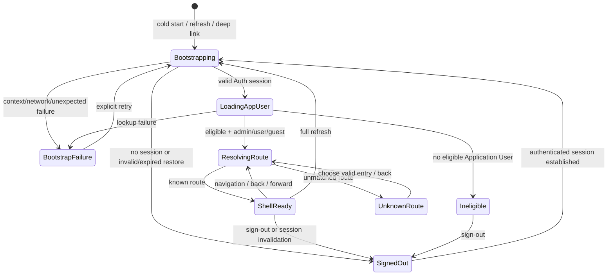

# Application Shell Experiment Review / Design Refinement v2

- Review date: 2026-09-16
- Review type: Independent Review / Experiment Design Refinement
- Status: Review complete; experiment not implemented
- Source Work Order: [`../work-orders/application-shell-experiment-review-v2.md`](../work-orders/application-shell-experiment-review-v2.md)
- Research context: [`../../knowledge/maps/nook-technical-platform.md`](../../knowledge/maps/nook-technical-platform.md)

## Executive Judgment

Primary Draft 的方向正確，但若把所有 lifecycle、三種 `user_type`、真正 backend denial、完整 RWD、browser failure 與 global error handling 一次視為單一必須通過的 runtime experiment，scope 會過大，也容易把 demo 偷偷養成 framework。建議保留**一個刻意可拋棄的 Shell artifact**，但將研究拆成兩個有獨立 Evidence 與 Stop Condition 的 phase：

1. **Phase 1 — Lifecycle / User Context Probe**：先證明 bootstrap、Authentication Identity、Application User eligibility、`user_type`、route resolution、coarse visibility、direct entry 與 invalidation 的 deterministic state transition。
2. **Phase 2 — RWD / Browser Interaction Probe**：只在同一組已收斂 state fixtures 上，證明 iPad-first chrome、touch navigation、viewport transition、refresh 與 browser history 的 observable behavior。

這不是兩套 application，也不要求 Phase 1 選定 production framework。Phase 2 可以延用 Phase 1 artifact；兩個 phase 分開記錄，是為了避免 layout 問題與 lifecycle 問題互相遮蔽。

`app_user.user_type = admin / user / guest` 是本 Review 的既定 architecture input。它只適合 coarse Navigation / Feature Entry Visibility，不是 Role Entity、Permission set 或 RBAC。任何 client-side hidden entry、route guard 或 fixture outcome 都不得被描述為 authoritative Backend Authorization。

## 1. Scope Assessment

### 應保留的最小 Shell responsibility

- 一個 top-level chrome / header。
- 一個 responsive Navigation surface。
- 一個 route/content outlet，使用 synthetic pages。
- 一個能辨識目前 Authentication / Application User Context 的 affordance，以及 sign-out action。
- 一個 global bootstrap/loading region 與一個 unexpected-error region；兩者不可把 feature-level validation 全吸進 Shell。
- cold start、direct/deep link、refresh、back/forward 與 unknown route 的可觀察 outcome。
- `admin`、`user`、`guest` 三種 coarse entry visibility。
- sign-out、invalid/expired session 或 context replacement 後，舊的 privileged navigation、content 與 cached context 同步失效。

### 應縮小或移出的內容

- 不做 production dashboard、CRUD page、Form / Table / Dialog、Design System 或 component-library comparison。
- 不把所有 Supabase Auth failure mode 重跑一次。既有 Experiment A 只證明基本 login/session path，且明列 reload persistence、expiration、refresh 與 logout 尚未驗證；Shell experiment 只補與 Shell state ownership 直接相關的代表性狀態。
- 不重新證明完整 Backend Authorization architecture。既有 Experiment B / C 已顯示 Authentication Success 不等於 Application Access，且 `HTTP 200 + rows=[]` 可能無法區分 no data 與 no access；本次只需讓 UI 與 Evidence 明示 client visibility 非授權結論。
- 不加入 offline/PWA、cross-tab synchronization、multiple simultaneous accounts、OAuth/passkey、animation polish、accessibility certification 或所有 Safari quirk。它們缺乏本次必要 requirement，會造成 checklist inflation。

## 2. Recommended Phase Split

### Phase 1 — Lifecycle / User Context Probe

使用 deterministic test controls 或 fixtures 進入有限狀態，不建立管理 UI，也不讓使用者自行配置 arbitrary permission：

- `restoring-session`
- `anonymous-or-invalid-session`
- `authenticated-but-ineligible`
- `eligible-admin`
- `eligible-user`
- `eligible-guest`
- `application-context-failure`
- `resolved-route` / `unknown-route`

Phase 1 的重點不是 UI 好看，而是同一 URL 與同一 fixture 組合總是得到同一 state/outcome；transition log 或可複製的 structured snapshot 應至少包含 scenario、requested route、session state、eligibility outcome、`user_type`、visible entry IDs、resolved outcome 與 invalidation result，但不得輸出 token 或完整 Session。

Expired session 不必建立精密倒數計時器。只要一個 deterministic 的「restore 得到 invalid/expired outcome」fixture，證明 Shell 清除 Application User Context 並轉入 signed-out outcome 即足夠。Network failure 也只需要放在 Application User Context/bootstrap boundary 的一個代表性 failure；無須模擬每個 request layer。

### Phase 2 — RWD / Browser Interaction Probe

固定使用 `eligible-admin`（最大 navigation set）和至少一個 reduced set（建議 `eligible-guest`），在 viewport matrix 中觀察：

- chrome 與 content 不互相遮擋、無必要 horizontal page overflow；
- navigation 在 expanded / collapsed 模式間行為一致；
- touch target 可操作，menu opening、selection、dismiss 與 focus 不產生 dead end；
- portrait / landscape transition 後沒有 duplicated overlay、stale breakpoint state 或 content 被困在不可見區；
- direct URL、refresh、back/forward 保留 route semantics，不把所有 entry 重置成 home；
- loading、unknown route 與 unexpected error region 在 narrow viewport 仍可辨識並可恢復或離開。

不要求對每個 `user_type × lifecycle state × viewport` 做笛卡兒積。Lifecycle matrix 在 Phase 1 驗證，Phase 2 只選最大與縮減 navigation set 做 responsive interaction，避免測試數量膨脹而沒有新資訊。

## 3. Runtime Evidence vs Platform Design / Rule

| Concern | 本次分類 | 合格輸出 / 理由 |
| --- | --- | --- |
| cold start / direct link 的 transition order 與 route outcome | Runtime Evidence | 以可重現 scenario、URL、observable state snapshot 證明 |
| session restore success、invalid/expired outcome、sign-out invalidation | Runtime Evidence | 驗證 Shell 不顯示 stale identity、privileged entries 或 content；不外推完整 Session Policy |
| Application User eligibility 與 `user_type` context 載入 | Runtime Evidence | 需區分 Authentication Identity 與 Application User Context |
| 三種 `user_type` 的 coarse entry visibility | Runtime Evidence | 使用固定 synthetic fixture；證明呈現行為，不宣稱授權 |
| unknown route、bootstrap network failure、unexpected error region | Runtime Evidence | 每類一個代表性、deterministic outcome 即可 |
| refresh、back/forward、orientation / viewport transition、touch menu | Runtime Evidence | 需在指定 browser/viewport 留下操作結果 |
| hidden Navigation / direct route 不是 Backend Authorization | Platform Rule，附最小 runtime illustration | Rule 由 trust boundary 決定；可展示 direct entry 仍會到 backend-controlled denied/neutral outcome，但不重做 security matrix |
| `user_type` 僅為 single coarse classification | Confirmed Platform Design input | 不由 demo 發明，也不得擴張成 role/permission semantics |
| eligibility 定義、inactive/deleted user policy、default `user` migration semantics | Platform Design / Business Rule | Work Order 未提供完整正式 contract，不能靠 synthetic fixture 決定 |
| route taxonomy、default route、403/404 wording、return URL policy | Platform Design / Product Rule candidate | Experiment可比較 outcome，不能把 fixture 文案升格成正式規則 |
| Session lifetime、refresh policy、multi-tab policy | Platform/Auth Rule | 本次只觀察 chosen scenarios，不決定 production policy |
| browser-safe config 只含 public values，secret 不進 client | Platform Security Rule / static inspection | 不需要用 runtime 泄漏 secret 來「驗證」；artifact config 可做 source inspection |
| global vs feature error ownership | Platform Design candidate | 本次只驗 Shell 能承接 bootstrap/unexpected failure；business validation 留給 Feature UI |
| framework、router、state library、component library | Deferred implementation choice | 單一 demo 成功不足以形成 Platform Rule |

### 最小 Backend Authorization illustration

推薦建立一個 synthetic `admin-inspector` entry：

1. `admin` 看得到入口；`user` / `guest` 看不到入口。
2. `user` / `guest` 仍可直接輸入該 URL，證明 hidden menu 並未阻止 request/route attempt。
3. route outcome 清楚標記為 `entry-not-offered` 或 client routing outcome，且畫面明示「not an authorization verdict」。
4. 若 baseline 中已有不需變更 Supabase/DB 的安全 synthetic backend endpoint，可再記錄 backend 的 authoritative denied/empty outcome；若沒有，就用 documented stub boundary / neutral explanation，將真正 denial 標為未驗證，不得假造 HTTP 403。

如此可以展示 trust boundary，而不新增 policy、database object、Role/Permission model 或一輪完整 security experiment。尤其既有 Evidence 已指出 RLS empty rows 不自動等同 explicit authorization denial，因此不得把空集合改標成 `403`。

## 4. Revised Lifecycle / State Model

### State invariants

- `Bootstrapping` 尚未確定 context 時，不可短暫顯示前一位使用者的 navigation 或 protected content。
- `SignedOut` 與 `Ineligible` 不可持有 `user_type`；兩者應分開，因為「未 Authentication」與「已 Authentication 但無 Application eligibility」不是同一件事。
- 只有 `eligible + user_type resolved` 才能產生 visibility set；unknown `user_type` 必須 fail closed 到明確 unsupported/context-error outcome，不可默認成 `admin`，也不應擅自利用 database default 補救 malformed runtime data。
- route resolution 應在 context 可用後才決定 entry presentation，但 direct URL 必須保留 requested target，讓 backend / product rule 能給出可觀察 outcome，而非 redirect loop。
- sign-out 或 session invalidation 必須以單一 transition 清除 identity-derived Shell state、Application User Context、privileged navigation 與當前 privileged content。Feature-specific server data cache 的清除策略屬後續 implementation design，但本 probe 至少不可在畫面留下舊 content。
- back/forward 是 route transition，不應重新建立第二份 Auth listener 或 Bootstrap instance；refresh 才是新的 cold bootstrap。
- retry 必須由 error state 明確觸發，不做無限自動 redirect/retry loop。

### 刻意不納入的 state

Background token refresh race、multi-tab sign-out propagation、offline queue、suspended-tab resume 與 long-idle iPad memory eviction 都可能重要，但目前沒有足夠 production Session Policy 或代表性 requirement。記為 future assurance，不阻擋本次 focused experiment。

## 5. `user_type` Visibility Fixture

### Synthetic feature entries

| Entry ID | 說明 | `admin` | `user` | `guest` |
| --- | --- | :---: | :---: | :---: |
| `home` | 所有 eligible Application User 的 neutral landing page | Visible | Visible | Visible |
| `workspace` | 一般 authenticated work entry，不做真實 Feature UI | Visible | Visible | Hidden |
| `admin-inspector` | 僅用於觀察 coarse admin entry 差異的 synthetic page | Visible | Hidden | Hidden |

這個三列 staircase 是最低有辨識力的 matrix：每種 `user_type` 都得到唯一且容易核對的 visibility set，又沒有 per-action permission、allow/deny override、multiple roles、menu configuration table 或 dynamic menu framework。

### Representation rules

- `user_type` 應顯示為 current Application User Context 的一個唯讀 label，可由 deterministic scenario selector 切換 fixture；selector 必須標明 `Test control`，不能偽裝成 production「切換角色」功能。
- fixture 資料與 entry list 固定在 experiment source；不要建立 Role editor、Permission checkbox 或 database-maintained menu。
- Navigation 與 content outlet 應使用相同的 entry metadata 或同一個純判定函式，以便測試 consistency；但不要因三列資料就建立可擴張的 policy engine。
- `guest` 在此是已建立 Application User Context 的 coarse type，不可未經正式 contract 就等同 anonymous visitor。
- visibility snapshot 應記錄 stable entry IDs，而不是只依賴 screenshot 或 menu 文案。

## 6. RWD Observable States / Viewport Matrix

Device 名稱只描述目標使用情境；Evidence 應同時記錄實際 CSS viewport 寬高、orientation、browser/version 與 input method，避免把模擬 viewport 當成實機 iPadOS Evidence。

| Target | 建議 reference viewport | 必看 Shell states | 主要 observation |
| --- | --- | --- | --- |
| iPad landscape（primary） | `1024 × 768` CSS px | admin ready、guest ready、menu interaction、deep link、error | expanded/collapsed rule、touch reachability、content width、orientation return |
| iPad portrait（primary） | `768 × 1024` CSS px | admin ready、guest ready、menu open/closed、loading、unknown route | overlay/drawer dismiss、no occlusion、rotation cleanup |
| iPhone narrow | `390 × 844` CSS px；另以 `320px` width 做 stress check | admin maximum nav、guest reduced nav、deep link、error | no horizontal page overflow、header/action wrapping、scroll and touch access |
| Desktop sanity | `1440 × 900` CSS px | admin ready、direct link、back/forward | layout 不被 mobile rule 破壞；不做 desktop design optimization |

Reference viewport 不是 device support contract。實機 iPad Safari 若可用，應完成 landscape ↔ portrait、touch menu、refresh、back/forward；DevTools/emulation 可用於快速 matrix，但 Evidence 必須標示 `emulated`。iPhone 若只有 emulation，本次可形成 provisional layout Evidence，不能宣稱 iPhone Safari runtime verified。

最低 screenshot / structured evidence 不需涵蓋每個 cell，建議為：

1. iPad landscape `admin` maximum navigation。
2. iPad portrait menu open 與選取後 closed。
3. iPhone narrow `admin` maximum navigation 及 deep-linked content。
4. iPhone narrow `guest` reduced navigation。
5. desktop `admin` sanity state。
6. 一份 orientation transition、refresh、back/forward 的操作 log；動態行為不可只靠 screenshot 證明。

Safe-area inset、virtual keyboard resize 與 standalone/PWA display mode 本次 deferred，除非實機 probe 直接暴露 blocker。Hover-specific interaction不得是 entry 的唯一方式。

## 7. Revised Acceptance / Stop Condition

### Phase 1 acceptance

- 指定 fixtures 對 cold start、deep link、valid restore、invalid/expired restore、ineligible user、context failure、unknown route、sign-out 產生 deterministic、可重現的 state/outcome。
- Authentication Identity、Application User eligibility 與 `user_type` 在 state 與呈現上明確分層；`guest` 未被當成 anonymous synonym。
- `admin` / `user` / `guest` 精確產生 visibility matrix 中的 stable entry ID sets，且沒有 Role/Permission/RBAC 或 dynamic menu model。
- direct navigation 到未顯示 entry 仍有明確 route outcome，報告不把 hidden entry、client guard、empty rows 或 stub response 宣稱為 Backend Authorization。
- invalidation / sign-out 後，舊 identity、`user_type`、privileged navigation 與 privileged content 在下一個 observable stable state 全部消失；沒有 transient stale privileged Shell state 被測得。
- retry、redirect、route resolution 無 loop；scenario evidence 能辨識 requested route 與 final outcome。
- client artifact/source 未包含 secret、`service_role`、password、token 或完整 Session output。

### Phase 2 acceptance

- 在表列四類 viewport 完成指定 observable states；iPad landscape/portrait 與 iPhone narrow 是 primary，desktop 只做 sanity check。
- maximum/reduced navigation set 在 responsive mode 下皆可觸達；無必要 horizontal page overflow、不可關閉 overlay、被 chrome 遮蔽的主要 content 或 hover-only entry。
- iPad 實機（若可得）完成 touch menu、landscape ↔ portrait、refresh 與 back/forward；若只有 emulation，結論明確降級並列為 limitation。
- viewport/orientation transition 不留下 duplicated navigation overlay、錯誤 breakpoint state或 stale content；direct/deep link 與 history outcome仍一致。

### Overall stop condition

當上述 acceptance 取得足以回答 Shell responsibility、lifecycle ownership、coarse visibility 與 minimum responsive interaction 的 Evidence，就停止。以下均**不是**為了完成本 experiment 而必須加入：production framework migration、完整 router abstraction、central store、Design System、real Feature UI、permission administration、dynamic menu、全面 browser certification、production Session Policy 或新的 backend security implementation。

若某一 outcome 只能靠尚未定義的 Business / Platform Rule 判斷，記錄為 open decision，而不是擴張 demo 代替 Claire + Primary Agent 做 architecture decision。

## 8. Deferred Decisions

- **Framework / rendering model**：不由本 probe 選定 production SPA/SSR/meta-framework。
- **Router**：不決定 package、nested-route convention、code splitting、loader API 或正式 URL taxonomy；只要求 history/deep-link semantics 可觀察。
- **State management**：不選 global store library。先用最小 explicit state model；不得把 feature data、form state與 server cache塞進 Shell store。
- **Server-state cache**：cache library、deduplication、retry/backoff、cross-tab invalidation 等待 representative Feature / Session Policy。
- **Component library / Design System**：不比較或選定；Shell CSS 只需支援結構、touch usability與 state legibility。
- **Production authorization UX**：正式 401/403/404 mapping、request-access flow、support wording與 audit behavior 需另有 Backend contract / Product Rule。
- **Role / Permission evolution**：未來若需要 multiple roles 或 fine-grained mapping，另開 Role / Permission design，不擴張 `user_type`。
- **Production menu governance**：local synthetic entry list 不是 database-driven menu 或 metadata framework 的先例。
- **Detailed Feature UI**：CRUD、validation、toolbar、table/form/dialog responsive pattern 留給 Application UI Maintenance Pattern。

任何 demo implementation choice 都應在 report 標為 `experiment mechanism`，不可僅因「這次可運作」就升格為 Platform Rule。

## 9. Hidden Assumptions, Risks, and Unknowns

| Item | 風險 / 未知 | 本次處置 |
| --- | --- | --- |
| `guest` semantics | 可能被誤解為 anonymous；Work Order 只確認它是 `app_user.user_type` 值 | 明確建模為 eligible Application User Context；正式 business meaning 待確認 |
| Application User eligibility | active/inactive/deleted、lookup contract與 failure semantics 尚未在本 Work Order 定義 | 使用 synthetic outcomes，不創造正式 rule |
| Default `user` | Database default 不代表 Shell 遇到 missing/unknown value 可以自行 fallback | runtime malformed/unknown type fail closed；migration rule deferred |
| Backend denial Evidence | 現有 RLS Evidence 常呈現 empty rows，不能等同 403 | reuse only accurately described baseline；沒有 safe endpoint 就不宣稱 denial verified |
| Session expiration | Experiment A 未驗證 reload persistence、expiration、refresh、logout | 本 probe 做 deterministic Shell invalidation；真實時間/refresh assurance 仍可能需要後續 targeted test |
| Browser history | Router choice deferred，但 browser history behavior 又需驗證 | 以 user-observable URL/outcome寫 acceptance，不把 library API 寫成 rule |
| Responsive dimensions | CSS viewport 不等於所有實體 device、zoom、browser chrome或 Split View | 記錄實際 viewport/environment；不宣稱 universal device support |
| iPad orientation | resize、Safari chrome、keyboard、Split View 可能改變可用 viewport | 先驗 primary full-browser transition；keyboard/Split View 遇到 blocker 才升級 scope |
| Test fixture coupling | selector 若混入 production path，可能成為 privilege spoofing 入口 | fixture mode 僅屬 experiment；明顯標示，不複製到 production |
| Flicker / stale state | persisted client data 可能在 context resolved 前顯示前一位 user content | bootstrap invariant 預設先遮蔽 identity-derived UI，並觀察 invalidation |
| Error boundary scope | 把所有錯誤集中到 global region 會吞掉 feature-specific recovery | 只涵蓋 bootstrap與unexpected shell failure；feature validation deferred |
| Accessibility | touch usable 不等同 WCAG conformant | 基本 keyboard/focus/semantic sanity值得做，但 formal audit不在本次 acceptance |
| Evidence provenance | screenshot 只能證明靜態畫面，emulation也不是實機 runtime | state snapshot + action log + environment metadata；清楚標示 Human/Runtime/Emulated evidence |

## 10. Proposed Final Experiment Scope

建立一個 disposable、single-artifact Application Shell probe，以固定 synthetic routes 與 deterministic Application User Context fixtures，分兩個 evidence phase 回答：

1. Shell 是否能將 Auth restore、Application User eligibility、`user_type`、route resolution、coarse entry visibility、failure與 invalidation 組合成 deterministic lifecycle，且不留下 stale privileged UI或 redirect loop？
2. 相同 Shell state 是否能在 iPad landscape/portrait、iPhone narrow與 desktop sanity viewport 維持可操作的 navigation、deep link、refresh、history與orientation behavior？

fixture 僅包含 `home`、`workspace`、`admin-inspector`，分別形成 `admin = 3`、`user = 2`、`guest = 1` 的 coarse visible set。直接輸入 hidden entry URL 用來展示 client visibility 不是 security boundary；Backend Authorization 只引用既有正確 Evidence或一個可安全重用的 backend outcome，不能偽造或藉本次擴張 backend scope。

Experiment 完成時交付 source、scenario/transition results、environment metadata、必要 screenshots與limitations。它不交付 production Shell、Role/Permission/RBAC、dynamic menu、Feature UI、framework decision或 Platform Architecture final decision。

## Review Limitations

- 本次為 repository snapshot 的 design review，沒有建立或執行 Shell artifact，因此本文所有新 lifecycle/viewport項目都是 recommendation，不是 runtime-verified result。
- 未存取 optional historical Issue #35；Work Order 已明定其不可用不構成 blocker，且 v2 Work Order 為 authoritative contract。
- 未存取或修改 `nook-works`；`user_type` architecture context完全採用 Work Order內嵌的 confirmed input。
- Repository既有 Experiment A 明列多項 Session lifecycle尚未驗證；因此不能從既有基本 login Evidence推導 refresh、expiration或logout均已可靠。
- iPhone runtime、iPad orientation/history與 desktop compatibility在本次 Review 中均未執行；未來 Evidence必須區分實機與 emulation。
