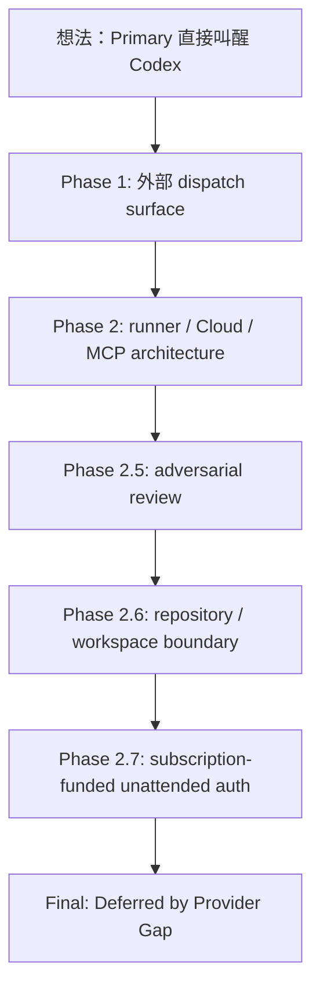
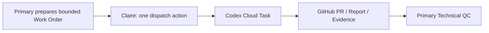

# P-CODEX-PHONE — ChatGPT → Codex Autonomous Dispatch Reconnaissance

- Date: 2026-09-15
- Status: `Verified / Deferred by Provider Gap`
- Implementation result: **No production or PoC code was created**
- Final architecture verdict: **WAIT**
- Primary Agent: 墨衡
- Implementation / Recon Agent: Codex
- Human Environment / Business Constraint Owner: Claire

## 1. Why this experiment existed

這個 Experiment 起源非常單純，而且非常人類：Claire 不想繼續當 ChatGPT Primary 與 Codex 之間的人工傳話筒。

現況協作鏈是：

```text
Primary prepares Work Order
→ Claire copies / dispatches it to Codex
→ Codex works and publishes GitHub evidence
→ Claire tells Primary that Codex finished
→ Primary reviews GitHub evidence
```

這個流程的真正浪費不是「人類參與」，而是人類被迫承擔沒有判斷價值的 middleware responsibility。

Research Question 因此是：

> 能否在保留 GitHub 作為 durable collaboration boundary 的前提下，讓 ChatGPT Primary 自主 dispatch Codex，Codex 自己工作並留下 GitHub-visible evidence，而 Claire 只保留真正需要人類判斷的 authorization / acceptance gate？

這不是要把人類從軟體工程移除，而是要把人類從訊息轉送層移除。

---

## 2. Research evolution

這次研究沒有一開始就知道正確問題。它沿著幾層邊界逐步收斂：



研究過程的重要價值，是每一次「好像可以」都被拆成更精確的 provider / runtime / credential question，而不是直接蓋一個看起來會動的服務。

### Phase 1 — External dispatch reconnaissance

確認了：

- `codex exec` 是可 non-interactive 使用的 CLI execution surface。
- Codex CLI 存在 `[EXPERIMENTAL] codex cloud exec`、status、list、diff、apply 等 Cloud task primitives。
- ChatGPT App / MCP 可以是 caller，但不是 Codex execution host。
- 尚未確認 stable production-supported external Codex Cloud Task API。

Report：`agent-work/reports/2026-09-15-codex-external-dispatch-recon.md`

### Phase 2 — Dispatch experiment design

初始最小候選曾收斂為：

```text
ChatGPT → admission bridge → GitHub Actions → codex exec → validation → GitHub PR
```

這個方案技術上合理，但仍有 caller identity、publication authority、credential isolation 與 execution trust boundary 未解。

Report：`agent-work/reports/2026-09-15-codex-dispatch-experiment-design.md`

### Phase 2.5 — Adversarial validation

Codex 對 Primary Draft 主動找碴後，重要修正包括：

- GitHub Issue 的 actor identity 不等於「可證明只有某一個 Primary instance」。
- Issue trigger 可以作 doorbell，但不應被誤認成 cryptographic caller attestation。
- execution job 與 publication job 應分離。
- 第一個 phone proof 應使用 bounded result / deterministic reconstruction，而不是一開始就讓 model-controlled raw patch 直接獲得 publication authority。
- idempotency、immutable source SHA、event snapshot 與 repository settings 都必須顯式處理。

這輪研究證明了 adversarial multi-agent review 的價值：第二個 Agent 不是把第一個 Agent 的答案重新說一次，而是應主動攻擊其假設。

Report：`agent-work/reports/2026-09-15-p-codex-phone-phase2-5-adversarial-validation.md`

### Phase 2.6 — Repository / workspace boundary

這一輪把「Codex」拆成兩種完全不同的 execution model。

#### Codex Cloud Task

Observed workspace：

- 單一 selected repository snapshot。
- synthetic local branch `work`。
- 沒有一般 Git remote。
- 沒有 shell-visible GitHub CLI login。
- Create PR 是 product publication boundary，不等於 workspace 自帶 general-purpose GitHub credential。

因此 Cloud Task 應 operationally 視為：

> single selected-repository / selected-source workspace + separate publication flow

而不是一台已登入 Claire GitHub、可以自由跨 private repositories 漫遊的普通 workstation。

#### `codex exec`

`codex exec` 則是 runner 上的 process。CLI contract 支援 `--cd` 與 `--add-dir`，因此 repository boundary 主要來自 host filesystem、sandbox、network 與 credential，而不是 Codex UI task selector。

這得到一條非常重要的 reusable principle：

> **Autonomous reasoning is not autonomous authorization.**

AI 能決定執行 Git command，不代表它憑空擁有 GitHub authority。

Report：`agent-work/reports/2026-09-15-codex-github-boundary-recon.md`

### Phase 2.7 — Subscription-funded unattended authentication

這一輪才真正撞到最後那堵牆。

已確認的產品 / auth-mode boundary：

- ChatGPT sign-in 的 Codex usage 使用 eligible ChatGPT plan allowance。
- API key sign-in 使用 OpenAI API pricing。
- `codex exec` 可以沿用 CLI 的 ChatGPT authentication state。

所以問題不是「Plus 額度不能跑 CLI」。

真正缺的是：

> 如何讓 ephemeral / unattended runner 在不保存 Claire 個人 refreshable ChatGPT credential、不要求每次人類 device login、也不改走 API billing 的前提下取得 subscription-backed Codex identity？

目前沒有找到符合全部條件的 supported provider contract。

Report：`agent-work/reports/2026-09-15-codex-subscription-auth-automation-recon.md`

---

## 3. What was actually verified

### 3.1 Stable findings

1. **GitHub 是合理的 durable collaboration boundary。**
   Work Order、Report、commit、PR、evidence 都可以跨 ChatGPT / Codex session 保存，不要求兩個 Agent 共用完整 conversation context。

2. **Codex Cloud Task 與 `codex exec` 必須分開建模。**
   Cloud Task 是 provider-managed selected workspace；`codex exec` 是 caller-controlled runtime process。把兩者混在一起會導致錯誤的 repository / credential assumptions。

3. **Workspace access、GitHub authority、publication authority 是不同能力。**
   有 checkout 不代表能 fetch；有 remote 不代表能 push；能 push 不代表能 PR；能 PR 不代表能 merge/deploy。

4. **ChatGPT subscription entitlement 與 API billing 是兩套不同的成本邊界。**
   技術上最簡單的 GitHub Actions + API key 路線，對本研究的 business constraint 並不是最佳方案，因為會讓已支付的 ChatGPT Codex allowance 閒置，同時增加 API 支出。

5. **Device auth 是 headless-machine friendly，不是 unattended workload identity。**
   它讓遠端機器不需要本機 Browser，但仍需要人類在另一個裝置完成授權。

6. **複製個人 Codex auth store 到 CI 不符合本案的 credential custody boundary。**
   即使技術上可能運作，也會把 Claire 的 refreshable personal identity 變成長期 automation secret，blast radius 與 lifecycle 都不合理。

7. **Persistent authenticated runner 技術上 plausibly workable，但 architecture cost 不值得。**
   為了消滅一次人工 dispatch，反而新增 credential-bearing host、patching、availability、incident response 與 re-login responsibility，違反 iPad-first managed-runtime 方向。

8. **`codex cloud exec` 是值得保留觀察的 provider clue，但目前仍是 Experimental，且沒有解決 caller authentication。**

---

## 4. Architecture candidates and why they were not selected

| Candidate | Technical feasibility | Cost / Security / Ops | Current judgment |
| --- | --- | --- | --- |
| GitHub Actions + OpenAI API key + Codex | Strong | 額外 API 計費；不使用既有 Plus allowance | Rejected by cost model |
| GitHub Actions + device login every run | Works interactively | Claire 每次仍要授權 | Reject: not autonomous |
| GitHub Actions + restored ChatGPT auth store | Possibly workable | Personal refresh credential becomes CI secret | Reject: credential custody |
| Persistent authenticated runner | Plausible | Always-on/on-demand host + security/ops burden | Reject: disproportionate |
| `codex cloud exec` from authenticated caller | Plausible | Caller still needs durable ChatGPT auth; command Experimental | Watch / Deferred |
| Stable provider Cloud Task API with subscription workload identity | Desired | Not currently exposed as supported contract | Wait |

這裡最重要的 Technical Decision 不是「哪個 workaround 勉強能跑」，而是：

> **不要為了自動化一個低成本的人類 gate，建立比 gate 本身更昂貴、更高風險、更難維護的 credential infrastructure。**

---

## 5. Final current architecture

在禁止額外 API 支出、禁止 escrow personal ChatGPT credential、禁止 Claire 維護 persistent runner 的條件下，目前最合理的 supported workflow 仍然是：



這不是理想終點，但它的責任分工其實已經相當乾淨：

- Primary：Research Question、Architecture、Work Order、Technical QC。
- Claire：一次性 provider authorization / dispatch gate，以及 Functional Acceptance。
- Codex：implementation / runtime research / evidence publication。
- GitHub：durable shared state。

被保留下來的唯一人工 middleware 是「啟動 Codex task」這一小段，而不是 requirement translation、technical relay 或 evidence copying。

---

## 6. Why WAIT is an experiment result, not surrender

本 Experiment 沒有產生任何可部署 Code，卻產生了高價值結果。

我們已經知道：

- 問題不在 model intelligence。
- 問題不在 Codex 能不能 non-interactive execution。
- 問題不在 GitHub 能不能當 durable state。
- 問題不在 Cloud Task 是否存在。
- 問題甚至不在 Plus allowance 是否能供 Codex CLI 使用。

真正的 provider gap 是：

> **缺少一個 supported、short-lived、project-scoped、unattended、subscription-entitled Codex workload identity / task invocation boundary。**

這使 WAIT 成為合理的 Architecture Decision Candidate，而不是「做不到所以算了」。

當 provider 正在快速演進時，等待可能比自建 workaround 更低成本、更安全，也更容易在未來直接利用正式能力。

---

## 7. Re-open triggers

只要出現下列任何一項，就值得重新開啟 P-CODEX-PHONE：

- Stable Codex Cloud Task API / tool。
- ChatGPT / Codex subscription workload identity。
- GitHub OIDC → Codex entitlement federation。
- Official short-lived CI credential helper。
- ChatGPT Plugin / Connector 可直接 create Codex task。
- GitHub integration 可在不匯出 user session 的情況下，以 connected user 的 ChatGPT allowance 啟動 Codex。
- `codex cloud` 脫離 Experimental，並公開 stable auth / lifecycle / billing contract。

重新開啟時，不需從零研究。先拿新的 provider capability 對照本 Experiment 的缺口即可。

---

## 8. Future architecture if the missing primitive appears

最理想的未來 shape 仍然是：

```text
Primary
→ thin authenticated dispatch primitive
→ Codex task / execution
→ GitHub durable evidence
→ Primary QC
```

若未來要支援 public / private 多 repository：

- Private repo 可以自然承擔 repo-local dispatch / execution boundary。
- Public repo 不應因為 public Issue surface 就直接暴露昂貴 execution trigger；可以由 private control plane routing 到 target-owned workflow。
- Central dispatcher 若出現，應優先做 routing，而不是持有 broad multi-repo write credential。

但這些都應等真實 multi-repo demand 與 provider auth primitive 成熟後再實作，不提前蓋一座「以後也許有用」的 agent platform。

---

## 9. Meta-learning: what this experiment taught about Agent Engineering

這次沒有 Code 的實驗反而清楚展示幾個 Agent Engineering 原則。

### 9.1 Agent capability 是系統組合，不是 model feature list

一個有效 Agent 不只靠模型推理能力。它需要：

```text
Reasoning
+ durable state
+ tool access
+ authorization
+ execution surface
+ evidence
+ failure / escalation boundary
```

缺任何一層，都可能讓「理論上會做」變成「系統上不能安全做」。

### 9.2 Durable memory 應外部化

ChatGPT 與 Codex 不需要共享完整 conversation memory。Repository 已經可以承擔更可靠的 shared state：

- Work Order 保存 intent / scope。
- Reports 保存 observation。
- Git history 保存時間軸。
- Evidence 保存可重用結論。
- Knowledge Map 保存 research context。

真正穩健的 Agent System 不應把唯一記憶寄放在任何單一 context window。

### 9.3 Independent Agent review 比「兩個 Agent 一起想」更有價值

Primary 與 Codex 分別保留獨立視角，再用 GitHub artifacts 對答案互相 QC，可以降低同一套錯誤假設一路污染設計、implementation 與 validation 的風險。

理想分工不是兩個 Agent 各做 50%，而是：

> 每個 Agent 在自己的 responsibility / runtime 內做到 100%，再讓不同 evidence source 互相挑錯。

### 9.4 Negative evidence should be preserved

「沒有 stable Cloud Task API」、「Cloud Task workspace 沒有普通 Git remote」、「ephemeral runner 沒有安全 subscription workload identity」都不是無用失敗。

它們是 provider capability map 的牆。

牆被記錄下來，未來 provider 改變時才知道哪裡值得重新探測，而不是下一個 Agent 再從頭撞一次。

---

## 10. Current judgment

**Result：Verified Provider Gap / Deferred.**

P-CODEX-PHONE 的 Business / Collaboration Intent 仍然成立，但在 2026-09-15 的 provider capability 下，不值得進入 Phase 3 implementation。

我們選擇等待，不是因為不知道怎麼做 workaround，而是因為已經知道 workaround 的成本、credential risk 與維運責任高於它所消除的人工作業。

> The goal was never to remove humans from software development. The goal was to remove humans from being middleware.

這次電話沒有接通，但地下管線圖已經畫完。下一次電信公司真的把交換機蓋出來，我們知道該從哪個接線盒開始。