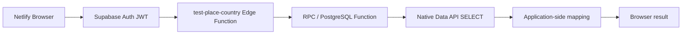
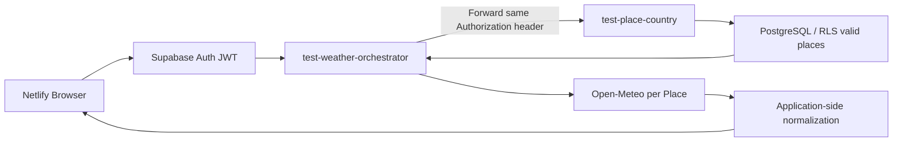
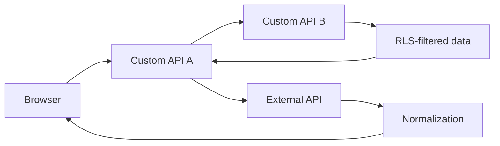

# Experiment C — Supabase Custom API

## C-0 — Supabase Edge Function Deployment Lifecycle

- Date: 2026-09-12
- Status: Completed / Verified

GitHub source → GitHub Actions → Supabase CLI → Edge Function，以及 GitHub source → ChatGPT Supabase Connector → Edge Function 均已驗證。iPad-first lifecycle 不要求 Local Desktop / Mac。完整 lifecycle Evidence 延續既有 C-0 結論。

---

## C-DB-1 — Database-centric Custom API

- Date: 2026-09-13
- Status: Completed / Verified
- API: `supabase/functions/test-place-country/index.ts`
- Browser: `public/custom-api/index.html`
- PostgreSQL Function: `public.test_get_valid_places()`

### Verified chain



具有效 Application Access 的 Claire 測試帳號得到 HTTP 200、2 個 Place；TU01 / TU02 均 Authentication Success，但因 tested RLS / Application Access behavior 得到 HTTP 200 + `rows=[]`。這支持 caller-scoped RLS boundary 在 tested chain 中被保留。

RLS empty rows 仍不能區分 `No Data` 與 `No Application Access`。Explicit Business Authorization / 403 semantics 尚未驗證。Custom API 內 Native INSERT / UPDATE / DELETE 也不屬於本 Probe；Native CRUD 已由 Experiment B 驗證。

---

## C-EXT-1 — Custom API Orchestration / External API

- Date: 2026-09-13
- Status: Completed / Runtime Verified
- Weather API: `supabase/functions/test-weather-orchestrator/index.ts`
- Internal API: `supabase/functions/test-place-country/index.ts`
- Browser: `public/custom-api-orchestration/index.html`
- Deployment: `.github/workflows/deploy-test-weather-orchestrator.yml`
- External Provider: Open-Meteo Weather Forecast API

### Research Question

Supabase Edge Function 是否能承擔 Nook Works 常見的 orchestration workload：一支 Custom API 以 caller identity 呼叫另一支 Custom API，取得 RLS-filtered application data，再呼叫 External API，最後 normalize 成 Browser 可使用的 response？

### Probe design



Weather Orchestrator 刻意不直接碰 DB / RPC。`test-place-country` 負責「caller 可見的有效 Place」，Weather API 負責「取得這些 Place 的外部天氣並 normalize」。本 Probe 不寫 DB、不測 CUD、不加 scheduler / queue / retry framework，也不做 Open-Meteo Multiple Locations optimization。

### Deployment Evidence

PR #16 經 Primary Agent Technical QC 後 merge 至 `main`，merge commit：

`08cdadb027490e298ae72f9ff0ba1d5440cdc8de`

Claire 由 GitHub UI 觸發 `Deploy Test Weather Orchestrator` workflow。GitHub Actions Run `34762954904` completed / success；checkout 正是上述 main commit。Supabase CLI `2.117.0` 實際輸出：

```text
Deploying Function: test-weather-orchestrator (script size: 4.5 kB)
Deployed Functions on project cctonymfrxneonxryqei: test-weather-orchestrator
```

Workflow 使用 GitHub Actions secret `SUPABASE_ACCESS_TOKEN`，log 中值被 masking；deploy command 沒有 `--no-verify-jwt`。

### Runtime Evidence

#### 1. No Authorization header

直接開 Weather endpoint，未攜帶 Authorization：

```json
{"code":"UNAUTHORIZED_NO_AUTH_HEADER","message":"Missing authorization header"}
```

這證明未取得 / 未攜帶 caller JWT 的 request 不會進入正常 orchestration path。精確語意是 Authentication 未成立，不應寫成「登入後但未授權」。

#### 2. Valid Application Access identity

具有效 Application Access 的 Claire 測試帳號由 Netlify Browser UI 實測：

```text
HTTP 200
valid_place_api_status = 200
place_count = 2
weather_success_count = 2
weather_failure_count = 0
```

札幌與雪梨兩筆均 `provider_status = 200`，並成功 normalize temperature min/max、precipitation、weather code、sunrise、sunset、daylight duration 與 timezone。

因此下列完整 runtime chain 已實際成立：



#### 3. TU01 / TU02

TU01 與 TU02 均能正常 Authentication，但兩者 observable result 相同：

```json
{
  "experiment": "custom-api-orchestration",
  "valid_place_api_status": 200,
  "place_count": 0,
  "weather_success_count": 0,
  "weather_failure_count": 0,
  "rows": []
}
```

Browser UI 顯示沒有可見有效地點，因此沒有發出 Open-Meteo request。這與 C-DB-1 Evidence 一致，並進一步支持 caller identity / RLS visibility behavior 在 `Weather API → Valid Place API` 的 API composition 中仍被保留。

這仍不是 explicit Business Authorization Evidence：`HTTP 200 + rows=[]` 無法區分真正無資料與沒有 Application Access。

### Place-local D-1 observation

本次同一個 request 中：

- Sapporo / `Asia/Tokyo` → `weather_date = 2026-09-12`
- Sydney / `Australia/Sydney` → `weather_date = 2026-09-13`

Open-Meteo request 使用 `timezone=auto`，因此「D-1」應理解為 **each Place timezone based previous local calendar date**，而不是 Browser、Claire 所在地或 server 的單一全域昨天。

這是未來 Daily Weather Batch Specification 必須明確寫出的 Business / Time Semantics，否則「昨天」會成為一顆很有文化底蘊的時區地雷。

### Verified capability baseline

```text
Supabase Edge Function outbound HTTP                         VERIFIED
Custom API → Custom API composition                         VERIFIED
Caller Authorization forwarding through tested API chain   VERIFIED
Caller-scoped RLS visibility through composition            VERIFIED
External API per-Place calls                                VERIFIED
Application-side external response normalization            VERIFIED
Zero-visible-place short-circuit                            VERIFIED
GitHub Actions → Supabase deployment                        VERIFIED
Explicit Business Authorization / 403 semantics             NOT YET
DB CUD inside Custom API                                     NOT TESTED HERE
Retry / queue / scheduling / long-running behavior           NOT TESTED HERE
Secret management for external provider credential           NOT TESTED (Open-Meteo probe needs no key)
```

### Architecture implication, not Production Decision

C-DB-1 與 C-EXT-1 合併後，Supabase Edge Functions 已對兩種 Nook Works 預期主要 workload class 留下 runtime Evidence：

1. Database-centric / application processing.
2. Internal API composition + External API orchestration.

因此 `Supabase = Auth + Primary Custom API + PostgreSQL/RLS` 的候選架構可信度進一步提高；Netlify 可自然維持 Web/UI delivery responsibility。這仍不是 Production Architecture Decision，Pure Compute / longer-running、runtime limits、observability、cost 與需要時的 explicit Business Contract 仍待後續研究。

---

## C-BSA-1 — Custom API / Backend Service Database Access

- Date: 2026-09-15
- Status: Candidate / Research Design Ready
- Representative workload: Nook Works Daily Weather Batch transaction semantics

### Why this experiment exists

D-BATCH-1 暴露了 formal `place` permission failure，但真正問題不屬於 Cron。C-BSA-1 要回答的是：**Supabase Edge Function 作為 trusted backend service 時，應如何以明確、最小且可治理的權限存取 PostgreSQL objects，以及當一個 Business Operation 需要多個 SQL statement 時，transaction boundary 應落在哪一層。**

本實驗只使用 synthetic / formal-style secured objects，不為實驗直接放寬 Nook Works 正式資料表。

### Research model

C-BSA-1 不把「Backend Service 能不能碰 DB」當成單一問題，而拆成三個互相相關但必須分開觀察的模型：

```text
C-BSA-1
├─ Access Model
│  ├─ service identity
│  ├─ PostgreSQL object privilege
│  └─ RLS boundary
├─ Operation Model
│  ├─ Native Data API CRUD
│  ├─ RPC / PostgreSQL Function
│  ├─ EXECUTE privilege
│  └─ SECURITY INVOKER / SECURITY DEFINER
└─ Transaction Model
   ├─ multiple Data API requests
   ├─ atomic PostgreSQL operation
   └─ rollback boundary
```

核心原則是假說而非既定結論：

> **Transaction boundary 應由擁有完整 Business Operation 的那一層決定。**

C-BSA-1 的目的之一，就是用 Supabase / PostgreSQL runtime evidence 驗證這個原則在 Nook Platform 候選架構中如何落地。

### Phase A — Backend Service Access / Privilege Boundary

建立 synthetic secured table，刻意控制 table grants 與 RLS，透過 Edge Function 使用 backend service identity 執行 `SELECT / INSERT / UPDATE / DELETE`。

至少觀察：

1. backend service 具 table privilege、RLS policy 不允許一般 caller 時，實際行為為何；
2. backend service 缺少 `SELECT` privilege 時，SELECT 是否確實失敗；
3. backend service 具 `SELECT` 但缺少 `UPDATE` 時，是否形成可觀察的 least-privilege boundary；
4. table privilege 與 RLS 是否能在 Evidence 中被清楚區分，而不是把所有 permission failure 混成「RLS 問題」。

Research output：定義 Frontend User Access 與 Backend Service Access 是否應採不同 trust / authorization model。

### Phase B — RPC / PostgreSQL Function Operation Boundary

建立 synthetic PostgreSQL Functions，比較：

- `SECURITY INVOKER`
- `SECURITY DEFINER`
- caller `EXECUTE` privilege
- caller 自身是否具有 underlying table write privilege

重點不是證明 PostgreSQL Function「可以跑」，C-DB-1 已有 RPC mechanism evidence；本 Phase 要回答：

> Nook Platform 是否需要支援「Backend Service 不直接取得廣泛 table write privilege，而只允許 EXECUTE 經批准的 database operation」這種 operation-level security model？

此 Phase 只產生 feasibility / security-boundary evidence，不預先指定它必須成為 Preferred Pattern。

### Phase C — Atomic Business Transaction

以 Daily Weather Batch 的 transaction semantics 建立 synthetic representative case，不直接操作正式 `daily_weather`。

初始狀態：

```text
Synthetic Place A
→ existing weather row = OLD
```

Business Operation：

```text
DELETE OLD
→ INSERT NEW
```

刻意讓 INSERT 違反 constraint。驗收結果必須能區分：

```text
Atomic behavior:
INSERT fails
→ DELETE rolls back
→ OLD remains
→ NEW does not exist
```

與：

```text
Non-atomic behavior:
DELETE succeeds
→ INSERT fails
→ OLD is lost
```

比較至少兩條候選路徑：

```text
Pattern A
Edge Function
→ Native Data API DELETE
→ Native Data API INSERT
```

```text
Pattern B
Edge Function
→ one RPC / PostgreSQL Function call
→ DELETE
→ INSERT
→ success or rollback as one database operation
```

目前 Research Hypothesis：**多次獨立 Data API request 不應被假設共享同一 database transaction；需要 atomic multi-statement Business Operation 時，完整 operation 很可能必須收斂至同一 PostgreSQL transaction boundary。** 此項必須以 runtime evidence 驗證，不得直接升格為 Platform Rule。

### Optional Phase D — Caller-owned / Composed Transaction

若 Phase C 完成後仍有平台決策價值，再驗證 composed database operations：

```text
Outer Business Operation
→ Inner Function A
→ Inner Function B
→ B fails
→ whole outer operation rolls back
```

研究問題是：較小的 reusable DB operation 不自行決定 commit，而由擁有完整 Business Operation 的 caller 決定 transaction boundary，在 PostgreSQL / Supabase 下如何實際表現。

此 Phase 預設 Deferred，避免 C-BSA-1 膨脹成 PostgreSQL Transaction 百科全書。

### Evidence discipline

本實驗必須分別留下：

- successful access evidence；
- intentionally denied access evidence；
- RLS 與 object privilege 的區分；
- RPC INVOKER / DEFINER behavior；
- forced transaction failure 前後的 synthetic row state；
- API / RPC response 與 database state 的對照。

不得只以 HTTP 200 或 scheduler / function invocation success 宣稱 transaction 或 authorization 已驗證。

### Expected platform decisions after C-BSA-1

C-BSA-1 完成後，應足以支援下列 Platform Pattern 討論，但不預寫答案：

1. Backend Service 的標準 service identity 與 least-privilege object access。
2. 何時允許 Native Data API direct CRUD。
3. 何時應使用 RPC / PostgreSQL Function 封裝 application/database operation。
4. 需要 multi-statement atomicity 時，transaction owner 應位於何處。
5. Frontend User Access、Backend Service Access、Atomic Business Operation 是否應被視為三種不同平台責任。

### Privacy / provenance note

本 Research Design 的 transaction semantics 只引用 Nook Works repository 中已存在的 Daily Weather Batch Specification 作為 representative workload。私人、非 repository 的歷史業務程式與內容不得寫入 Playground、Evidence 或後續公開文件。