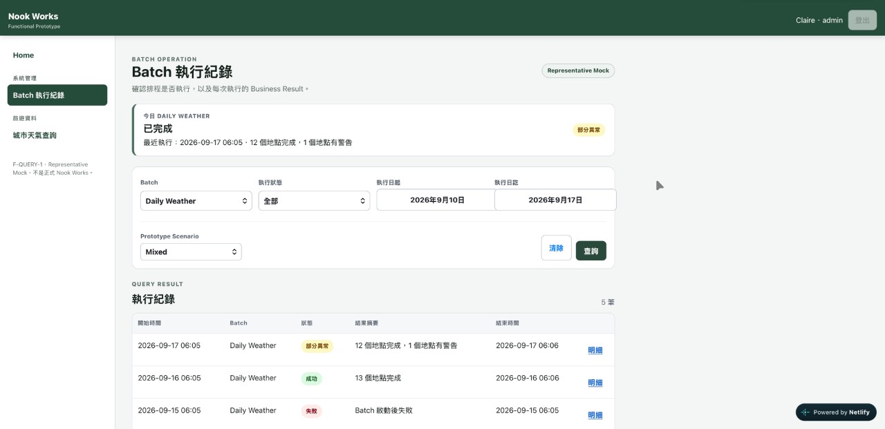

# F-QUERY-1 — Representative Read-only Query Vertical Prototype

## Experiment Identity

- Date: `2026-09-17`
- Phase: `Nook Works Technical Platform / Requirement-driven Vertical Slice`
- Type: `Representative Functional Prototype`
- Business Requirement Source: `nook-works/docs/business/specifications/batch/daily-weather.md`
- Shell Baseline: `S-SHELL-1`
- Status: `In Research / Functional Shape Reviewed`
- Data: `Representative Mock Fixture`

## Research Question

第一個真實 Nook Works Requirement 以 Batch 執行記錄作為 Requirement Carrier，但本 Experiment 的研究目標不是替 `batch_log` 客製一張漂亮頁面，而是從真實需求中找出可重用的 **Generic Read-only Query Feature Pattern**。

核心問題是：

> 一個最單純的唯讀查詢 Feature，Pattern 應承載哪些 Functional responsibilities；哪些複雜度應留在 Feature Requirement、API Contract、Detail、Export 或其他獨立 capability，而不是塞進 Query Pattern？

## Why Mock First

Native Data API / View Read Model capability 已有既存 Evidence。第一輪主要未知不是「Browser 能不能讀 DB」，而是 Functional Interaction 是否合理。

因此本輪刻意使用 deterministic representative fixtures，讓 Claire 可以無成本推翻欄位、資訊階層、查詢條件與 responsive behavior，而不讓既有 API / DB implementation 反過來綁架 Functional Design。

```text
Formal Business Requirement
→ Shell-like Functional Prototype
→ Representative Mock Data
→ Claire Functional Review
→ Generic / Feature-specific responsibility split
→ Technical Responsibility Analysis
→ Real Shell Integration
→ Real Data Mechanism
→ Current Working Pattern
```

## F-QUERY-1A — First Functional Review Findings

第一版 Prototype 值得留下，不是因為它是一個應被保存的舊版本，而是因為這張畫面讓後續幾個 Pattern 判斷有了可見的起點。當時頁面同時帶著 Daily Weather summary、Batch-specific result semantics、預先載入的 inline detail，以及尚未收斂的 Safari form-control behavior。若只閱讀修正後的結論，外部讀者很難知道這些判斷究竟是在反對什麼。



> **Visual Evidence boundary：**這張截圖保存的是「什麼畫面改變了判斷」，不是一份需要永久維護的舊版 Live Demo。Prototype 可以繼續演進；值得保存的是能解釋 Decision Rationale 的 Evidence。

### 1. Generic Query Page 與 Feature-specific Content 必須分離

第一版把 `今日 Daily Weather` summary 放在 Query 上方，這是過度深入 Batch / Daily Weather business semantics 的設計。

Generic Read-only Query Pattern 的候選結構收斂為：

```text
Feature Identity
→ Query Criteria
→ Query Result
```

其中：

- `Feature Identity`、`Query Criteria`、`Query Result` 是候選共通責任。
- `Batch`、`執行狀態`、`執行日期`、實際 Result columns 是 Feature-specific content。
- Dashboard / Today Summary / KPI 類資訊不得因第一支 Requirement 是 Batch 就偷渡成 Query Pattern 標準區塊。

### 2. Result Region 使用中性語意

頁面 Feature Name 可為 `Batch 執行記錄`，但共通 Result Region 使用 `查詢結果` 等中性語意。Platform 不應要求每支 Feature 客製共通區塊名稱，除非 Requirement 明確需要另一種 composition。

### 3. Feature Identity 需要 Stable Identifier

Business display name 適合與 User / SA 溝通，但 Pool PG、Issue、Specification、Log 等技術協作不應只依賴自然語言名稱。

目前確認：Feature 頁面需要可見的 Stable Feature Identifier，作為 Business / SA / PG 的共同 communication anchor。

尚未決定正式名稱是 `feature_code`、`function_code`、`program_id` 或其他，也尚未決定 Business Function 與實際 Program 的 mapping cardinality。這是後續 Shell metadata / Technical Design 問題，不由 Prototype 偷跑定義。

### 4. Safari / iPhone Form Control 是 Platform Constraint

Safari 實機曾觀察到 native date/select/input/button 的 intrinsic sizing、disabled appearance 與 narrow-screen layout 差異。Prototype 已加入 feature-local normalization candidate；需實機回看後才能決定是否提升為 Platform UI Rule。

### 5. List-only 與 Master → Detail 是不同 Pattern

第一版將完整 fixture detail 預先放在 Browser memory，點 `明細` 只做 inline expand。這個 Prototype 行為不應被誤認為 Technical Decision。

```text
A. List-only Query
Query → Result List

B. Master → Detail Query
Query → Result List → Select Record → Dedicated Detail Surface
```

Master → Detail 的 retrieval / presentation 應在真正需要它的 Requirement 中研究，不由最單純 Query Pattern 預先承載。

## F-QUERY-1B — Second Review: Design Rationale

第二輪 Review 沒有再發現需要大量調整畫面的問題，反而收斂出 Query Pattern 背後的設計理由。這些 rationale 比某一版 Prototype 的 CSS 更耐久。

### 1. Query Pattern 不承載 Backend Data Complexity

一張普通 Query Page 背後可能是：

- 一個 table。
- 多個 tables / views 的 join。
- Derived / mapped fields。
- Custom API orchestration。

這些是 **Data Access / API Contract / Technical Specification** 的責任，不是 Query UI Pattern 的責任。

```text
Query Pattern
→ 定義 User 如何給條件、取得結果、理解結果

API / Data Contract
→ 定義結果如何取得、由哪些資料來源組成、預設排序與資料邊界
```

因此 Pattern 不因後端是 `3 views + 5 tables` 就增加 UI complexity。後端複雜不等於 User 應該看見複雜。

### 2. Nook Works Candidate：Result Table 不使用 Horizontal Scroll

這不是因為 scrollbar 難看，而是刻意保留 **design pressure**。

Result List 的目的，是讓 User 在目前工作情境下辨識、比較、選擇資料，而不是把 database record 或 API response 全欄位攤在畫面上。

```text
Result columns 放不下
→ 先檢查是否真的都是辨識 / 比較所需的精華資訊
→ 非必要完整資訊進 Detail
→ 大量資料外部使用需求另評估 Export capability
```

因此 Nook Works 目前採取：

> **Result Table 不以 horizontal scrolling 作為正常設計能力。欄位必須由 SA / Requirement 精準收斂至可在結果區合理閱讀的資訊。**

這是目前 Nook Works 的 Candidate Decision，不宣告為所有企業系統的普遍真理。未來若真實 Requirement 證明某個 Feature 必須同時比較大量欄位，可以重新挑戰此 Decision。

Horizontal scroll 的問題不只是 UI。它容易把「再加一欄」變成近乎零成本，進而形成欄位膨脹，接著自然衍生 freeze columns、不同 Feature 固定不同欄數、複雜 table interaction 等需求。技術上的容錯能力可能反而削弱 Functional Design 的約束。

欄位增加也可能擴大 payload；若欄位牽涉 join、large text、derived data 等，還可能增加 DB query、serialization、network transfer 與 Browser rendering 成本。但這些成本需依實際 Data Contract 評估，不能把「欄位多」直接等同「Server 一定很慢」。

### 3. Query List、Detail、Export 是不同 Capability

```text
Query List
≠ Detail
≠ Export
```

- **Query List**：辨識、比較、選擇目標資料。
- **Detail**：閱讀單筆較完整資訊。
- **Export**：將較大量 / 較完整資料帶離 Application UI 供外部處理。

Export 即使 technically read-only，也可能具有更高的 data exfiltration risk。User 可以逐筆查閱資料，不代表 User 應自動取得大量下載能力。因此 Export 不能只是因為 Table 欄位塞不下就順手加一顆「匯出 Excel」按鈕；它需要獨立 Requirement，並視資料性質評估 Authorization、Scope、Masking、Volume Limit、Audit 等安全責任。

### 4. Sorting Responsibility 取決於 Result Ownership，不以 Browser 為預設

第二輪原本只討論「完整 Result Set 已一次載入 Browser」的情境，因此得到：完整且 bounded 的結果可以由 Browser 做 Single-column Sorting。這個判斷在該前提下仍成立，但不能擴寫成 Enterprise Query 的一般預設。

```text
A. Complete-set Browser-owned
Query
→ Backend 回傳完整、明確 bounded 的 Result Set
→ Browser 對完整集合做 Single-column Sort
→ Browser 再呈現目前頁面 / 區段

B. Server-paged
Query
→ Backend 對完整符合條件集合 Filter / Sort
→ Backend 只回傳目前 page
→ User 改排序
→ 重新送出 sort state
→ Backend 對完整集合重新排序後再切 page
```

Server-side Pagination 存在時，不能只排序 Browser 手上的目前 page records，卻讓 User 以為排序的是完整結果。

目前仍不因 UI library 免費提供 Multi-column Sort 就自動擴張 capability；但「Single-column」與「由哪一層執行 Sort」是兩個不同問題。

### 5. Multi-select 是 Field Capability，不是所有 Dropdown 的 Default

現代 UI / Browser / API 技術可以支援 Query Criteria 的 multi-select，例如：

```text
status ∈ {SUCCESS, FAILED, RUNNING}
```

但 Generic Query Pattern 不應讓所有 dropdown 預設 multi-select。是否 multi-select 由 Feature Requirement / Field semantics 決定。

理由除了 SQL / Query performance 必須依實際條件評估，也包含 Select All、Clear All、空集合語意、mobile interaction、query-state representation 等額外 complexity。技術可做，不等於免費，也不等於應該到處做。

## F-QUERY-1C — Enterprise Query Scale / Pagination Review

這一輪沒有新增 Browser prototype，而是用企業查詢的實務經驗重新挑戰「最小 Query Pattern」的尺度。主要修正是：**Minimal 不等於殘缺，也不能暗中假設資料量永遠小。**

### 1. Business Query Boundary 與 Technical Result Boundary 必須分離

SA / Requirement 應定義有業務意義的查詢範圍，例如：

- 起訖日期預設值與最大區間；
- 必填條件；
- 哪些條件可以留空；
- 哪些查詢範圍對 User 的工作情境才合理。

但 Platform / Technical Design 不能把系統安全寄託在「SA 一定限制得很好」或「User 不會 key 錯」。Technical boundary 仍需讓單次 request / response 的成本保持可控。

```text
Business Query Boundary
→ 控制「User 合理上應該查多少」

Technical Result Boundary
→ 控制「即使符合很多資料，單次操作也不能把系統拖垮」
```

Storage size、matching-row count、network payload 與 Browser rendering cost 是不同尺度。資料庫只有數萬筆不代表 Browser 應一次載入數萬筆。

### 2. Enterprise-style Query Baseline 應納入 Server-side Pagination / Sorting

對會持續累積資料的 business system，較安全的 baseline candidate 是：

```text
Criteria
+ Sort Field / Direction
+ Page Number
+ Page Size
        ↓
Validated Query Contract
        ↓
Server-side Filter
→ Server-side Sort
→ Server-side Page
        ↓
Bounded Rows
+ Total Count / Page Metadata
```

即使符合條件有 3,000、30,000 或更多 records，也不代表一次 response 要承載全部 records。

因此 Server-side Pagination / Sorting 不再被視為「等未來資料大了才研究的附加能力」；對 enterprise-style query，它們是 baseline technical behavior candidate。真正仍可 deferred 的，是 Cursor / Keyset Pagination、Infinite Scroll、Multi-column Sort 等較進階策略。

### 3. Page Navigation 與 Page Size Selector 是基本完整性

一個合理的 paged Query Result，至少應考慮：

- total result count；
- current page；
- previous / next；
- page number navigation；
- page size selector；
- page-size change 後的 deterministic behavior。

常見 page size options 例如 `10 / 20 / 50`，但數值本身不應被升格為 universal platform law。Platform 更適合提供一致的 pagination contract、page-size behavior 與 UI primitive；Feature / Product 可依資料密度與 Requirement 選擇 default / allowed options。

候選 Query State 因此至少包含：

```text
criteria
sortField
sortDirection
pageNumber
pageSize
```

### 4. Complete-set Browser Processing 保留為明確受限的 Variant

若某個 Feature 能證明完整 Result Set 小、bounded、成本合理，Browser-side sorting / pagination 仍可作為較簡單的 implementation variant。

但 architecture 不再從「小資料完整載入」出發，然後等資料變大才翻修。對 General / Enterprise Query，更安全的預設是讓 query contract 從一開始就能表達 paging / sorting，而不是假設 Storage scale 小就等於 interaction scale 小。

### 5. Known Pattern-2 Pressure：Master → Detail Return Context

雖然 Master → Detail 尚未正式進入 Pattern 2 Experiment，但已知有一個不能忽略的 functional pressure：

> User 從 Query Result 進入某筆 Detail，再返回 Result List 時，應回到原本工作的資料上下文，而不是無條件回 Page 1。

而且真正的 return anchor 不一定是原本的 `pageNumber`。如果在 User 看 Detail 期間有新資料插入，原本那筆 record 可能從 Page 32 移到 Page 33。

因此未來 Pattern 2 應研究的不是單純 `restore page = 32`，而是：

```text
Query Context
- criteria
- sortField / sortDirection
- pageSize

Return Anchor
- selected stable row identity

Return
→ 重新取得最新 query state
→ 找出 anchor record 在目前排序集合的位置
→ 回到包含該 record 的 page
```

這目前是 **Known Design Pressure / Open Contract**，不是 F-QUERY-1 已驗證的 Pattern Rule，也不在本輪偷跑實作。

Domain 若規定資料不可 physical delete、只能 Void / Cancel / Invalidate，stable row identity 的可追溯性會更強；是否允許 hard delete 仍屬正式 Business Domain Rule，不由 Generic Query Pattern 擅自發明。

### 6. Pattern 的核心仍是 Responsibility Boundary，但 Baseline 必須完整

目前收斂後，Read-only Query Pattern 仍不需要知道後端 schema，也不需要承載 Detail / Export 的完整 lifecycle。

但「保持簡單」不再等於省略正常 Query 工作所需的基本 paging behavior。

```text
Feature Identity
→ Query Criteria
→ Query Action
→ Query Result
   ├─ curated result columns
   ├─ total count / page metadata
   ├─ page navigation
   ├─ page size
   └─ single-column sorting
```

其中 criteria semantics 與欄位能力由 Requirement 定義；pagination / sorting 的 execution owner 則依 operation contract 決定，enterprise-style baseline 優先採 server-side bounded execution。

## Current Judgment

F-QUERY-1 現在形成的主要判斷不是「Query 越小越好」，而是：**Generic Query Pattern 應保持責任清楚、功能完整，並對資料成長保持技術上的防禦性。**

Nook Works / General Platform 目前的 Query Pattern Candidate：

- 共通骨架為 Feature Identity / Query Criteria / Query Action / Query Result。
- Result columns 由 Requirement 精準選擇，不把完整 record 當成 Result List。
- Nook Works Result Table 不以 horizontal scroll 作為正常能力。
- Enterprise-style baseline 納入 Server-side Pagination / Sorting、total count、page navigation 與 page size。
- 完整且明確 bounded 的小型 Result Set 仍可採 Browser-side sorting / pagination 作為受限 variant。
- Multi-select 是 Criteria Field capability，由 Requirement 指定。
- Business Query Boundary 與 Technical Result Boundary 分離：SA 收斂合理查詢範圍，Technical Platform 保證單次 interaction cost 有界。
- Detail / Export 仍是獨立 capability boundary。
- Master → Detail 的 return-context / row-anchor semantics 已列為下一 Pattern 的 Known Design Pressure，不在本輪假裝解完。
- Backend table/view/join complexity 屬 API / Data Contract，不滲入 Query Pattern。

這些仍是 **Current Judgment / Pattern Candidate**，不是跨所有 Requirement 永久不可推翻的戒律。下一個真實 Requirement 可以重用它，也可以拿證據把它打壞。

## Evidence Boundary

本 Prototype 的 Browser 行為形成 **Functional / Interaction Evidence**。F-QUERY-1C 的企業查詢尺度、pagination baseline 與 Master → Detail return-context 內容屬 **Design Review / Architecture Pressure**，不是新的 runtime Evidence。

本 Experiment 仍不證明正式 Data Access、Authorization、Detail Retrieval、Export Security、Server-side Pagination implementation 或 Production UI Architecture。

`Feasibility Evidence ≠ Preferred Pattern ≠ Platform Rule ≠ Production Implementation.`

## Next Step Boundary

F-QUERY-1 不需要為了「讓 Experiment 看起來比較完整」直接把所有 future capability 寫進 Prototype。

但下一步正式 Nook Works 技術設計若要實作 Query，不應再假設完整 Result Set 必然一次載入；應以可表達 criteria / sort / page / pageSize / total-count semantics 的 bounded operation contract 為起點。

真正還需要由後續 Requirement 驅動的研究，包括 Master → Detail return context、Export、Cursor / Keyset Pagination、Multi-column Sort、Infinite Scroll 等。平台不需要預先替不存在的 User 許三個願望，但也不能把方向盤和煞車一起列成「以後再說」。