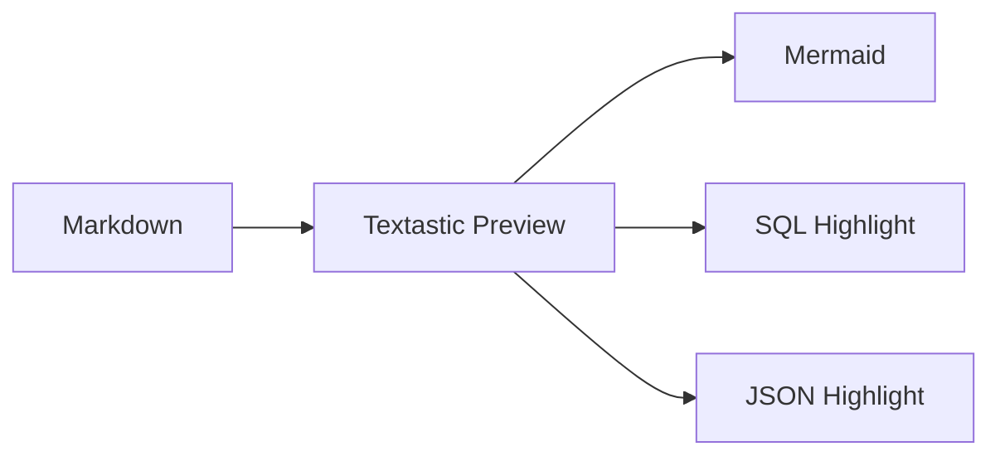

<!-- sql-highlight-debug -->

# T-TXT-2 — Markdown Syntax Highlighting Showcase

這份文件持續長大，用來驗證 Textastic Markdown Preview 對明確標記語言的 fenced code block 套用 Highlight.js，同時保留森林系樣式、Mermaid 與人工換頁。

> 診斷模式：頁面最上方暫時顯示 T-TXT-2 HIGHLIGHT DEBUG。這是實驗探針，不是正式 Preview 功能。

## SQL：查詢語法

```sql
-- 查詢啟用中的區域代碼
SELECT
    oid,
    type_code,
    item_code,
    item_name,
    enabled
FROM comm_code
WHERE type_code = 'REGION'
  AND enabled = true
ORDER BY item_code;
```

## SQL：DDL / DML / type / value

```sql
CREATE TABLE test_highlight (
    oid bigint GENERATED BY DEFAULT AS IDENTITY PRIMARY KEY,
    item_code varchar(40) NOT NULL,
    amount numeric(12, 2) DEFAULT 0,
    created_at timestamptz DEFAULT now()
);

INSERT INTO test_highlight (item_code, amount)
VALUES ('A001', 1250.50);

UPDATE test_highlight
SET amount = amount + 100
WHERE item_code = 'A001';
```

## JSON：object / array / value types

```json
{
  "experiment": "T-TXT-2",
  "feature": "markdown-syntax-highlighting",
  "enabled": true,
  "version": 2,
  "score": 98.5,
  "notes": null,
  "languages": [
    "sql",
    "json"
  ],
  "theme": {
    "name": "forest",
    "darkCodePanel": true,
    "autoDetect": false
  }
}
```

## JSON：比較接近 API / config 的巢狀資料

```json
{
  "request": {
    "method": "POST",
    "path": "/api/batch/run",
    "headers": {
      "content-type": "application/json"
    },
    "body": {
      "batchCode": "WEATHER_DAILY",
      "region": "TW",
      "dryRun": false,
      "retryCount": 3
    }
  },
  "result": {
    "success": true,
    "rowsAffected": 12,
    "error": null
  }
}
```

## 無 language fence：不應該被自動猜測

```
SELECT this_should_stay_plain
FROM no_auto_detection;

{"this":"should also stay plain"}
```

## Inline code：不應該被影響

例如 `SELECT * FROM comm_code;` 與 `{"enabled":true}` 仍然只是一般 inline code。

## Mermaid regression check



<!-- pagebreak -->

## Page Break regression check

如果 Preview 在上方仍顯示淡淡的 `PAGE BREAK`，而 Print 時能正常強制換頁，代表既有功能沒有被 syntax highlighting 搞壞。人類今天暫時守住了相容性。
