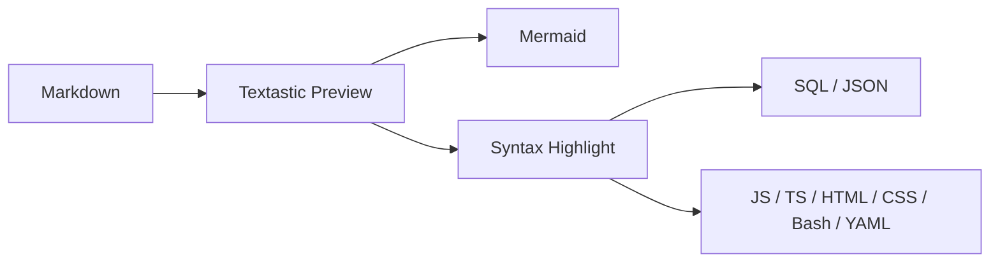

# T-TXT-2 — Markdown Syntax Highlighting Showcase

這份文件持續長大，用來驗證與展示 Textastic Markdown Preview 對明確標記語言的 fenced code block 套用 Highlight.js，同時保留森林系樣式、Mermaid 與人工換頁。

## SQL：查詢語法

```sql
-- 查詢啟用中的區域代碼
SELECT
    oid,
    type_code,
    item_code,
    item_name,
    enabled
FROM comm_code
WHERE type_code = 'REGION'
  AND enabled = true
ORDER BY item_code;
```

## SQL：DDL / DML / type / value

```sql
CREATE TABLE test_highlight (
    oid bigint GENERATED BY DEFAULT AS IDENTITY PRIMARY KEY,
    item_code varchar(40) NOT NULL,
    amount numeric(12, 2) DEFAULT 0,
    created_at timestamptz DEFAULT now()
);

INSERT INTO test_highlight (item_code, amount)
VALUES ('A001', 1250.50);

UPDATE test_highlight
SET amount = amount + 100
WHERE item_code = 'A001';
```

## JSON：object / array / value types

```json
{
  "experiment": "T-TXT-2",
  "feature": "markdown-syntax-highlighting",
  "enabled": true,
  "version": 2,
  "score": 98.5,
  "notes": null,
  "languages": ["sql", "json", "javascript", "typescript", "html", "css", "bash", "yaml"],
  "theme": {
    "name": "forest",
    "darkCodePanel": true,
    "autoDetect": false
  }
}
```

## JSON：比較接近 API / config 的巢狀資料

```json
{
  "request": {
    "method": "POST",
    "path": "/api/batch/run",
    "headers": {
      "content-type": "application/json"
    },
    "body": {
      "batchCode": "WEATHER_DAILY",
      "region": "TW",
      "dryRun": false,
      "retryCount": 3
    }
  },
  "result": {
    "success": true,
    "rowsAffected": 12,
    "error": null
  }
}
```

## JavaScript：DOM / async / function

```javascript
// 讀取 API 並更新頁面狀態
async function loadBatchStatus(batchCode) {
  const response = await fetch(`/api/batch/${batchCode}`);
  const result = await response.json();

  if (!response.ok) {
    throw new Error(result.message || 'Batch status request failed');
  }

  document.querySelector('#batch-status').textContent = result.status;
  return result;
}
```

## TypeScript：Edge Function 常見型別與 async

```typescript
type BatchRequest = {
  batchCode: string;
  dryRun: boolean;
  retryCount?: number;
};

async function runBatch(request: BatchRequest): Promise<Response> {
  const payload = {
    ...request,
    requestedAt: new Date().toISOString()
  };

  return Response.json(payload, { status: 200 });
}
```

## HTML：Markdown renderer 客製片段

```html
<section class="experiment-card" data-status="verified">
  <h2>Textastic Markdown Preview</h2>
  <p>Syntax highlighting is <strong>enabled</strong>.</p>
  <button type="button" aria-label="Run preview">Preview</button>
</section>
```

## CSS：森林系 Preview 元件

```css
.experiment-card {
  padding: 1rem;
  border: 1px solid var(--line);
  border-radius: 12px;
  background: var(--panel);
}

.experiment-card[data-status="verified"] strong {
  color: #557f6e;
  font-weight: 700;
}
```

## Bash / Shell：技術文件常見 CLI

```bash
# 呼叫本機觀察端點，失敗時立即停止
set -e

API_URL="http://localhost:8888/api/batch/run"
curl --fail --silent --show-error \
  -H "Content-Type: application/json" \
  -d '{"batchCode":"WEATHER_DAILY","dryRun":true}' \
  "$API_URL"
```

## YAML：GitHub Actions workflow

```yaml
name: Deploy Playground

on:
  workflow_dispatch:
  push:
    branches:
      - main

jobs:
  deploy:
    runs-on: ubuntu-latest
    steps:
      - name: Checkout repository
        uses: actions/checkout@v4

      - name: Run verification
        run: |
          echo "Verifying Textastic showcase"
          test -f experiments/textastic-markdown/markdown_head.html
```

## 無 language fence：不應該被自動猜測

```
SELECT this_should_stay_plain
FROM no_auto_detection;

{"this":"should also stay plain"}
```

## Inline code：不應該被影響

例如 `SELECT * FROM comm_code;` 與 `{"enabled":true}` 仍然只是一般 inline code。

## Mermaid regression check



<!-- pagebreak -->

## Page Break regression check

如果 Preview 在上方仍顯示淡淡的 `PAGE BREAK`，代表既有 Preview enhancement 沒有被 syntax highlighting 搞壞。Print 強制換頁行為由 T-TXT-1 的既有 Human Environment Evidence 支持；若未重新做 Print Preview，不把這份 showcase 冒充成新的 Print regression evidence。
