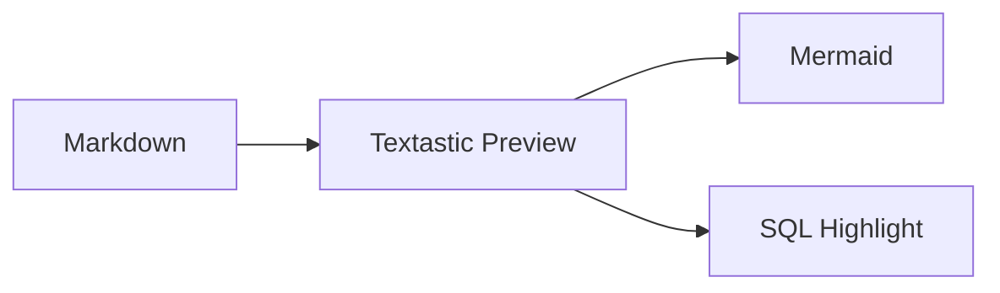

# T-TXT-2 — SQL Syntax Highlighting Probe

這份文件只驗證一件事：Textastic Markdown Preview 能否只對明確標記為 `sql` 的 fenced code block 套用 Highlight.js，並維持既有森林系樣式。

## SQL：應該出現語法上色

```sql
-- 查詢啟用中的區域代碼
SELECT
    oid,
    type_code,
    item_code,
    item_name,
    enabled
FROM comm_code
WHERE type_code = 'REGION'
  AND enabled = true
ORDER BY item_code;
```

## SQL：DDL / DML / function / number

```sql
CREATE TABLE test_highlight (
    oid bigint GENERATED BY DEFAULT AS IDENTITY PRIMARY KEY,
    item_code varchar(40) NOT NULL,
    amount numeric(12, 2) DEFAULT 0,
    created_at timestamptz DEFAULT now()
);

INSERT INTO test_highlight (item_code, amount)
VALUES ('A001', 1250.50);

UPDATE test_highlight
SET amount = amount + 100
WHERE item_code = 'A001';
```

## 無 language fence：不應該被自動猜測

```
SELECT this_should_stay_plain
FROM no_auto_detection;
```

## Inline code：不應該被影響

例如 `SELECT * FROM comm_code;` 仍然只是一般 inline code。

## Mermaid regression check



<!-- pagebreak -->

## Page Break regression check

如果 Preview 在上方仍顯示淡淡的 `PAGE BREAK`，而 Print 時能正常強制換頁，代表既有功能沒有被 SQL highlighting 搞壞。人類今天暫時守住了相容性。
