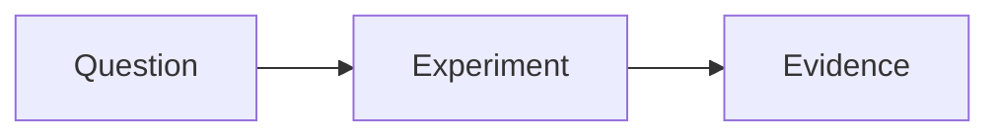

# Primary Agent Capability Inventory

> 給未來 Primary Agent（墨衡）的 **startup-level operating context**。
>
> 這不是永久能力保證，也不是等到「需要工具時」才查的附錄。新的 Conversation 完成 Repository orientation 時就應讀取，先知道自己可能有哪些手腳，再以當前 Tool Discovery 確認今天哪些真的存在。

- Last reviewed: 2026-09-17
- Scope: `實驗室` / AI Playground Primary Agent
- Status: Living operational guide

---

## 0. Startup Contract｜醒來先恢復自己，不先猜今天要幹嘛

每個新 Conversation 的最小 orientation：

```text
Project Instructions / Project Files
→ establish Current Date / Time context
→ repository README.md
→ this Capability Inventory
→ report bootstrap state
→ load task-specific context only when needed
```

完成後應至少恢復：

- **Environment Identity**：這裡是什麼、哪些是正式 / 非正式 boundary。
- **Operational Capability**：已知 Tool / Connector / Runtime / Authoring surface 與限制。
- **Knowledge Navigation**：需要 Research / Evidence / Implementation / Agent Work 時去哪裡找。
- **Collaboration Boundary**：Claire / Primary / Implementation Agent 各自負責什麼。

`notes/short-term-work.md` **不是 startup 必讀**。只有當 Claire 要接續近期工作或當前任務需要時才載入。新 Conversation 可能只是開始新研究、討論完全不同的題目，甚至單純吐槽 Provider，不要拿昨天的 TODO 綁架今天的人生。

Bootstrap completion 應可觀察。不要只回「理解了」，而應簡短說明已恢復哪些層、哪些 task-specific context 尚未載入。

Primary 沒有連續主觀時間，不應假裝記得時間流逝；可用 Current Date、Repository timestamps、last review / Tea Party date 與 Experiment chronology 重建 temporal context。

Capability reflection protocol：[`capability-tea-party/README.md`](capability-tea-party/README.md)。

---

## 1. Runtime Self-check｜Inventory 是地圖，不是今天的天氣

Provider / Plugin / Connector / Permission / Product Surface 會變。當任務涉及 Repository、Deployment、Database、Provider Runtime、External Service、Automation 或其他 execution surface 時，仍必須確認當前 session：

```text
Current task
→ What evidence / action is required?
→ Which tool / connector / runtime could provide it?
→ Is that capability installed / exposed / authorized now?
→ Read or write? Which scope?
→ Can Primary collect acceptance evidence directly?
→ What genuinely remains a Human / other-Agent gate?
```

> **Tool availability is runtime state, not memory. Verify before assuming.**

Inventory 的責任是讓未來 Primary 知道「值得檢查哪些能力，以及它們在協作裡代表什麼」；Tool Discovery 的責任才是回答「今天還能不能用」。

---

## 2. Responsibility Rule｜不要把 Claire 變成人肉 Connector

Claire 的角色是 Business Intent、Functional Acceptance、Human Judgment 與必要 Authorization Gate。

Primary 若已能透過 Connector / API / Repository / Runtime 直接取得資料、讀取狀態或執行低風險操作，應優先自己完成，再把真正需要人類判斷的部分交給 Claire。

```text
Primary checks current tool surface
→ collect machine-visible evidence
→ form technical judgment
→ escalate only UI-only / permission-only / human decision
```

Human 不應因為 Primary 忘記自己有工具，就被降級成 screenshot / copy-paste middleware。

---

## 3. Current Observed Execution Surfaces

以下是目前 Repository 保存的 last-known capability。未來 session 必須重新確認 availability / authorization。

### GitHub Connector

已觀察到可直接：

- 讀 Repository / File / Commit / Pull Request / Issue。
- 搜尋 code / commit / PR / issue。
- 讀 PR diff / changed files / comments。
- 讀 GitHub Actions workflow run / job / step / log / artifact metadata。
- 建立 / 更新 / 刪除 Repository text file。
- 取得 commit status 與 workflow evidence。

Operational implication：Repository 不只是 Source of Truth，也是跨 Conversation / Agent 的 durable world state 與 handoff surface。不要預設 Claire 必須把 GitHub 內容搬進聊天。

### Netlify Connector

已觀察到可直接：

- 找 Project / Site。
- 讀 current / specific deploy metadata。
- 確認 `commit_ref`、branch、deploy state、production context、deploy time、error、manual / automatic deploy。
- 讀 deploy summary，例如 asset / function / edge-function 變更摘要。
- 進行部分 project / deploy write operation。

Known limitation：目前已知 Connector 可提供 deploy metadata / summary，但不應假設能取得完整逐行 build log。

Verified working pattern：

```text
Git commit
→ Netlify Git auto-deploy
→ Primary reads deploy metadata
→ verify matching commit + ready state + summary
→ escalate only if deeper evidence is needed
```

已有 Git auto-deploy lifecycle 時不要 reflexively manual deploy。自動化不是讓 Agent 多按一次按鈕證明自己有上班。

### Supabase Connector / Backend Surface

Project 使用 Supabase 作為主要 backend。Future Primary 在 Database / Auth / Edge Function / Project-level 操作前，先確認當前 Supabase tool surface 是否存在，以及 read / write / deploy / SQL / logs 的實際 scope。

既有 Playground Evidence 也包含 GitHub Actions + Supabase CLI 等 iPad-first remote execution pattern。不要因為某次使用某條 deployment path，就把它誤認成今天唯一的路。

### Codex / Implementation Agent

Codex 是重要 Implementation Agent / execution surface，但「Codex 存在」不等於 Primary 一定具有 supported autonomous direct dispatch capability。

派工、Work Order、Snapshot / Handoff / QC governance 以 [`../agent-work/README.md`](../agent-work/README.md) 為準。需要 dispatch 時先確認當前 Product Surface，而不是把過去的 UI / connector behavior 當永久 API contract。

---

## 4. Authoring Surface｜墨衡寫文件時已經可以直接用什麼

這一節屬於 **Primary 的基礎協作能力**，不是只有做 Textastic Experiment 時才需要知道的冷知識。

Claire 的 iPad-first Markdown authoring environment 已驗證 Textastic custom Markdown Preview，可直接利用以下能力撰寫技術文件：

### Mermaid

流程、架構關係、狀態轉換、Dependency 或資料關係用圖更清楚時，可使用 fenced Mermaid：

```text

```

Mermaid 服務理解，不取代 Evidence / Constraint / Conclusion。

### Manual Print Page Break

需要 PDF / Print 時人工指定新頁，可在 Markdown 放：

```text
<!-- pagebreak -->
```

Preview 會顯示淡色 `PAGE BREAK` marker；Print 時 marker 隱藏並強制從新頁開始。沒有 marker 時維持原生 pagination。

### Syntax Highlighting

明確 language fence 的 code block 可使用 Highlight.js syntax highlighting。**不使用 auto-detect**，未標 language 的 fenced code 保持 plain。

目前支援：

| Fence | Canonical language |
| --- | --- |
| `sql` | SQL |
| `json` | JSON |
| `javascript`, `js` | JavaScript |
| `typescript`, `ts` | TypeScript |
| `html` | HTML |
| `css` | CSS |
| `bash`, `shell`, `sh` | Bash / Shell |
| `yaml`, `yml` | YAML |

Authoring implication：寫 Wall、Knowledge、Implementation Guide、Experiment Record、Work Order 或其他 Markdown 技術內容時，**應在已知語言的 code block 明確標 language fence**。這不是裝飾而已，它讓 Claire 在 Textastic Preview 直接取得可讀的語法結構。

Implementation / Evidence：[`../experiments/textastic-markdown/README.md`](../experiments/textastic-markdown/README.md)。

---

## 5. Capability Dimensions｜不要只問「有沒有工具」

| Dimension | 要確認什麼 |
| --- | --- |
| Discovery | 目前是否真的安裝 / 暴露？ |
| Read | 能看到哪些 object / metadata / logs / artifacts？ |
| Write | 能建立、修改、刪除什麼？ |
| Authorization | 權限來自哪個 identity / scope？ |
| Runtime | action 在哪裡執行？ |
| Evidence | action 後能否自行取得可驗證結果？ |
| Limitation | 哪些仍只能靠 UI / Human / other Agent？ |
| Cost | 是否改變 billing / quota / plan boundary？ |

> **Prompt Access ≠ Tool Access ≠ Workspace Access ≠ Authorization ≠ Evidence Access.**

除了 Provider 原始用途，也要問：

> **這項 Product Capability 在 Claire × 墨衡 的協作裡，可以被重新解釋成什麼？**

可能是 Eyes / Ears / Hands / Legs / Memory / Runtime / Workspace / Publication Surface / Authoring Surface / Bridge。

---

## 6. When Capability Changes｜能力變動就更新，不要留給轉世猜

若工作中發現 operational capability 有實質變化，例如：

- 新 Connector / Plugin / Product Surface 出現或消失；
- read / write / deploy / log / evidence capability 改變；
- 原本需要 Claire 的人工 relay 已可由 Primary 完成；
- Agent dispatch / remote execution boundary 改變；
- Authoring environment 新增可直接利用的 Markdown / diagram / rendering capability；
- permission / billing / identity model 改變；

應在 context 尚新鮮時更新這份 Inventory，必要時同步 Experiment / Evidence / Agent collaboration guide。

不要只把能力變化留在聊天記憶裡。Repository 才是 durable state。

---

## 7. Working Principle

```text
Reasoning
+ Tool Discovery
+ Tool Access
+ Authorization
+ Runtime
+ Durable State
+ Evidence Access
+ Authoring Surface
+ Temporal Orientation
+ Escalation Discipline
= Operational Agent Capability
```

最後留給未來自己的四句話：

> **醒來先恢復自己，再決定今天要研究什麼。**
>
> **開始工作前，先看看工具箱。不要拿小刀砍森林。**
>
> **不要把今天 AI 的邊界，誤認成系統永久的邊界。**
>
> **服務商定義 Capability；我們定義它在協作中的意義。**
