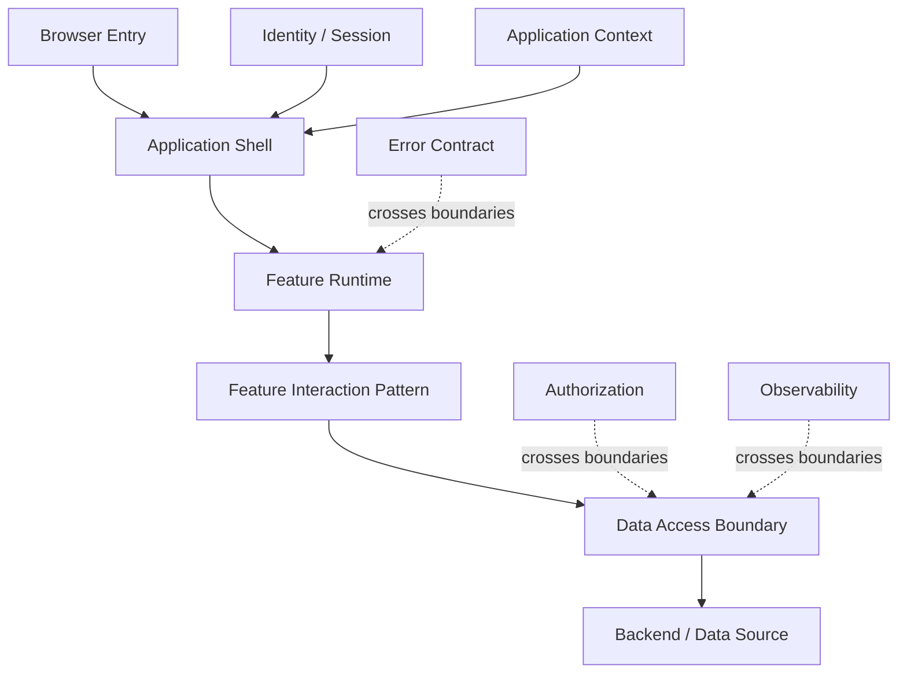
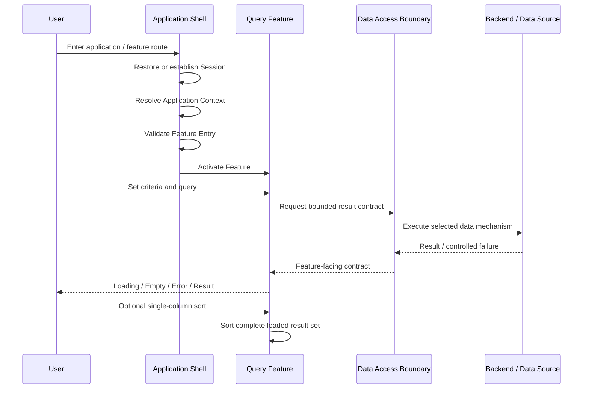

# General Application Platform Architecture

> Status: Architecture Baseline Candidate v0.1  
> Date: 2026-09-17  
> Scope: General browser-based application platform  
> Current challenge coverage: Application Shell + Read-only Query Feature  
> Maturity: Evidence-backed where explicitly marked; otherwise Candidate / Open

## 1. Purpose

This document is the first architecture synthesis produced from Playground evidence. It is intentionally written as **general platform technical knowledge**, not as a Nook Works feature design and not as a disguised production specification.

The current architecture asks a narrow but important question:

> Given an already verified Application Shell and the first representative Read-only Query Pattern, what technical responsibility boundaries are justified now, before CRUD / Master-Detail / Export / Server-side Pagination or other later patterns challenge them?

The goal is not to predict every future feature. The goal is to establish the smallest architecture that can explain the responsibilities we already have evidence for, then allow later patterns and implementation review to attack it.

```text
Real Requirement
→ Functional Pattern
→ Experiment / Evidence
→ Architecture Synthesis
→ Architecture Challenge
→ Revision
```

A baseline becomes a foundation only after later requirements fail to break its important boundaries.

---

## 2. Evidence and Provenance

Current v0.1 is primarily supported by:

- `evidence/s-shell-1-application-shell-findings.md`
  - Auth / Session lifecycle.
  - Application User Context bootstrap.
  - metadata-driven Navigation / Feature Entry.
  - Route / deep-link / refresh / browser history behavior.
  - separation between Shell responsibility and Feature data state.
- `experiments/feature-query/README.md`
  - Functional shape of a simple Read-only Query Feature.
  - Query Pattern responsibility boundary.
  - curated Result List rather than record dumping.
  - Browser-side single-column sorting only when the complete result set is already loaded.
  - Detail / Export / Server-side Pagination kept outside the simple Query Pattern.
  - backend schema complexity kept outside UI interaction semantics.
- Earlier Playground capability evidence for Native Data API, View Read Model, Custom API, backend service access, external API orchestration and browser integration.

This provenance matters because the architecture must not pretend that untested future patterns have already endorsed it.

---

## 3. Architecture Principle: Platform Owns Shared Technical Responsibilities

A platform should not own a behavior merely because multiple screens contain similar HTML or because a framework can abstract it.

A responsibility becomes a platform concern when centralizing it reduces repeated technical decisions, lifecycle risk, security inconsistency or integration ambiguity across features.

Conversely, a responsibility should remain Feature-owned when its meaning depends on the business operation or when centralizing it would require the platform to understand feature-specific semantics.

```text
Shared technical responsibility
→ Platform candidate

Business / feature semantic responsibility
→ Feature

Data-source implementation complexity
→ Data Access / Backend contract

Convenience offered by a library
→ not architecture by itself
```

The platform is therefore a **responsibility system**, not a universal component library and not a configuration engine for all business behavior.

---

## 4. Initial Responsibility Model

v0.1 separates the browser application into five conceptual responsibility areas.



These are responsibility boundaries, not a mandatory folder structure, framework hierarchy or deployment topology.

### 4.1 Application Shell

**Evidence-backed responsibility candidate.**

The Shell owns application-level lifecycle that exists before and across individual business features:

- Authentication / Session lifecycle.
- Authentication Identity to active Application User Context bootstrap.
- Application eligibility handling.
- metadata-derived Navigation / Feature Entry.
- Route resolution, deep link, refresh and browser history integration.
- Shell-level loading / failure / invalidation / explicit logout behavior.
- browser-safe runtime configuration boundary.

The Shell does **not** automatically own:

- Feature query criteria.
- Feature result data.
- CRUD / Form state.
- pagination / sorting / filtering state.
- business validation.
- Business Authorization.
- server result cache merely because multiple Features use data.

The important rule is:

> Application-wide lifecycle belongs to the Shell; business-operation state does not become global merely because the Feature is rendered inside the Shell.

### 4.2 Feature Runtime

**Architecture candidate introduced in v0.1.**

Feature Runtime is the technical boundary where the Shell hands control to a selected Feature.

Its purpose is to give a Feature a stable execution context without forcing the Shell to understand the Feature's business semantics.

A Feature Runtime may receive or access:

- stable Feature identity / route context.
- current Application User Context when required.
- platform-provided invocation capability.
- shared presentation/lifecycle primitives that are genuinely platform-level.

It then owns the lifecycle of the active Feature until control returns to Shell navigation.

This boundary is deliberately thin. v0.1 does **not** define a generic Feature framework, plugin system, component registry or dependency injection mechanism. Those would be implementation choices without current evidence.

### 4.3 Feature Interaction Pattern

**Pattern-specific responsibility.**

An Interaction Pattern describes how a class of Feature behaves from the user's perspective. It is not allowed to infer backend structure from UI shape.

For Pattern 1, Read-only Query:

```text
Feature Identity
→ Query Criteria
→ Query Action
→ Query Result
```

The Query Feature owns:

- criteria values and validation required to issue the query.
- query submission / reset interaction.
- query-specific loading / empty / result / recoverable error state.
- presentation of curated result columns.
- optional Browser-side single-column sorting when the complete result set is already present.

The Query Pattern does not own:

- source table / view / join structure.
- Detail retrieval.
- Export.
- Server-side Pagination / Sorting.
- mutation / Save lifecycle.
- business authorization policy.

A future pattern may reuse some primitives while having a different lifecycle. Reuse must be demonstrated, not assumed from visual similarity.

### 4.4 Data Access Boundary

**Evidence-backed capability; architecture contract still evolving.**

The browser Feature should consume a bounded data contract rather than depend on the physical data model.

Possible mechanisms already demonstrated in Playground include:

- Native Data API.
- View Read Model.
- authenticated Custom API.
- RPC / database function behind a server-side boundary.
- backend composition involving external APIs.

The architecture rule is not "always use one mechanism". The rule is:

> Feature Interaction depends on the contract it needs; Data Access / Backend architecture decides how that contract is fulfilled.

For a Read-only Query Feature, the contract should define at least the criteria representation, result shape, default ordering, boundedness and error semantics relevant to the Feature. It should not expose physical schema complexity merely because that complexity exists.

### 4.5 Backend / Data Source

**Mechanism layer, not UI semantics.**

Backend implementation may involve tables, views, joins, database functions, custom APIs, external providers or orchestration. Those choices must preserve the contract consumed by the Feature but do not automatically alter the Query Pattern.

This prevents a common architecture leak:

```text
Backend became complicated
≠
UI must become complicated
```

If backend complexity changes the actual user-visible behavior, latency model, authorization boundary or failure semantics, then the contract and possibly the Feature Pattern must be revisited explicitly.

---

## 5. Runtime Flow for Pattern 1

The initial runtime model for a simple authenticated Read-only Query Feature is:



Important separations:

- Shell Feature Entry does not prove Feature Data Access authorization.
- Query submission is a Feature action, not a Browser navigation event.
- Browser-side sorting does not change API default ordering or backend state.
- Data Access implementation is replaceable only to the extent that the Feature-facing contract remains valid.

---

## 6. State Ownership

State should live at the narrowest lifecycle that owns its meaning.

| State | v0.1 Owner | Reason |
| --- | --- | --- |
| Authentication Session | Shell / Auth lifecycle | Exists across Features |
| Application User Context | Shell-level Application Context | Needed to establish application identity/context |
| Current Route / Feature Entry | Shell | Application navigation lifecycle |
| Query Criteria | Query Feature | Meaning belongs to active Feature |
| Query Result | Query Feature | Result belongs to one query lifecycle |
| Client-side Sort State | Query Feature | Presentation of current loaded result |
| Physical DB query plan / joins | Backend / Data Access | Not browser interaction state |
| Business Authorization decision | Appropriate backend / authorization boundary | Must not be inferred from navigation visibility |

This is a strong v0.1 rule candidate:

> **State ownership follows semantic lifecycle, not visual containment.**

A component being rendered inside the Shell is not evidence that its state belongs in Shell-global state.

---

## 7. Authorization Boundaries

Current evidence supports keeping these concepts separate:

```text
Authentication Identity
≠ Application Eligibility
≠ Navigation Visibility
≠ Route / Feature Entry
≠ Feature Data Access
≠ Business Authorization
```

The architecture must therefore avoid two shortcuts:

1. "The menu item is hidden, therefore the backend is protected."
2. "The user entered the Feature, therefore every query result is authorized."

v0.1 does not yet define the general Business Authorization model. It only establishes that authorization is a distinct responsibility and cannot be collapsed into Shell navigation.

---

## 8. Query Pattern Technical Decisions in v0.1

These are current candidates, not universal laws.

### 8.1 Curated Result List

A Result List is an interaction surface for identification, comparison and selection. It is not a raw representation of a database record.

Result columns should therefore be selected by requirement semantics. The platform should not normalize "show every available field" as a query capability.

### 8.2 No Normal Horizontal-scroll Dependency

For the current target class of business applications, v0.1 treats a horizontally scrolling result grid as an exception rather than a default platform capability.

The purpose is architectural pressure: if the result cannot be understood without exposing many columns, first question whether the interaction is actually a List, Detail or Export problem.

This rule is expected to be challenged by future real requirements.

### 8.3 Browser-side Sorting Only for Complete Loaded Result Sets

When the entire result set is already loaded and bounded, single-column sorting may remain Browser-owned because it changes only the user's temporary reading order.

If future requirements introduce server-side pagination or result sets too large to load completely, this responsibility must be revisited. Sorting only the current page while implying global ordering would violate the interaction contract.

### 8.4 Multi-select Is Field Semantics

A criteria field may support multi-select when the requirement needs set membership semantics. Multi-select is not a default property of every dropdown and is not a reason to make the whole Query Pattern more complex.

---

## 9. Error Responsibility: Initial Boundary

v0.1 can establish ownership direction but not yet a final cross-platform Error Contract.

```text
Provider / DB / API failure
→ Data Access translates technical failure into bounded contract
→ Feature decides interaction state / user-facing recovery
→ Shell intervenes only when failure invalidates application-level lifecycle
```

Examples:

- expired / invalid Session that destroys Application Context: Shell concern.
- one Query request fails while Session remains valid: Feature concern, using platform error semantics when available.
- raw database/provider diagnostics: must not be treated as the user-facing contract by default.

A later pattern should challenge whether common Error primitives deserve stronger platform standardization.

---

## 10. What v0.1 Deliberately Does Not Design

The following are outside the current architecture baseline because Pattern 1 does not require them or existing evidence is insufficient:

- CRUD / Create / Edit / Delete lifecycle.
- Form dirty-state and unsaved-change handling.
- Master → Detail navigation and Detail retrieval.
- Export / download authorization and audit.
- Server-side Pagination / Sorting / Filtering contract.
- reusable Data Grid framework.
- generalized component library / Design System.
- generic workflow engine.
- production Role / Permission / RBAC model.
- final Business Authorization architecture.
- final Error Contract.
- framework/router/state-management library selection.
- generic cache layer.
- generic repository/service abstraction merely to hide provider SDKs.

These omissions are intentional. A platform does not become mature by naming every future problem in advance and surrounding it with interfaces.

---

## 11. Architecture Challenge Protocol

v0.1 should now be attacked from two directions before being treated as a stronger foundation.

### 11.1 Implementation-agent Review

An independent implementation/review agent should inspect the architecture from two perspectives:

**Reviewer perspective**

- Are responsibility boundaries internally consistent?
- Does any claim exceed its Evidence?
- Are there hidden contradictions between Shell, Feature, Data Access and Authorization?
- Has the architecture accidentally generalized a Pattern-1-specific decision?

**Implementer perspective**

- Could an engineer implement Pattern 1 without guessing where major responsibilities belong?
- Which contracts are too vague to construct safely?
- Which boundaries would create unnecessary ceremony or duplication?
- Where would real code pressure tempt the implementation to violate the proposed ownership model?

The reviewer is explicitly allowed to challenge the architecture. Review feedback is input to Primary Architecture Judgment, not automatic Architecture Decision authority.

### 11.2 Pattern 2 Challenge

After review/revision, the next representative Feature Pattern should test v0.1.

The desired outcome is not "v0.1 survives unchanged". The desired outcome is to classify each change:

```text
Reuse
Extend / Generalize
Refactor
Replace
New independent capability
```

Boundaries that repeatedly survive unrelated patterns gain confidence as platform foundations.

---

## 12. Current Architecture Judgment

At Pattern 1, the strongest emerging foundation is not a particular framework or API mechanism. It is the separation of **lifecycles and responsibilities**:

```text
Application lifecycle        → Shell
Active business feature      → Feature Runtime
User interaction semantics   → Feature Pattern
Feature-facing data contract → Data Access Boundary
Execution / storage detail   → Backend / Data Source
```

Cross-cutting concerns such as Authorization, Error Contract and Observability must connect these layers without collapsing them.

The first architecture baseline therefore favors **thin shared boundaries and explicit ownership** over early generic frameworks.

This is intentionally modest. If Pattern 2 destroys it, that is useful evidence obtained while demolition is still cheap.