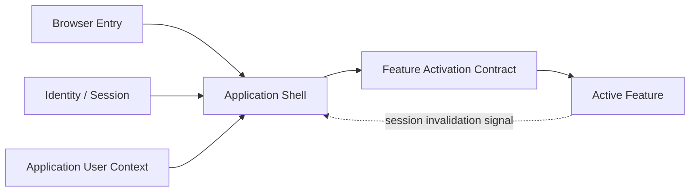
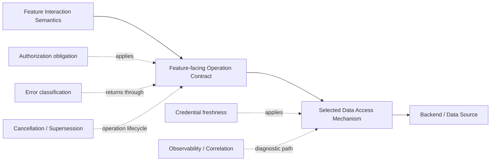
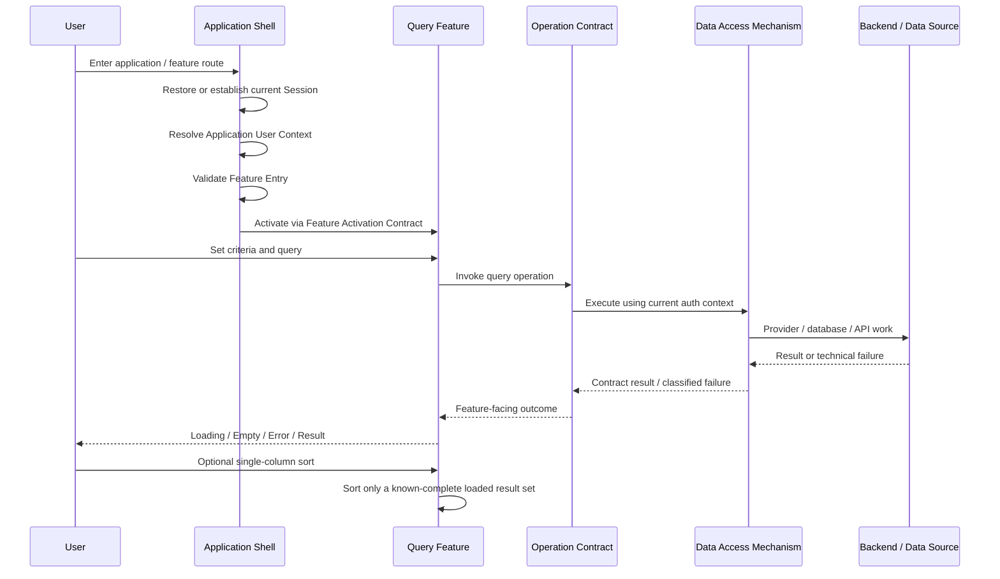

# General Application Platform Architecture

> Status: Architecture Baseline Candidate v0.2  
> Date: 2026-09-17  
> Scope: General browser-based application platform  
> Current challenge coverage: Application Shell + Read-only Query Feature + Implementation-agent adversarial review  
> Maturity: Direct Evidence / Inference / Candidate Boundary / Pattern-specific Decision / Open Contract are distinguished explicitly

## 1. Purpose

This document is a general platform architecture synthesis produced from Playground Experiment / Evidence and subsequent adversarial review. It is **not** a Nook Works production specification and it does not claim that one Query prototype has discovered the universal shape of browser applications.

The current question remains deliberately narrow:

> Given a verified Application Shell, a first representative Read-only Query Pattern, and an independent implementation-oriented review, which responsibility boundaries are justified now, and which must remain provisional until later patterns challenge them?

The working loop is:

```text
Real Requirement
→ Functional Pattern
→ Experiment / Evidence
→ Architecture Synthesis
→ Independent Review
→ Architecture Revision
→ Next Pattern Challenge
```

A boundary becomes more trustworthy by surviving different kinds of pressure. A neat diagram is not evidence. Humans have produced enough neat diagrams already.

---

## 2. Evidence, Review and Claim Strength

v0.2 is primarily informed by:

- `evidence/s-shell-1-application-shell-findings.md`
  - Session restore / login lifecycle.
  - Application User Context bootstrap.
  - metadata-driven Navigation / Feature Entry.
  - route / deep-link / refresh / browser history behavior.
  - separation between Shell lifecycle and Feature-owned business state.
  - separation between Feature Entry and downstream authorization.
- `experiments/feature-query/README.md`
  - Functional shape of a simple Read-only Query Feature.
  - Query responsibility boundary.
  - curated Result List.
  - client-side sorting only when a complete result set is loaded.
  - Detail / Export / Server-side Pagination kept outside the simple Query Pattern.
  - backend data complexity kept outside UI interaction semantics.
- Earlier Playground capability evidence for Native Data API, View Read Model, authenticated Custom API, backend service access and external API orchestration.
- `agent-work/reports/2026-09-17-general-platform-architecture-v01-review.md`
  - independent reviewer + implementer challenge of v0.1.
  - specific attacks on `Feature Runtime`, the five-layer pipeline, authorization obligations, boundedness, error taxonomy and construction ambiguity.

### 2.1 Claim-strength vocabulary

v0.2 uses five labels:

| Label | Meaning |
| --- | --- |
| **Direct Evidence** | Observed in a concrete runtime / browser / provider experiment under stated conditions |
| **Inference from Evidence** | Reasoned conclusion supported by Evidence but not itself directly observed |
| **Candidate Boundary** | Architecture responsibility split currently judged useful but still challengeable |
| **Pattern-specific Decision** | Decision local to the current interaction/product context; not generalized into platform architecture |
| **Open Contract** | Minimum responsibility is known, but exact interoperable contract still requires technical design or later Evidence |

This distinction matters because capability evidence does not automatically prove a code-layer architecture. For example, multiple Data Access mechanisms have been demonstrated; that does **not** prove every Feature needs a browser-side repository class wearing a tiny suit and carrying no useful responsibility.

---

## 3. Architecture Principle: Responsibility Before Abstraction

A platform should centralize a responsibility when centralization materially reduces repeated lifecycle decisions, security inconsistency, integration ambiguity or cross-feature technical risk.

It should **not** centralize behavior merely because:

- several screens contain similar markup;
- a framework offers an abstraction;
- a provider SDK feels untidy;
- a diagram looks more architectural with another box.

```text
Shared technical lifecycle / invariant
→ Platform candidate

Business-operation semantics
→ Feature

Feature-facing operation contract
→ explicit seam

Execution / storage mechanism
→ Data Access / Backend choice

Library convenience
→ implementation detail unless Evidence proves otherwise
```

The platform is therefore a responsibility system, not a universal component framework and not a configuration engine for all possible business behavior.

---

## 4. Two Orthogonal Architecture Views

v0.1 incorrectly mixed runtime owners, interaction patterns, contract seams and backend mechanisms into one five-step linear pipeline. The adversarial review was right to attack that shape.

v0.2 separates two different questions.

### 4.1 Lifecycle / Activation View



This view answers:

> Who owns the application lifecycle, and how is control transferred to one active business Feature?

### 4.2 Feature Operation View



This view answers:

> How does an active Feature perform one business operation without becoming coupled to physical schema or provider mechanics?

These views are related, but they are not layers of the same species. That distinction removes several opportunities for us to construct ceremonial adapters and then admire them like expensive houseplants.

---

## 5. Application Shell

**Claim strength: Direct Evidence + Candidate Boundary.**

The Shell owns application-level lifecycle that exists before and across individual Features:

- Authentication / Session lifecycle.
- Authentication Identity → active Application User Context bootstrap.
- Application eligibility handling.
- metadata-derived Navigation / Feature Entry.
- Route resolution, deep link, refresh and browser history integration.
- Shell-level startup / failure / invalidation / explicit logout behavior.
- browser-safe runtime configuration boundary.

The Shell does **not** automatically own:

- query criteria or query results;
- CRUD / Form state;
- pagination / sorting / filtering state;
- business validation;
- Business Authorization decisions;
- server result cache merely because multiple Features render inside the same application.

Candidate rule:

> **Application-wide lifecycle belongs to the Shell; business-operation state does not become global merely because the Feature is rendered inside the Shell.**

---

## 6. Feature Activation Contract

**Claim strength: Candidate Boundary.**

v0.1 called this `Feature Runtime`. The review correctly identified that current Evidence does not justify an independent runtime owner, class, service, provider or framework.

v0.2 therefore uses **Feature Activation Contract**: the seam where Shell hands control to an active Feature.

It is not a mandatory code object.

### 6.1 Minimum obligations

Before activating a Feature, the Shell side must have resolved the prerequisites required by that Feature entry, including the application lifecycle state needed to enter it.

The handoff must make these responsibilities unambiguous:

- **Stable Feature identity / route context** has a canonical source.
- **Application User Context access** must represent current application context when the Feature needs it; do not treat an uncontrolled bootstrap snapshot as eternally current.
- **Authenticated invocation** must obtain a current credential/session at invocation time or through an equivalent freshness-preserving mechanism. A stale JWT carried around as convenient Feature props is not a platform pattern.
- **Active Feature disposal / supersession** has an owner when navigation replaces the active Feature or an operation is abandoned.
- **Session-invalid signal** can return to Shell so application lifecycle can be re-established or terminated.

### 6.2 Explicit non-goals

Current architecture does not justify:

- Feature plugin registry;
- generic `FeatureRuntime` class;
- service locator;
- dependency-injection framework;
- global Feature context containing random shared utilities;
- cross-feature state container.

If later Patterns reveal an invariant that is shared across Features but belongs to neither Shell nor individual Feature, a real Runtime boundary may re-emerge. Until then, it remains an architectural ghost and does not get office space.

---

## 7. Feature Interaction Semantics

**Claim strength: Pattern-specific Decision + Candidate Boundary.**

An Interaction Pattern describes the user-visible behavior of a class of Feature. It is a design and responsibility vocabulary, not a mandatory runtime component.

For Pattern 1, Read-only Query:

```text
Feature Identity
→ Query Criteria
→ Query Action
→ Query Result
```

The Query Feature owns:

- criteria values;
- functional validation needed to issue the query;
- submit / reset interaction;
- query-local loading / empty / result / recoverable error state;
- presentation of curated result columns;
- client-side single-column sorting only when the result set is known to be complete.

The simple Query Pattern does not own:

- physical table / view / join topology;
- Detail retrieval;
- Export;
- Server-side Pagination / Sorting;
- mutation / Save lifecycle;
- Business Authorization policy.

A future Pattern may reuse some behavior, but visual similarity is not evidence that the lifecycle is shared.

---

## 8. Feature-facing Operation Contract

**Claim strength: Candidate Boundary + Open Contract.**

The architecture requires a clear **operation contract** between a Feature and whichever mechanism fulfills the operation. It does **not** require a dedicated browser-side repository/service wrapper if the selected mechanism already satisfies that contract directly.

For an authenticated Read-only Query, the technical design must explicitly define at least:

### 8.1 Criteria semantics

- field representation;
- omitted vs `null` vs empty string semantics where relevant;
- empty set semantics for multi-select where relevant;
- date/time/timezone encoding where relevant;
- server-side validation expectations that differ from client functional validation.

### 8.2 Result semantics

- result fields and data types;
- nullability / unknown-value handling;
- stable row identity when the Feature requires identity;
- deterministic default ordering, including tie behavior when correctness requires it;
- whether the result represents the complete matching set.

### 8.3 Boundedness / completeness

The contract must not silently confuse a provider default row cap with a complete result set.

The technical design must state how the operation behaves when the result exceeds its supported bound, for example:

- reject as too broad;
- return an explicit boundedness outcome;
- use another mechanism or Pattern.

Silent truncation is not an acceptable basis for a UI that later claims to sort or compare the complete result.

### 8.4 Authorization enforcement point

The design must identify the trusted boundary that validates caller/session and enforces data/business scope for the operation.

### 8.5 Operation lifecycle

The design must state the policy for superseded or stale requests when multiple requests can overlap. Exact cancellation APIs are implementation details; allowing an old response to overwrite a newer query is a correctness problem, not a charming race-condition collectible.

### 8.6 Error outcomes

The contract must expose enough classification for Feature and Shell to respond consistently without displaying raw provider diagnostics.

---

## 9. Data Access Mechanism and Backend

### 9.1 Data Access Mechanism

**Claim strength: Direct capability Evidence; mechanism selection remains technical design.**

Playground has demonstrated multiple ways to fulfill operations:

- Native Data API;
- View Read Model;
- authenticated Custom API;
- RPC / database function behind a suitable boundary;
- backend composition involving external providers.

The architectural rule is:

> **Feature depends on the operation contract it needs. The technical design selects the simplest mechanism that can satisfy that contract, including its authorization, boundedness and failure semantics.**

A direct Native Data API call can satisfy this architecture if it directly fulfills the Feature-facing contract. There is no current Evidence requiring a one-to-one repository wrapper whose main job is forwarding parameters with great dignity.

### 9.2 Backend / Data Source

**Claim strength: Candidate Boundary.**

Backend implementation may involve tables, views, joins, functions, custom APIs, external providers or orchestration.

```text
Backend became complicated
≠
UI must become complicated
```

But mechanism changes are not automatically transparent. If a different mechanism changes authorization, latency, completeness, partial-failure behavior, cancellation or error semantics, the Feature-facing contract must be revisited.

---

## 10. Pattern 1 Runtime Trace

The current authenticated Read-only Query trace is:



Important separations:

- Feature Entry is not proof of Feature Data Access authorization.
- Query submission is a Feature action, not automatically Browser navigation.
- Feature criteria semantics remain Feature-owned even if a future implementation represents some criteria in the URL; Shell may transport URL/route state without interpreting business criteria.
- client-side sorting correctness depends on an explicit completeness guarantee.
- mechanism replaceability ends where contract semantics change.

---

## 11. State Ownership

**Claim strength: Candidate Boundary with strong support from Shell Evidence.**

State should live at the narrowest semantic lifecycle that owns it.

| State | Owner | Reason |
| --- | --- | --- |
| Authentication Session | Shell / Auth lifecycle | Exists across Features |
| Application User Context | Shell-level Application Context | Application identity/context lifecycle |
| Current Route / Feature Entry | Shell | Application navigation lifecycle |
| Query Criteria | Query Feature | Meaning belongs to active business operation |
| Query Result | Query Feature | Result belongs to one query lifecycle |
| Client-side Sort State | Query Feature | Presentation of current loaded result |
| Operation correlation / supersession state | Feature operation lifecycle or mechanism as appropriate | Prevent stale outcome from replacing current operation |
| Physical DB query plan / joins | Backend / Data mechanism | Not browser interaction state |
| Business Authorization decision | Trusted authorization boundary | Must not be inferred from visibility metadata |

Strong candidate rule:

> **State ownership follows semantic lifecycle, not visual containment.**

If query criteria later appear in a URL, that does not make the Shell the semantic owner of those criteria. Transport and meaning are different jobs. Apparently this also needed to be written down, because architecture diagrams enjoy stealing things left unattended.

---

## 12. Authorization Boundaries and Minimum Obligations

**Claim strength: Direct Evidence for separation; Candidate Boundary for minimum obligations.**

Keep these distinct:

```text
Authentication Identity
≠ Application Eligibility
≠ Navigation Visibility
≠ Route / Feature Entry
≠ Feature Data Access
≠ Business Authorization
```

v0.2 does not define a universal RBAC (Role-Based Access Control) schema. It does establish minimum obligations:

1. **A data operation must validate caller/session at a trusted boundary appropriate to the mechanism.**
2. **Browser-supplied eligibility, navigation metadata, user type or other client context is not by itself proof of data authorization.**
3. **Feature Entry denied, Data Access forbidden and Session invalid are different outcomes.**
4. **Session invalidation must be able to escalate back to Shell lifecycle handling.**
5. **The selected mechanism may use RLS, grants, server authorization or another suitable approach; v0.2 does not prematurely standardize the provider-specific mechanism.**

The architecture therefore rejects two shortcuts:

- hidden menu = protected data;
- successful Feature activation = authorized result set.

---

## 13. Minimum Error Taxonomy

**Claim strength: Candidate Boundary / minimum interoperability obligation.**

v0.2 still does not define a final enterprise Error Contract. It does require enough discrimination to preserve lifecycle boundaries.

Minimum categories:

| Category | Default owner / consequence |
| --- | --- |
| `validation` | Feature handles user-correctable criteria/input issue |
| `session-invalid` | Escalates to Shell application lifecycle |
| `forbidden` | Feature operation denied; does not automatically mean logout |
| `boundedness` | Query cannot honestly return the requested complete set under current contract |
| `transient/unavailable` | Feature may offer retry according to Feature requirement |
| `internal/unknown` | Feature presents controlled failure; diagnostics remain technical |
| `cancelled/superseded` | Operation-control outcome, normally not a user-facing error |

Principle:

```text
Provider / DB / API failure
→ mechanism captures technical diagnostics
→ operation contract maps to bounded outcome
→ Feature decides interaction/recovery
→ Shell intervenes only for application-lifecycle invalidation
```

Raw provider diagnostics are not the user-facing contract by default.

---

## 14. Pattern 1 Decisions vs General Platform Architecture

The review correctly identified one place where v0.1 generalized too aggressively.

### 14.1 General candidate: Curated Result Contract

A Result List is for identification, comparison and selection. It should expose requirement-relevant information rather than blindly dump a physical record or API payload.

This is useful as a general responsibility principle.

### 14.2 Pattern-specific: No Normal Horizontal Scroll

The decision to avoid horizontal scrolling as the normal Nook Works Query result behavior remains valuable design pressure, but it is **not** a general browser-platform architecture rule.

It remains documented in `experiments/feature-query/README.md` as a Nook Works Pattern-1 candidate and can be challenged by future Requirements.

General platform architecture therefore keeps the curated-result principle and leaves viewport/layout policy to the relevant Pattern / formal system.

### 14.3 Browser-side Sorting

Client-side single-column sorting is valid only when the loaded result is explicitly known to be complete for the operation contract.

If future Requirements introduce Server-side Pagination or an unbounded result space, sorting responsibility must be redesigned. Sorting one page while implying global order remains wrong no matter how attractive the arrow icon is.

### 14.4 Multi-select

Multi-select remains field semantics chosen by Requirement, not a universal property of dropdowns and not a platform architecture concern by itself.

---

## 15. What v0.2 Deliberately Does Not Design

Current architecture still refuses to pre-build answers for problems not yet required by Evidence:

- CRUD / Create / Edit / Delete lifecycle;
- Form dirty-state / unsaved changes;
- Master → Detail navigation and retrieval;
- Export / download authorization, masking and audit;
- Server-side Pagination / Sorting / Filtering;
- reusable Data Grid framework;
- generalized component library / Design System;
- generic workflow engine;
- production RBAC / permission schema;
- final Business Authorization architecture;
- final Error Contract / universal error UI;
- framework/router/state-management library selection;
- generic cache layer;
- universal retry policy;
- cross-feature shared state;
- generic repository/service abstraction merely to hide provider SDKs;
- generic query-state restoration;
- dedicated Feature Runtime / plugin framework;
- full observability standard beyond the diagnostics/correlation needed by the current operation.

These are not forgotten. They are deliberately unemployed until a real Requirement hires them.

---

## 16. Review Disposition: What v0.2 Accepted

The Implementation Agent review is preserved as an independent report rather than silently blended into architecture truth. Primary architecture judgment accepted these challenges as follows:

| Review finding | v0.2 disposition |
| --- | --- |
| R1 Feature Runtime unproven | **Accepted.** Replaced with Feature Activation Contract; no independent runtime framework required. |
| R2 five-layer pipeline mixes unlike concepts | **Accepted.** Replaced with lifecycle view + operation view. |
| R3 generalization / Evidence labels too broad | **Accepted.** Added claim-strength vocabulary and narrowed mechanism-vs-layer claims. |
| R4 no-horizontal-scroll over-generalized | **Accepted.** Returned to Pattern-specific / Nook Works candidate status. |
| R5 authorization separation lacks enforceable minimum | **Accepted.** Added trusted-boundary and outcome obligations without inventing RBAC. |
| R6 error direction lacks taxonomy | **Accepted.** Added minimum categories and Shell escalation rule. |
| R7 Data contract not constructible enough | **Accepted.** Reframed as mandatory operation-contract checklist. |
| R8 route/query state seam unclear | **Accepted narrowly.** Clarified semantic ownership; generic restoration remains deferred. |

The review did not become authority merely because it was thorough. It earned influence by finding concrete contradictions and implementation traps that survived Primary re-evaluation. This is considerably healthier than architecture by parental decree.

---

## 17. Next Challenge Protocol

The architecture is now ready for the next **real Pattern**, not for speculative framework expansion.

The next representative Requirement should challenge v0.2 using:

```text
Reuse
Extend / Generalize
Refactor
Replace
New independent capability
```

Questions for the next challenge include:

- Does Feature Activation Contract remain thin?
- Does state ownership by semantic lifecycle survive mutation-oriented behavior?
- Is the operation-contract concept still sufficient when operations mutate data or involve multi-step interaction?
- Which Error / Authorization obligations survive unchanged?
- Does any responsibility emerge that genuinely belongs between Shell and Feature?

A boundary that survives unrelated Patterns gains confidence. A boundary that fails cheaply in Playground is doing exactly what Playground is for.

---

## 18. Current Architecture Judgment

At Pattern 1 plus independent implementation review, the strongest emerging foundation is now:

```text
Application lifecycle
→ Application Shell

Shell-to-feature control transfer
→ Feature Activation Contract

Business interaction meaning and local state
→ Active Feature / Interaction Semantics

Feature-visible operation meaning
→ Feature-facing Operation Contract

Execution choice
→ Selected Data Access Mechanism

Physical query / orchestration / storage
→ Backend / Data Source
```

Cross-cutting responsibilities are not decorative arrows. They carry minimum obligations:

- current identity / credential freshness;
- trusted authorization enforcement;
- explicit completeness / boundedness;
- stale-operation control;
- classified errors;
- session-invalid escalation;
- technical diagnostics / correlation without leaking provider internals to users.

The architecture still favors **thin seams, explicit ownership and evidence-backed restraint** over generic frameworks.

v0.2 is stronger than v0.1 precisely because one of its prettiest boxes got demoted before anyone had time to build a shrine around it.