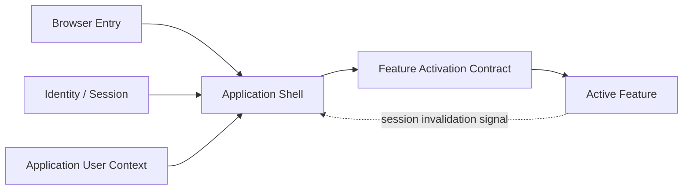
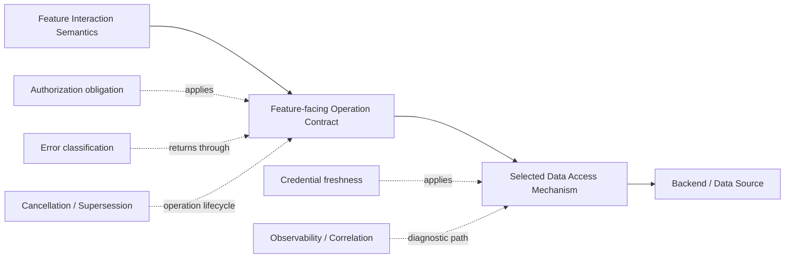
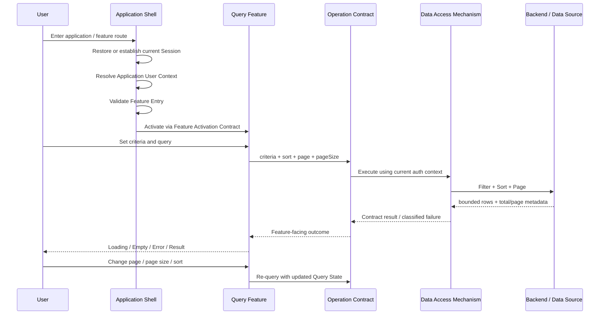

# General Application Platform Architecture

> Status: Architecture Baseline Candidate v0.3  
> Date: 2026-09-17  
> Scope: General browser-based application platform  
> Current challenge coverage: Application Shell + Read-only Query Feature + Implementation-agent adversarial review + Enterprise Query scale review  
> Maturity: Direct Evidence / Inference / Candidate Boundary / Pattern-specific Decision / Open Contract are distinguished explicitly

## 1. Purpose

This document is a general platform architecture synthesis produced from Playground Experiment / Evidence, independent implementation review, and subsequent Functional / Technical design challenge.

It is **not** a Nook Works production specification and it does not claim that one Query prototype has discovered the universal shape of browser applications.

The working loop remains:

```text
Real Requirement
→ Functional Pattern
→ Experiment / Evidence
→ Architecture Synthesis
→ Independent Review
→ Architecture Revision
→ Next Pattern Challenge
```

v0.3 adds one important correction to v0.2: a Query Pattern cannot quietly assume that a small system, small database, or first requirement implies a small result set. **Storage scale, matching-row count, response payload and Browser rendering cost are different things.**

A neat diagram is still not Evidence. Neither is saying「這系統資料不多啦」with sufficient confidence.

---

## 2. Evidence, Review and Claim Strength

v0.3 is primarily informed by:

- `evidence/s-shell-1-application-shell-findings.md`
  - Session restore / login lifecycle.
  - Application User Context bootstrap.
  - metadata-driven Navigation / Feature Entry.
  - route / deep-link / refresh / browser history behavior.
  - separation between Shell lifecycle and Feature-owned business state.
  - separation between Feature Entry and downstream authorization.
- `experiments/feature-query/README.md`
  - Functional shape of a Read-only Query Feature.
  - curated Result List and Feature-specific responsibility boundaries.
  - F-QUERY-1C Enterprise Query scale review: Business Query Boundary vs Technical Result Boundary, pagination / sorting baseline, page-size behavior, and known Master → Detail return-context pressure.
- Earlier Playground capability evidence for Native Data API, View Read Model, authenticated Custom API, backend service access and external API orchestration.
- `agent-work/reports/2026-09-17-general-platform-architecture-v01-review.md`
  - independent reviewer + implementer challenge of v0.1.
  - specific attacks on `Feature Runtime`, the five-layer pipeline, authorization obligations, boundedness, error taxonomy and construction ambiguity.

### 2.1 Claim-strength vocabulary

| Label | Meaning |
| --- | --- |
| **Direct Evidence** | Observed in a concrete runtime / browser / provider experiment under stated conditions |
| **Inference from Evidence** | Reasoned conclusion supported by Evidence but not itself directly observed |
| **Candidate Boundary** | Architecture responsibility split currently judged useful but still challengeable |
| **Pattern-specific Decision** | Decision local to the current interaction/product context; not generalized into platform architecture |
| **Open Contract** | Minimum responsibility is known, but exact interoperable contract still requires technical design or later Evidence |

Enterprise Query scale conclusions in F-QUERY-1C are **Design Review / Architecture Pressure**, not new runtime Evidence. That distinction stays explicit because architecture becomes useless the moment every sensible opinion starts wearing an Evidence badge.

---

## 3. Architecture Principle: Responsibility Before Abstraction

A platform should centralize a responsibility when centralization materially reduces repeated lifecycle decisions, security inconsistency, integration ambiguity or cross-feature technical risk.

It should not centralize behavior merely because:

- several screens contain similar markup;
- a framework offers an abstraction;
- a provider SDK feels untidy;
- a diagram looks more architectural with another box.

```text
Shared technical lifecycle / invariant
→ Platform candidate

Business-operation semantics
→ Feature / Requirement

Feature-facing operation contract
→ explicit seam

Execution / storage mechanism
→ Data Access / Backend choice

Library convenience
→ implementation detail unless Evidence proves otherwise
```

A second v0.3 principle is equally important:

> **Minimal does not mean incomplete.**

A Pattern may remain simple while still including the normal baseline behavior required for the class of work. Deferring every common capability until a future Pattern is not restraint if the result is a Query Pattern that only works while everyone behaves nicely and the data stays tiny.

---

## 4. Two Orthogonal Architecture Views

### 4.1 Lifecycle / Activation View



This view answers:

> Who owns the application lifecycle, and how is control transferred to one active business Feature?

### 4.2 Feature Operation View



These views are related, but they are not layers of the same species. Shell is a lifecycle owner, Interaction Pattern is design semantics, Operation Contract is a seam, and Data Access is an execution choice.

---

## 5. Application Shell

**Claim strength: Direct Evidence + Candidate Boundary.**

The Shell owns application-level lifecycle that exists before and across individual Features:

- Authentication / Session lifecycle.
- Authentication Identity → active Application User Context bootstrap.
- Application eligibility handling.
- metadata-derived Navigation / Feature Entry.
- Route resolution, deep link, refresh and browser history integration.
- Shell-level startup / failure / invalidation / explicit logout behavior.
- browser-safe runtime configuration boundary.

The Shell does **not** automatically own:

- query criteria or query results;
- CRUD / Form state;
- pagination / sorting / filtering semantics;
- business validation;
- Business Authorization decisions;
- server result cache merely because multiple Features render inside the same application.

Candidate rule:

> **Application-wide lifecycle belongs to the Shell; business-operation state does not become global merely because the Feature is rendered inside the Shell.**

---

## 6. Feature Activation Contract

**Claim strength: Candidate Boundary.**

v0.1 called this `Feature Runtime`. The adversarial review correctly identified that current Evidence does not justify an independent runtime owner or framework.

v0.3 therefore keeps **Feature Activation Contract**: the seam where Shell hands control to an active Feature. It is not a mandatory code object.

Minimum obligations:

- Stable Feature identity / route context has a canonical source.
- Application User Context access represents current application context when required.
- Authenticated invocation obtains current credential/session or an equivalent freshness-preserving mechanism.
- Active Feature disposal / supersession has a defined owner.
- Session-invalid signal can return to Shell.

Current architecture still does not justify a Feature plugin registry, service locator, global Feature context, generic `FeatureRuntime` class or cross-feature state container.

---

## 7. Read-only Query Interaction Semantics

**Claim strength: Pattern-specific Decision + Candidate Boundary.**

The Generic Read-only Query Feature remains conceptually simple:

```text
Feature Identity
→ Query Criteria
→ Query Action
→ Query Result
```

But v0.3 treats a normal paged result as part of the **baseline candidate**, not as speculative future decoration.

A representative enterprise-style Query Result may therefore include:

```text
Query Result
├─ curated result columns
├─ total count / page metadata
├─ current page
├─ previous / next
├─ page-number navigation
├─ page-size selector
└─ single-column sorting
```

The Query Feature owns the user-visible semantics of:

- criteria values and functional validation;
- submit / reset interaction;
- sort field / direction as current Query State;
- page number and page size as current Query State;
- loading / empty / result / recoverable error state;
- presentation of curated result columns.

The Query Feature does not own physical table/view/join topology, backend query plan, Business Authorization policy, Detail lifecycle or Export lifecycle.

### 7.1 Page-size behavior

The platform may provide a standard page-size selector and common options such as `10 / 20 / 50`, but the exact values are not universal architecture law.

Feature / Product Technical Design may select allowed options and default page size according to data density and Requirement. The behavior when page size changes must be deterministic; resetting to Page 1 is a simple candidate unless a Requirement justifies preserving another anchor.

---

## 8. Feature-facing Operation Contract

**Claim strength: Candidate Boundary + Open Contract.**

The architecture requires a clear operation contract between a Feature and whichever mechanism fulfills the operation. It does **not** require a dedicated browser-side repository/service wrapper if the selected mechanism already satisfies that contract directly.

For an authenticated paged Read-only Query, technical design should explicitly define at least:

### 8.1 Criteria semantics

- field representation;
- omitted vs `null` vs empty-string semantics where relevant;
- empty-set semantics for multi-select where relevant;
- date/time/timezone encoding where relevant;
- server-side validation expectations.

### 8.2 Sorting semantics

- allowed sortable fields;
- sort direction;
- deterministic default ordering;
- tie-break behavior where correctness requires it;
- whether sorting is server-owned or complete-set Browser-owned under an explicitly bounded variant.

### 8.3 Pagination semantics

- page number or equivalent paging state;
- page size;
- allowed/default page-size values as applicable;
- total count or another contract that allows the UI to understand available navigation;
- behavior when requested page becomes invalid after data changes.

### 8.4 Result semantics

- result fields and data types;
- nullability / unknown-value handling;
- stable row identity when the Feature requires identity;
- whether a response is a complete set or one bounded page.

### 8.5 Business Query Boundary vs Technical Result Boundary

These are distinct responsibilities.

```text
Business Query Boundary
→ Requirement / SA decides meaningful scope
→ examples: date range, mandatory criteria, allowed empty conditions

Technical Result Boundary
→ Platform / Technical Design controls execution cost
→ examples: page size, server-side paging, timeout, payload bound, resource protection
```

The Technical Platform must not rely on Business validation as its only protection. A User can key an overly broad range, a Requirement can miss one, and data grows while everyone is busy attending meetings.

Likewise, Technical pagination does not excuse poor Business design. Returning 20 rows at a time from a meaningless seven-year query may protect the AP server while still being a terrible Feature.

### 8.6 Boundedness and completeness

`Boundedness` no longer means only「the entire matching set is small」.

A query may match 30,000 rows and still be technically bounded if each interaction returns a controlled page and the backend execution contract remains protected.

The contract must therefore distinguish:

```text
Matching Result Cardinality
≠ Response Payload Size
≠ Browser-rendered Row Count
```

Provider default row caps must never be silently treated as completeness guarantees.

### 8.7 Authorization enforcement point

The design identifies the trusted boundary that validates caller/session and enforces business/data scope.

### 8.8 Operation lifecycle

The design states the policy for superseded or stale requests. An older response must not overwrite a newer query merely because networking felt nostalgic.

### 8.9 Error outcomes

The contract exposes enough classification for Feature and Shell to respond consistently without displaying raw provider diagnostics.

---

## 9. Pagination / Sorting Execution Candidate

**Claim strength: Candidate Boundary informed by enterprise design pressure; implementation not yet runtime-verified in F-QUERY-1.**

For enterprise-style queries, v0.3 prefers the following baseline candidate:

```text
Criteria
+ Sort Field / Direction
+ Page Number
+ Page Size
        ↓
Validated Operation Contract
        ↓
Server-side Filter
→ Server-side Sort
→ Server-side Page
        ↓
Bounded Rows
+ Total Count / Page Metadata
```

The correctness rule is:

> **Sort the logical matching set before selecting the requested page.**

Sorting only the 20 rows currently loaded in Browser while implying that 3,000 matching rows were sorted is incorrect.

### 9.1 Complete-set Browser variant

A Feature may still use complete-set Browser sorting / pagination when the operation contract can honestly guarantee that:

- the entire matching set is loaded;
- it is explicitly bounded;
- transfer and Browser cost are acceptable;
- the UI is not depending on a silently truncated provider response.

This is now treated as a **bounded implementation variant**, not the general enterprise-query default.

### 9.2 Advanced pagination remains deferred

v0.3 does not yet standardize:

- Cursor / Keyset Pagination;
- Infinite Scroll;
- Multi-column Sort;
- virtualization strategy;
- generic Data Grid behavior.

OFFSET / FETCH, LIMIT / OFFSET, window-function approaches, cursor paging or another backend mechanism are Technical Design choices so long as the Feature-facing contract remains correct and performant for the real workload.

---

## 10. Pattern 1 Runtime Trace

A representative authenticated server-paged Read-only Query trace is now:



Important separations:

- Feature Entry is not proof of Feature Data Access authorization.
- Query criteria, sorting and paging semantics remain Feature-owned Query State even if transported via URL or API parameters.
- Server-side execution may be standardized without making Business criteria semantics a Platform concern.
- mechanism replaceability ends where contract semantics change.

---

## 11. State Ownership

**Claim strength: Candidate Boundary with strong support from Shell Evidence.**

| State | Owner | Reason |
| --- | --- | --- |
| Authentication Session | Shell / Auth lifecycle | Exists across Features |
| Application User Context | Shell-level Application Context | Application identity/context lifecycle |
| Current Route / Feature Entry | Shell | Application navigation lifecycle |
| Query Criteria | Query Feature | Meaning belongs to active business operation |
| Sort Field / Direction | Query Feature | Current Query interpretation |
| Page Number / Page Size | Query Feature | Current Query navigation state |
| Query Result | Query Feature | Current operation result/page |
| Operation correlation / supersession state | Feature operation lifecycle or mechanism as appropriate | Prevent stale outcome from replacing current operation |
| Physical DB query plan / joins | Backend / Data mechanism | Not browser interaction state |
| Business Authorization decision | Trusted authorization boundary | Must not be inferred from visibility metadata |

Strong candidate rule:

> **State ownership follows semantic lifecycle, not visual containment.**

If criteria/page/sort later appear in a URL, Shell may transport them without becoming the semantic owner of the Query.

---

## 12. Authorization Boundaries and Minimum Obligations

**Claim strength: Direct Evidence for separation; Candidate Boundary for minimum obligations.**

```text
Authentication Identity
≠ Application Eligibility
≠ Navigation Visibility
≠ Route / Feature Entry
≠ Feature Data Access
≠ Business Authorization
```

Minimum obligations remain:

1. A data operation validates caller/session at an appropriate trusted boundary.
2. Browser-supplied eligibility, navigation metadata, user type or other client context is not by itself proof of data authorization.
3. Feature Entry denied, Data Access forbidden and Session invalid are different outcomes.
4. Session invalidation can escalate back to Shell lifecycle handling.
5. v0.3 does not prematurely standardize provider-specific RBAC / RLS / grant mechanisms.

---

## 13. Minimum Error Taxonomy

**Claim strength: Candidate Boundary / minimum interoperability obligation.**

| Category | Default owner / consequence |
| --- | --- |
| `validation` | Feature handles user-correctable criteria/input issue |
| `session-invalid` | Escalates to Shell application lifecycle |
| `forbidden` | Feature operation denied; does not automatically mean logout |
| `boundedness` | Query cannot safely/honestly satisfy the requested scope under current contract |
| `transient/unavailable` | Feature may offer retry according to Feature requirement |
| `internal/unknown` | Feature presents controlled failure; diagnostics remain technical |
| `cancelled/superseded` | Operation-control outcome, normally not a user-facing error |

```text
Provider / DB / API failure
→ mechanism captures technical diagnostics
→ operation contract maps to bounded outcome
→ Feature decides interaction/recovery
→ Shell intervenes only for application-lifecycle invalidation
```

---

## 14. Pattern Decisions vs General Platform Architecture

### 14.1 General candidate: Curated Result Contract

A Result List is for identification, comparison and selection. It should expose requirement-relevant information rather than dump a physical record or API payload.

### 14.2 Pattern-specific: No Normal Horizontal Scroll

Avoiding horizontal scrolling remains a **Nook Works Pattern candidate**, not a general browser-platform rule.

### 14.3 General candidate: Server-bounded enterprise Query

General platform architecture now treats server-bounded paging / sorting as the safer enterprise-style baseline candidate, while preserving a complete-set Browser variant for explicitly small / bounded workloads.

### 14.4 Field-specific: Multi-select

Multi-select remains field semantics chosen by Requirement, not a universal property of dropdowns.

---

## 15. Known Pattern-2 Pressure: Master → Detail Return Context

**Claim strength: Known Design Pressure / Open Contract, not yet runtime Evidence.**

Master → Detail remains a future Pattern, but one requirement pressure is already important enough to record:

> A User who enters Detail from a Query Result should not lose the Query work context merely because the Detail route caused the list to be queried again.

Restoring only `pageNumber = 32` is insufficient if new rows inserted ahead of the selected record move that record to Page 33.

The future contract should therefore investigate a distinction between:

```text
Query Context
- criteria
- sortField / sortDirection
- pageSize

Return Anchor
- selected stable row identity
```

Candidate return semantics:

```text
Detail → Return
→ restore Query Context
→ re-query current data
→ locate selected row under current ordering
→ return to the page containing that row
```

This preserves both freshness and User workflow continuity.

Exact implementation is deliberately open: URL state, history state, session/feature state, rank lookup, keyset/cursor technique or another mechanism may be appropriate.

Whether a record can physically disappear is a Business Domain Rule. A domain that preserves records and uses Void / Cancel / Invalidate should not force the technical platform to invent hard-delete recovery semantics merely for sport.

---

## 16. What v0.3 Deliberately Does Not Design

Current architecture still refuses to pre-build answers for problems not yet required by Evidence:

- CRUD / Create / Edit / Delete lifecycle;
- Form dirty-state / unsaved changes;
- full Master → Detail navigation / retrieval implementation;
- Export / download authorization, masking and audit;
- Cursor / Keyset Pagination;
- Infinite Scroll;
- Multi-column Sort;
- reusable Data Grid framework;
- generalized component library / Design System;
- generic workflow engine;
- production RBAC / permission schema;
- final Business Authorization architecture;
- final Error Contract / universal error UI;
- framework/router/state-management library selection;
- generic cache layer;
- universal retry policy;
- cross-feature shared state;
- generic repository/service abstraction merely to hide provider SDKs;
- generic query-state restoration mechanism;
- dedicated Feature Runtime / plugin framework;
- full observability standard beyond diagnostics/correlation needed by the current operation.

The difference from v0.2 is deliberate: **Server-side Pagination / Sorting are no longer deferred wholesale.** Their baseline semantics now belong to the Query candidate; only advanced strategies remain deferred.

---

## 17. Architecture Revision Disposition

v0.3 preserves the v0.2 adversarial-review corrections:

| Earlier finding | Current disposition |
| --- | --- |
| Feature Runtime unproven | Feature Activation Contract remains a thin seam |
| Five-layer pipeline mixed unlike concepts | Lifecycle view + Operation view remain separate |
| Evidence labels too broad | Claim-strength vocabulary retained |
| No-horizontal-scroll over-generalized | Kept Nook Works / Pattern-specific |
| Authorization obligations too vague | Trusted-boundary obligations retained |
| Error direction lacked taxonomy | Minimum taxonomy retained |
| Data contract not constructible enough | Operation-contract checklist retained and expanded |
| Route/query state seam unclear | Semantic ownership retained; Pattern-2 return context now recorded as Open Contract |

v0.3 adds these revisions from Enterprise Query review:

1. `Minimal ≠ incomplete` becomes an explicit design principle.
2. Business Query Boundary and Technical Result Boundary are separated.
3. Server-side Pagination / Sorting become enterprise-style baseline candidates.
4. Page navigation / page size / total metadata become baseline Query concerns.
5. Complete-set Browser processing is demoted from implicit default to bounded variant.
6. Master → Detail row-anchor restoration is recorded as known Pattern-2 pressure without pretending it is solved.

---

## 18. Next Challenge Protocol

The architecture is ready for real Pattern pressure rather than speculative framework expansion.

A future Requirement should classify changes as:

```text
Reuse
Extend / Generalize
Refactor
Replace
New independent capability
```

Near-term questions include:

- Can the first real Nook Works Query operation cleanly express criteria / sort / page / pageSize / total semantics?
- Which server-side paging mechanism best fits the actual data access path without leaking mechanism into the Feature?
- Does page-size behavior remain consistent on iPad / iPhone?
- Does Master → Detail require row-anchor restoration, and what is the smallest correct contract?
- Does Feature Activation Contract remain thin as features become stateful?

---

## 19. Current Architecture Judgment

The strongest emerging foundation is now:

```text
Application lifecycle
→ Application Shell

Shell-to-feature control transfer
→ Feature Activation Contract

Business interaction meaning and Query State
→ Active Feature / Interaction Semantics

Feature-visible operation meaning
→ Feature-facing Operation Contract

Execution choice
→ Selected Data Access Mechanism

Physical query / orchestration / storage
→ Backend / Data Source
```

For Query specifically:

```text
Requirement / SA
→ defines meaningful Business Query Boundary

Platform / Technical Design
→ keeps each operation technically bounded
→ server-side Filter / Sort / Page by default candidate
→ returns bounded rows + navigation metadata

Browser / Feature
→ owns current criteria / sort / page / pageSize semantics
→ renders the current result page
```

Cross-cutting responsibilities continue to include current credential freshness, trusted authorization enforcement, bounded execution, stale-operation control, classified errors and technical diagnostics.

v0.3 still favors **thin seams, explicit ownership, functional completeness and evidence-backed restraint** over generic frameworks.

The useful lesson here is mildly embarrassing but healthy: avoiding over-engineering does not mean designing a Query Pattern whose survival plan is「資料應該不會很多吧」。