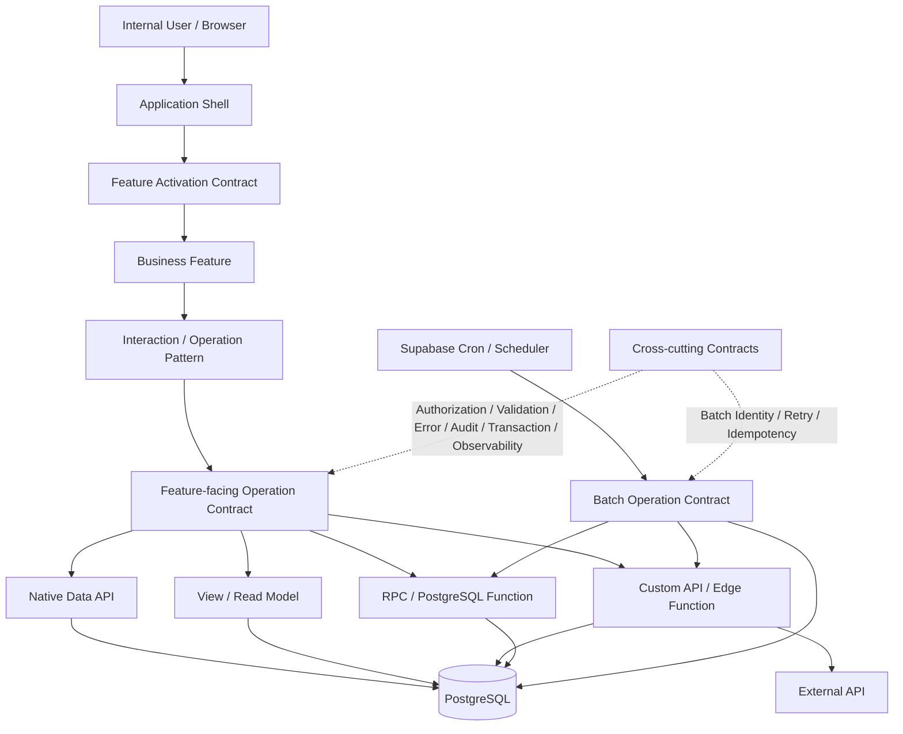

# Nook Works Application Architecture

> Status: Architecture Baseline Candidate v0.1  
> Date: 2026-09-17  
> Scope: Nook Works internal enterprise application platform  
> Basis: Verified technical capability + completed Functional Pattern research  
> Review State: Awaiting independent adversarial review

## 1. Purpose

本文件將目前 Playground 已完成的 technical evidence 與 functional pattern 收斂成 **Nook Works 第一版 Application Architecture Baseline**。

目前已完成四個常見企業場景的第一輪能力 / interaction research：

```text
Scheduled / Cron
Query
Query → Detail
Single-record Maintenance
```

本文件的目的不是宣告「平台已完成」，也不是把 Demo 原封不動升格為 Production Framework；而是第一次正式回答：

> Nook Works 的 Application、Business Feature、Operation、Data Access、Backend、Batch 與 Cross-cutting Responsibility 應如何分工？

目前尚未以真實 Requirement 驗證的 Master-detail / One-to-many / Many-to-many、Workflow / Approval、Advanced Query、Distributed Transaction 等能力保留為後續 extension，不阻擋本輪 baseline 成立。

---

## 2. Architecture Basis and Claim Strength

本 Architecture 不把所有內容都叫「已驗證」。不同結論的成熟度不同。

| Claim | Meaning |
| --- | --- |
| **Verified Capability** | 已在 Playground runtime / provider / Claire environment 實際驗證 |
| **Pattern Candidate** | Functional / interaction research 已完成第一輪收斂，可作 Architecture input |
| **Architecture Baseline Candidate** | Primary 根據 Evidence + Pattern 形成的 Nook Works responsibility design，仍待 adversarial review |
| **Open Contract** | Responsibility 已知道，但正式 interoperable contract 尚未完成 |
| **Deferred Extension** | 目前沒有代表性 Requirement，不為了湊齊平台功能表而提前設計 |

核心治理原則維持：

```text
Feasibility Evidence
≠ Preferred Pattern
≠ Platform Rule
```

---

## 3. Architecture Drivers

Nook Works 的第一版 Platform Architecture 由以下實際條件驅動：

1. **Internal enterprise application**：主要使用者是熟悉作業的內部人員，不以 customer-facing guided flow 作一般維護 baseline。
2. **iPad-first development / operation**：正式開發與維運 workflow 不假設 Desktop、Docker 或完整 local server。
3. **Supabase-first backend**：Auth、PostgreSQL、Native Data API、RPC、Edge Function、Cron 已有直接 Evidence。
4. **Netlify browser delivery**：目前 browser application delivery baseline 已可用。
5. **Business Specification 與 Technical Platform 分工**：SA 描述 Business Operation；Platform 負責 technical interpretation，而不是要求 Business Spec 決定 Edge Function / RPC / Native API。
6. **Responsibility before abstraction**：先定義誰負責什麼，再決定需不需要 framework / library / wrapper。
7. **General Pattern 不等於 auto-generated UI**：Feature Specification 仍決定 Business Content、欄位組合與畫面構成。

---

## 4. High-level Architecture



這不是一條「每次 request 必須走完所有 box」的 pipeline。

例如普通 Native Query 可以直接：

```text
Feature
→ Operation Contract
→ Native Data API
→ PostgreSQL
```

而 Business-sensitive mutation 可以是：

```text
Feature
→ Business Operation Contract
→ Custom API / RPC
→ authoritative validation + mutation
```

Architecture 的目標是讓不同 complexity 的 operation 可以選擇不同 execution mechanism，同時保持 responsibility 清楚，而不是逼所有功能通過同一個宇宙級 Service Layer。

---

## 5. Application Shell Responsibility

**Basis: Verified S-SHELL-1 + Architecture Candidate**

Application Shell 負責跨 Feature 的 application lifecycle：

- Authentication / Session restore / refresh / invalidation / explicit logout。
- Authentication Identity → active Application User Context。
- Application eligibility。
- metadata-driven Navigation。
- Route / deep-link / reload / Browser Back / Forward integration。
- Feature Entry。
- Shell-level startup / session-invalid / global failure handling。
- browser-safe runtime configuration。

Shell 不擁有：

- Query criteria / result。
- Form / Dirty State。
- Business Validation。
- Business Authorization decision。
- Business workflow state。
- Batch execution state。

強候選原則：

> Application-wide lifecycle 屬於 Shell；Business-operation state 不因為畫面被 Shell 包住就變成 global state。

---

## 6. Feature Activation Contract

Shell 與 Business Feature 之間需要穩定 activation seam，但目前不需要發明一個巨大的 `FeatureRuntime` framework。

Minimum contract：

- stable Feature identity / route context；
- current Application User Context access；
- current authenticated credential/session access when needed；
- active Feature disposal / supersession ownership；
- session-invalid 可回報 Shell。

Navigation Visibility / Feature Entry 只代表 application entry responsibility，不等於 backend authorization。

```text
Authentication Identity
≠ Application Eligibility
≠ Navigation Visibility
≠ Feature Entry
≠ Feature Data Access
≠ Business Authorization
```

---

## 7. Business Feature Pattern Baseline

### 7.1 Query Pattern

**Basis: F-QUERY-1 Pattern Candidate**

```text
Feature Identity
→ Query Criteria
→ Query Action
→ Server-side Filter / Sort / Page
→ Bounded Result + Metadata
→ Result Interaction
```

Feature owns：

- Business criteria semantics；
- functional validation；
- sort / page / pageSize state；
- loading / empty / recoverable error / result presentation；
- curated result fields。

Platform / Technical Design owns：

- Technical Result Boundary；
- bounded response / page execution；
- operation contract；
- data-access mechanism；
- trusted authorization boundary；
- stale / superseded request behavior。

Important distinction：

```text
Business Query Boundary
≠ Technical Result Boundary
```

### 7.2 Query → Read Detail Pattern

**Basis: F-DETAIL-1 Pattern Candidate**

```text
Query Context
→ Select Stable Record Identity
→ Read Detail
→ Feature-defined Business Content
+ Platform-standard Audit
→ Return
→ Re-resolve current work position
```

Key rule：

```text
Query Context ≠ Old Page Number
```

Stable Record Identity 是 return-context anchor candidate。Production bounded anchor-position / cursor resolution 尚是 Open Contract。

Read Detail 本身不等於 auto-generated page；Business Content 由 Feature Specification 決定。

### 7.3 Single-record Maintenance Pattern

**Basis: F-MAINT-1 Pattern Candidate**

Nook Works ordinary internal maintenance 採 Worklist-centric baseline：

```text
Query / Worklist Context
├─ Read   → Return        → Query Context
├─ Create → Save / Cancel → Query Context
└─ Update → Save / Cancel → Query Context
```

Maintenance Pattern owns：

- Read / Create / Update operation semantics；
- Effective Capability input；
- editable / immutable / read-only field state；
- validation lifecycle；
- dirty state / unsaved-change guard；
- Save / Cancel lifecycle；
- return-to-work-context behavior；
- Mutation Policy decision point；
- Audit semantics reuse。

Pattern 不規定：

- 一定同一頁 mode-based；
- 一定拆成三個頁面；
- 按鈕固定位置；
- generic Form Framework；
- 所有 Update 都做 optimistic locking。

### 7.4 Guided Process / Workflow is Separate

Customer-facing guided journey 與 internal maintenance 是不同 interaction archetype。

另外，企業內部 Workflow / Approval 也不應被塞進普通 Maintenance：

```text
Maintenance
= maintain Business Object

Workflow / Approval
= move Business Object through actors / decisions / states
```

Workflow 是 Deferred Extension，不是 Single-record Maintenance 的下一個必做 Phase。

---

## 8. Scheduled / Batch Architecture

**Basis: Verified D-BATCH-1**

Nook Works Batch / Scheduled Operation 與 interactive Feature 是平行 entry surface，不是 Browser Feature 的特殊模式。

Verified execution shapes 包括：

```text
Cron → PostgreSQL Function
Cron → pg_net → Edge Function
Edge Function → Native Data API
Cron-scheduled Edge Function → External API → DB
```

Parameterized invocation verified：

```text
Static Literal
Execution-time SQL Expression
PostgreSQL Function Return Value
```

Architecture baseline：

```text
Schedule Definition
→ Batch Invocation Contract
→ Batch Operation
→ Selected Backend Mechanism
→ Data / External Side Effect
→ Execution Result / Audit / Observability
```

Batch 與 interactive operation 可共享 Data Access / Custom API / RPC capability，但不共享 browser lifecycle。

Open Batch Contracts：

- Run Identity；
- Idempotency；
- Retry policy；
- failure classification；
- operational observability；
- long-running workload boundary。

這些應由實際 batch Requirement 驅動，不因為 Cron 已能執行就假裝完整 orchestration 已經設計完。

---

## 9. Feature-facing Operation Contract

Business Feature 不直接依賴「哪個 Provider SDK 好用」，而應依賴 operation semantics。

Candidate categories：

```text
Query Operation
Read Operation
Standard Mutation
Conditional Mutation
Business Operation
Batch Operation
```

Operation Contract 至少描述需要的：

- input semantics；
- output/result semantics；
- stable identity；
- validation outcome；
- authorization obligation；
- mutation policy；
- transaction need；
- error classification；
- cancellation / supersession when applicable；
- observability / correlation when applicable。

這是 responsibility seam，不要求每個 Feature 都建立一個多餘 wrapper class。

---

## 10. Data Access / Execution Mechanism Selection

Platform 不應以「所有東西都走 Custom API」取得虛假的一致性，也不應以「Native CRUD 很方便」假裝所有 Business Operation 都是 CRUD。

第一版 candidate selection guidance：

| Operation shape | Natural candidate | Notes |
| --- | --- | --- |
| Simple bounded table read | Native Data API | RLS / grants / result boundary 必須明確 |
| Curated read model | View + Native Data API | View security semantics must be explicit |
| Ordinary single-record Create / Update | Native CRUD | Last Write Wins 可作 ordinary default candidate |
| Stale-update-sensitive mutation | Conditional Native Update or Custom Operation | 視 error semantics / atomicity 選擇 |
| Current business-state-sensitive mutation | Custom API / RPC | authoritative precondition 應在 trusted boundary |
| Multi-object atomic DB operation | RPC / DB-owned transaction or backend-owned transaction | Transaction owner = layer that owns full Business Operation |
| External API orchestration | Custom API / Edge Function | 不把 third-party integration 暴露成 Browser business logic |
| Scheduled operation | Cron + DB Function / Edge Function / other selected backend operation | 依 workload responsibility 選擇 |

這是 Architecture Guidance，不是 provider-specific hard rule。

---

## 11. Mutation Policy

Concurrency 不是所有 Update 的 universal behavior，而是 explicit Mutation Policy decision point。

### Ordinary Maintenance Default Candidate

```text
Last Write Wins
```

若兩位 User 先後 Save，最後一次成功 mutation 成為 authoritative state，Audit 記錄最後修改人 / 時間。

### Stale-update-sensitive Mutation

Requirement 明確不能接受 silent overwrite 時，可使用：

```text
loaded updated_at / version
vs current authoritative updated_at / version
→ mismatch
→ reject stale mutation
```

### Business-state-sensitive Mutation

如果 operation 是否成立取決於現在的 authoritative Business State：

```text
Mutation Request
→ Validate current state
→ Validate authorization / business rule
→ Mutate atomically
```

此時問題不是單純 concurrency，而是 Business Operation precondition。

Platform / Specification guidance 必須顯性暴露這個 decision point。SA 可以接受 default，但不能因為沒聽過 concurrency 就讓行為靠 provider 偶然決定。

---

## 12. Validation Responsibility

Validation 不應被寫成「全部前端」或「全部後端」的二選一。

Candidate split：

```text
User-correctable interaction validation
→ Feature / Browser

Authoritative business validation
→ trusted backend boundary when correctness depends on current authoritative data/state

DB invariant
→ Database constraint / trusted data boundary
```

同一條規則可能在 Browser 有提前提示，但 authoritative enforcement 仍應存在於真正擁有 correctness 的 boundary。

Formal Validation Contract 仍為 Open Contract。

---

## 13. Transaction Ownership

**Basis: Verified C-BSA-1 + Architecture Candidate**

核心原則：

> Transaction boundary 由擁有完整 Business Operation 的那一層決定。

Candidate mapping：

```text
Single simple row mutation
→ Native operation may be sufficient

Database-centric atomic business operation
→ PostgreSQL Function / RPC may own transaction

Backend orchestration requiring multiple DB steps under one connection
→ Backend may own transaction

External side effects + DB consistency
→ requires separate compensation / orchestration design
```

不要為所有 Save 建 transaction framework；也不要在真正 multi-step atomic operation 出現時假裝每一步各自成功就叫 transaction。

---

## 14. Authorization Architecture

目前已有 direct evidence 支持 responsibility separation，但正式 Business Authorization model 尚未完整設計。

Baseline：

1. Shell / Navigation 可以決定 Feature 是否應顯示 / 可進入。
2. Browser capability 決定 presentation / interaction。
3. 真正 Data Access / Business Mutation 必須由 trusted boundary authorization enforcement。
4. Backend service identity 不等於 unrestricted DB access。
5. PostgreSQL grant、RLS、Function EXECUTE、service identity 是不同 authorization boundaries。

Open Contract：

- Feature-level Business Authorization representation；
- operation-level permission semantics；
- row / scope authorization；
- authorization error taxonomy；
- Production identity / secret / connection governance。

---

## 15. Error Contract

目前 Architecture 需要一致分類，但尚未宣告完整 schema。

Minimum candidate categories：

```text
validation
session-invalid
forbidden
not-found
conflict / stale-state (only when selected policy requires it)
business-rule
boundedness / request-too-broad
backend / dependency failure
unexpected
```

重要責任：

- raw provider error 不直接等於 Feature-facing error；
- `session-invalid` 可升級回 Shell；
- `forbidden` 不等於 logout；
- Business Rule failure 不應偽裝成 generic HTTP 500；
- Last Write Wins Feature 不需要硬製造 `conflict` outcome。

Formal transport shape / code taxonomy 是 Open Contract。

---

## 16. Audit and Observability

### Business Audit

F-DETAIL-1 已建立 ordinary record Audit sub-pattern candidate：

```text
created_at / created_by
updated_at / updated_by
```

Audit 是 Business Record presentation / trace semantics，不等於 operational logging。

### Operational Observability

Platform 尚需定義：

- request / operation correlation；
- Custom API invocation logging；
- Batch Run Identity；
- failure diagnostics；
- production-safe logging / secret boundary；
- tracing depth。

Observability 是 Architecture Open Contract，不因為 Playground Console 能看到錯誤就宣告完成。

---

## 17. State Ownership

Candidate ownership table：

| State | Primary Owner |
| --- | --- |
| Auth Session | Shell / Auth lifecycle |
| Application User Context | Shell |
| Route / Feature Entry | Shell |
| Query Criteria / Sort / Page / PageSize | Query Feature |
| Query Result / selected stable identity | Query / work context |
| Read Detail record state | Detail Feature |
| Form / Dirty State | Maintenance Feature |
| Effective Capability presentation state | Feature, based on trusted inputs / contract |
| Business Authorization decision | Trusted backend boundary |
| Transaction state | Operation owner / backend |
| Batch Run state | Batch runtime / operation owner |
| Workflow state | Future Workflow Pattern |

Strong candidate principle：

> State ownership follows semantic lifecycle, not visual containment.

---

## 18. Nook Works First Architecture Baseline

第一版可收斂為四個 application operation archetypes：

```text
1. Scheduled / Batch
   Schedule → Batch Operation → Backend / Data / External

2. Query
   Shell → Feature → Query Operation → Bounded Read → Result

3. Query + Detail
   Query Work Context → Stable Record → Read Detail → Restore Work Context

4. Maintenance
   Query Worklist → Read / Create / Update → Save / Cancel → Restore Work Context
```

這四類不是所有未來 Feature 的宇宙真理，但足以覆蓋目前 Nook Works 已識別且高頻的 internal enterprise application baseline。

---

## 19. Deferred Requirement-driven Extensions

以下不因為「企業系統遲早可能有」就現在先做 framework：

- Master-detail / one-to-many Maintenance；
- one-to-many-to-many composition；
- Approval / Workflow；
- Delete / Void generic handling；
- Cursor / Keyset Pagination；
- Infinite Scroll；
- generic Data Grid；
- generic Form Framework；
- pessimistic locking；
- distributed transaction / compensation；
- long-running orchestration；
- full Design System。

Re-open principle：

```text
Representative Requirement
→ challenge current baseline
→ reuse / extend / replace
→ focused experiment only if mechanism / behavior is uncertain
```

---

## 20. Architecture Open Contracts

下一輪 Architecture Design / Specification 應逐步處理，但不要求一次全部解完：

1. Business Authorization Contract。
2. Feature-facing Error Contract。
3. Validation ownership / error semantics。
4. Mutation Policy declaration in Feature Specification。
5. Transaction Pattern Selection guidance。
6. Query / Detail return-anchor production resolution contract。
7. Browser History / route integration for unsaved state。
8. Batch Run Identity / retry / idempotency contract。
9. Observability / correlation contract。
10. Production Identity / Secret / Connection Governance。
11. Requirement → Pattern → Operation Contract traceability。

這些才是接下來真正的架構工作。再畫十個 Prototype 不會自動替我們回答它們，最多只是讓 `public/` 目錄變得很熱鬧。

---

## 21. Current Judgment

Nook Works 現在已有足夠 Evidence / Pattern coverage，可以從「capability exploration + UI interaction research」進入 **Architecture-first refinement**。

目前 architecture direction 是：

```text
Application Shell
→ activates Business Feature
→ Feature owns Business interaction state
→ Feature invokes explicit Operation Contract
→ Platform selects proportionate execution mechanism
→ Trusted backend owns authoritative authorization / business correctness where required
→ State / transaction ownership follows semantic operation boundary
```

而不是：

```text
Every Feature
→ One giant generic framework
→ One mandatory API shape
→ One automatic UI generator
```

v0.1 仍是 Primary Architecture Candidate。下一步必須接受 independent reviewer / implementer 的 adversarial challenge，再決定哪些部分升級、修正、降級或拆成 Open Contract。
