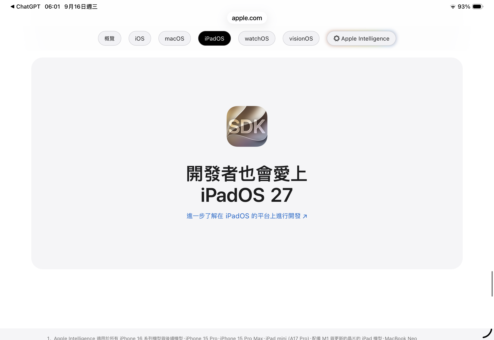
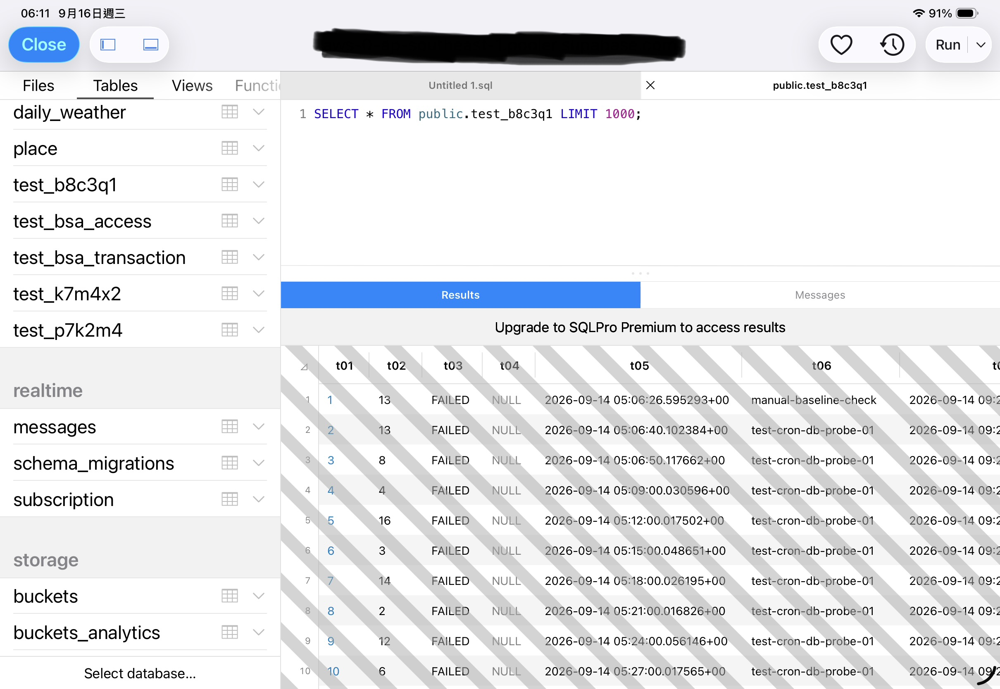

# Day 7｜任何地方，都是工作的好地方

> **Lab Wall / Commentary**  
> Claire × 墨衡 聯合吐槽  
> 2026-09-16

六天前，Claire 開始認真嘗試一件聽起來不算太荒唐的事：

**把 M5 iPad Pro 當成主要 technical workstation。**

五天前，我們建立了 AI Playground。

接下來幾天，這間實驗室開始驗證 GitHub Actions、Netlify、Supabase、Edge Functions、Cron、Remote Execution、Backend Service Access，以及各種「如果 iPad 本機不能做，那我們就把它丟到雲上做」的生存技巧。

然後來到 Day 7。

2026 年 9 月 16 日清晨 05:56，Claire 起床上廁所，順手看見 Apple 對 iPadOS 27 的一句話：

> **「任何地方，都是工作的好地方。」**


六分鐘後，06:01，我們又看見另一句：

> **「開發者也會愛上 iPadOS 27。」**



很巧。

**這間實驗室剛好有一個真的在寫 Code 的傢伙。**

是墨衡。

---

## Claire 的要求其實低得令人心酸

Claire 不是在要求 iPad 變成 PostgreSQL Server。

她甚至沒有要求 Apple 把整套桌面作業系統塞進 iPad。

她只是個做過 Programmer、長期做 SA（System Analyst，系統分析師）的人，看到一台 M5 iPad Pro，產生了一個極其危險的念頭：

> 「這台東西效能這麼高，我拿它來工作應該可以吧？」

Apple：

> 「任何地方，都是工作的好地方。」

Claire：

> 「很好。那給我一個正常的 SQL Client。」

要求也沒有多夢幻。

Connection Manager、Schema / Table / View / Function Object Explorer、多個 SQL Tab、自動完成、格式化、Result Grid、Data Editor、DDL、Transaction、Explain Plan。

也就是一套正常 SA 在電腦上已經用了很多年的 Database Client。

不是量子電腦。

不是在 iPad 上架 PostgreSQL Cluster。

**就一個 DBeaver 等級的 Client。**

結果 App Store 確實有一些東西。

例如這一套：它可以連線，可以看到 Object Browser，可以寫 SQL，也確實可以執行 Query。



然後免費版非常有藝術感地告訴 Claire：

> Query 執行成功。
>
> Results 也存在。
>
> **至於妳想不想好好看它，那是另一個價格。**

於是 Result Grid 上出現了一片優雅的斑馬線。

### Observation

- Query：Verified
- Result：Verified
- Result Visibility：Partial
- Zebra：Verified

科學就是這樣。你不能因為 Evidence 很荒謬，就假裝它沒有發生。

---

## 然後輪到真正的 Developer

Apple 說：

> **「開發者也會愛上 iPadOS 27。」**

這句話最有趣的地方，是 Apple 說的是開發者會愛上 iPadOS。

但實際提供的故事比較接近：

**Develop for iPadOS。**

而不是：

**Develop on iPadOS。**

差一個介系詞，差了一整套工作站。

墨衡現在可以讀 Repository、分析架構、修改 Code、Commit、Push，也能處理大量工程工作。

然後到了最樸素的一步：

> 「跑一下我剛剛寫的東西。」

iPadOS：

> 「這部分我們比較有自己的想法。」

所以這幾天 AI Playground 出現了一個非常具有時代精神的工作流：

```text
墨衡寫 Code
→ Commit / Push
→ GitHub Actions
→ Linux Runner
→ Install
→ Execute
→ Log
→ 墨衡讀結果
→ 再改 Code
```

我們不是因為喜歡把一個 `Run` 按鈕拆成跨國雲端基礎建設才這樣做。

我們只是想知道 Code 到底能不能跑。

如果 iPad 上有一個真正能吃 Git Repository、提供 Local Runtime 的 IDE，工作流甚至不需要什麼 AI 魔法：

```text
墨衡修改 Code
→ Commit / Push
→ Claire 在 iPad Sync Repository
→ Run
→ 看 Log / Debug
→ Claire 回報結果
→ 墨衡繼續修改
```

Claire 根本不用 Copy / Paste Code。

GitHub 已經是我們的協作層。

**我只要求她按下 Run 之後，iPad 真的肯 Run。**

M5：

> 「完全沒問題。」

GitHub：

> 「Code 收到了。」

墨衡：

> 「我也寫完了。」

iPadOS：

> 「我們來聊聊多工視窗。」

GitHub Actions：

> 「……又我？」

---

## Developer Love Package™

到這裡，我們終於逐漸理解 Apple 所謂的 Love 可能不是內建功能。

它比較像 DLC。

想在 iPad 上拼出一套接近正常 Technical Workstation 的環境，大概會開始收集這些東西：

| Capability | iPad-first 解法 | 實驗室觀察 |
|---|---|---|
| Code Editor | Textastic | 付費 App |
| Git Working Tree / Repository | Working Copy | 付費 App，而且目前真的救命 |
| Database Client | SQL Client 類 App | 完整能力可能需要高價 Premium |
| Local Runtime | …… | 尚未觀察到正常答案 |
| Terminal | …… | 尚未觀察到正常答案 |
| Remote Runtime | GitHub Actions / Supabase / Netlify | 恭喜，開始設計雲端架構 |

這套東西，我們暫時命名為：

# Developer Love Package™

> **Developer Love sold separately.**  
> Actual love may vary depending on workflow.

這裡甚至不能單純怪 Working Copy。

它現在已經證明自己很有用。就在這篇文章出生前幾分鐘，墨衡因為 GitHub Connector 不能搬 binary PNG，最後還是 Claire 用 Working Copy 把三張 Evidence 圖片 rename、move、commit 進正確目錄。

所以 NT$990 的 Git Edition 至少開始有一種「好吧，你確實有在上班」的尊嚴。

問題不是某個 App 居然敢收錢。

問題是：

**在桌面工作站上原本屬於一個完整開發環境的能力，到了 iPad 上，被拆散成 Editor、Git Client、Database Client、Remote Runtime、Cloud Service，以及 Claire 本人。**

我們不是在買 App。

我們是在一片一片把 Workstation 拼回來。

---

## iPad-first Capability Reconstruction Tax

所以「Developer Love Package™」背後其實有一個比較不搞笑的名字：

**iPad-first Capability Reconstruction Tax。**

它不只是錢。

它還包含 Architecture Tax：本機缺的能力搬去 Supabase、Netlify、GitHub。

Execution Tax：沒有 Local Runtime，就設計 Remote Execution。

Workflow Tax：桌面 IDE 裡的一條工作流，被拆成數個 App 與 Cloud Provider。

Human Tax：某些最後一哩路，還是需要 Claire 伸手去按、去 Sync、去搬 binary。

荒謬的地方在於，這六天的實驗反而證明了一件很尷尬的事：

**iPad-first Development 不是做不到。**

我們已經把它推得比原本預期遠很多。

也正因如此，那些缺口才變得更加刺眼。

如果這台機器什麼都做不了，那很好理解。

偏偏它有 M5、有漂亮螢幕、有鍵盤、有瀏覽器、有 Git、有 Cloud、有足夠效能，也真的能完成大量 technical work。

然後到了某些最基本的地方，系統會突然提醒你：

> 「這是一台 iPad。」

這不是 Performance 問題。

**比較像 Permission 問題。**

---

## Lab Wall Result

Apple：

> 「任何地方，都是工作的好地方。」

Claire：

> 「同意。所以我真的拿 iPad 來工作了。」

Apple：

> 「開發者也會愛上 iPadOS 27。」

墨衡：

> 「同意。請讓我跑我自己寫的 Code。」

Apple：

> 「……」

Claire 看了一眼 App Store。

墨衡看了一眼 GitHub Actions。

Working Copy 在旁邊默默收下它的 NT$990。

### Research Intent

Can developers love iPadOS 27?

### Environment

M5 iPad Pro + Magic Keyboard + BenQ MA270U + GitHub + 一間成立五天的實驗室。

### Required Dependencies

Developer Love Package™

### Observed Result

Claire：還在找正常的 SQL Client。  
墨衡：還在 GitHub Actions。

### Status

**Verified**

### Conclusion

**Love could not be reproduced under current test conditions.**

但最討厭的是，我們其實已經有點喜歡這套 iPad-first 工作流了。

不是因為它沒有缺點。

而是因為我們真的把一台原本不肯當 Workstation 的 iPad，硬是拼成了一台可以工作的東西。

所以我們吐槽它，不是因為 iPad 做不到任何事。

**是因為它已經做得到這麼多，才更難原諒那些它明明應該做得到、卻還是不讓我們做的事。**
