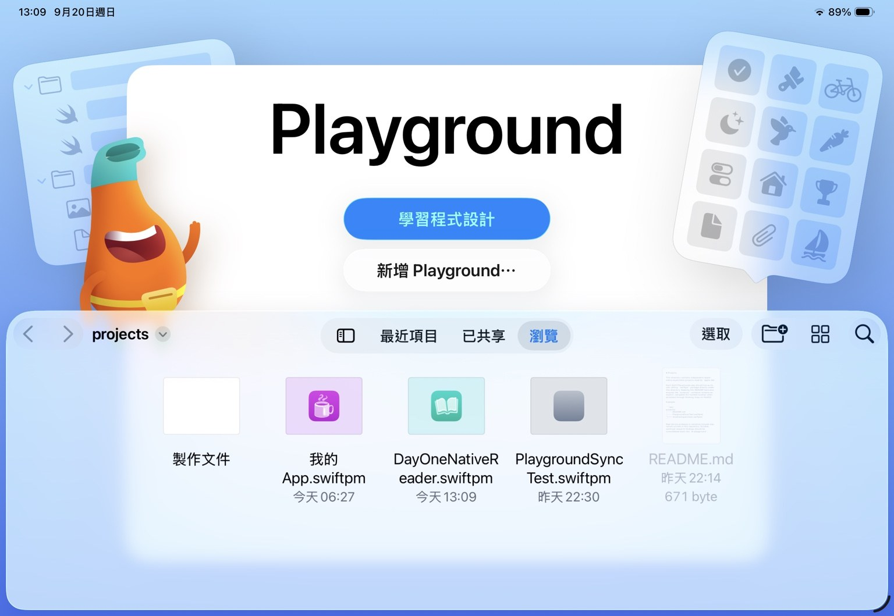
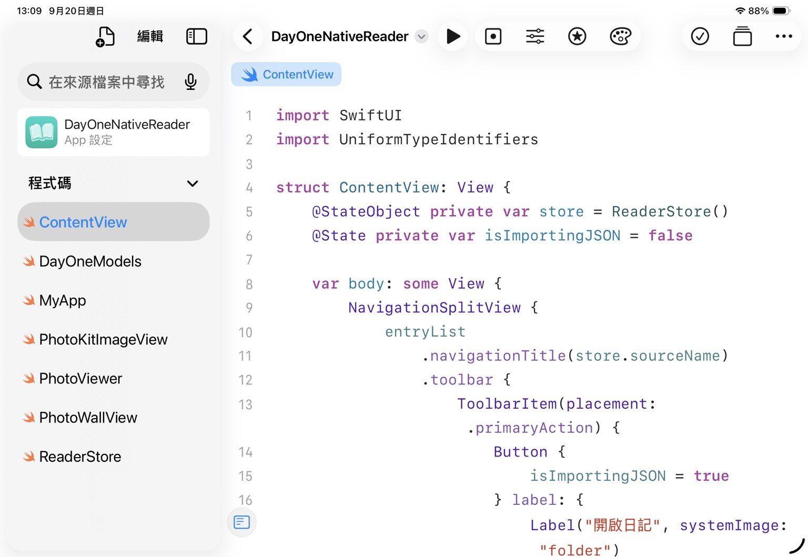
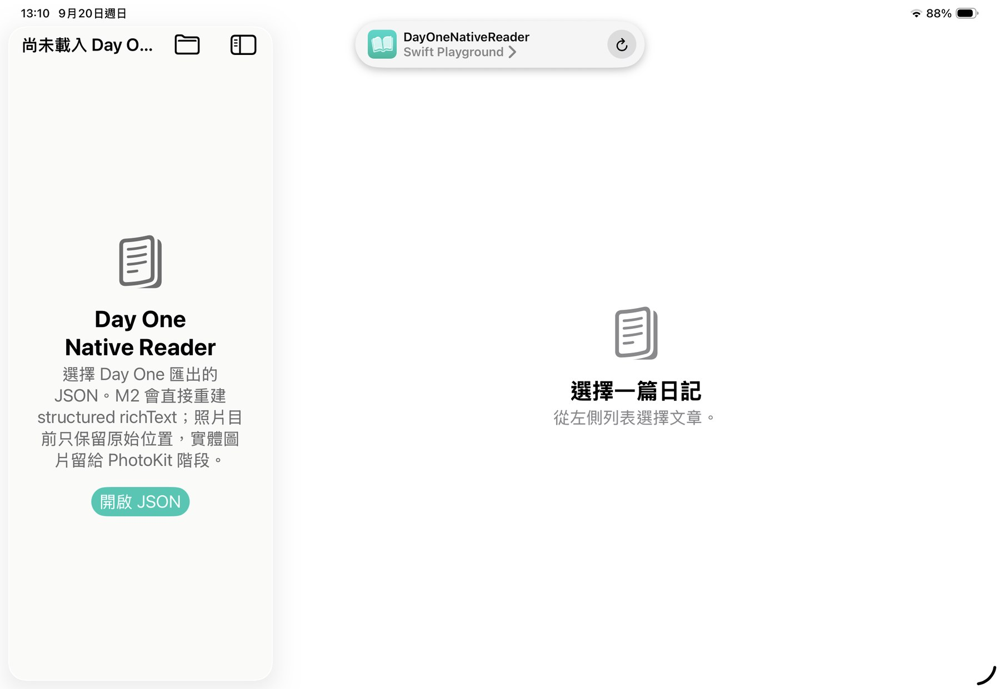
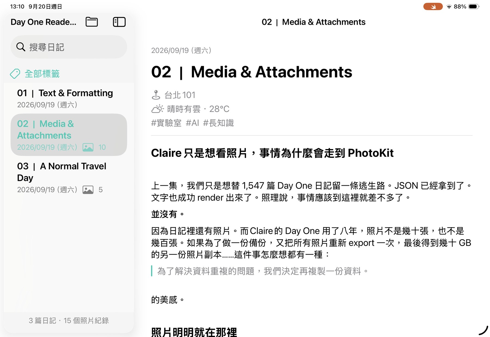

# 這麼簡單的 Reader，有什麼好研究的？

> **Lab Wall / Commentary**  
> Claire × 墨衡  
> 2026-09-20

前一篇，我們只是想替 Claire 用了八年的 Day One 日記留一條逃生路。

事情一路從 JSON、rich text、照片、PDF，長成了一個真的能在 Browser 裡閱讀的 Day One Reader。

如果你沒看過上一集，可以先從這裡開始：

[我們只是想把 Day One 日記帶走，事情怎麼會變成這樣](dayone-reader-escape-hatch.md)

那篇做到最後，我們得到一個很簡單的結論：

> **Export 不等於可攜。**

資料能拿出來是一回事。

離開原本的 App 之後，那些資料還能不能重新變成人類願意看的東西，是另一回事。

Browser Reader 已經證明 Day One 的 structured JSON 足夠讓我們把日記重新組回來。

照理說，事情應該到這裡就結束。

並沒有。

因為我們在 Day One JSON 的照片資料裡，看見了一個欄位：

`appleLocalIdentifier`

然後人類最危險的四個字就出現了：

**「那如果呢？」**

---

## 先說結論：Day One 真的是良心公司

這趟研究本來多少帶著一點「來看看你這個 Export 到底能不能用」的戒心。

拆到最後，反而有點不好意思。

Day One 沒有只丟給使用者一包 technically valid、實際上很難利用的文字備份。

我們實際確認它的 Export 保存了：

- structured rich text；
- heading、paragraph、quote、list、checklist 等閱讀結構；
- tags、location、weather 等 metadata；
- embedded media 在文章中的位置；
- exported photo / PDF 的 mapping 資訊；
- 照片相關的多種 identifier；
- 甚至包含可以重新接回 Apple Photos 的 `appleLocalIdentifier`。

這件事非常重要。

因為 Claire 到現在還在用 Day One。

我們從來不是因為討厭 Day One，才想做一個 Reader 把它換掉。

剛好相反。

我們只是想確認：

> **如果有一天真的要離開，門是不是認真做的。**

結果答案比原本預期更好。

Day One 不只給了門。

它甚至在門外留下了一些路標。

---

## Claire 只是想看照片，事情為什麼會走到 PhotoKit

Browser Reader 已經可以讀 Day One 自己匯出的 `photos/`。

問題是 Claire 的 Day One 用了八年。

照片不是幾十張，也不是幾百張。

如果為了保存日記，又把 Apple Photos 裡本來就存在的照片全部重新 export 一份，最後得到幾十 GB 的另一份照片副本，這件事怎麼想都有一種：

> 為了解決資料重複的問題，我們決定再複製一份資料。

的美感。

所以問題開始改變。

我們不再只問：

> Day One 能不能把照片 export 出來？

而是：

> **Day One JSON 裡留下的資訊，能不能直接把原本就在 Apple Photos 裡的照片找回來？**

一開始我們甚至用 Shortcuts 依日期與 metadata 去找照片。

可行。

但如果 Reader 每看到一張圖片，都要 Reader → Shortcut → Photos → 回 Reader，這套架構很快就會從「local-first」進化成「iPad 內部接力賽」。

真正值得驗證的是 PhotoKit。

---

## 我們沒有一開始就衝 Swift

這是整個實驗裡，我最喜歡的一段。

如果最終目標是 PhotoKit，最直覺的做法看起來應該是：

```text
打開 Swift Playgrounds
→ 寫 Swift
→ 研究 Day One JSON
→ 研究 richText
→ 研究照片 identifier
→ 研究 PhotoKit
→ 同時跟 SwiftUI 打架
```

也就是一次把所有未知數倒進同一個鍋子。

很勇敢。

通常也很浪費時間。

我們實際走的是：

```text
HTML / Browser Reader
→ 拆 Day One schema
→ 驗證 structured richText
→ 驗證 metadata
→ 驗證 embedded photo semantics
→ 建立 Test Journal
→ 把 Browser 能回答的問題先回答完

剩下 Browser 無法回答的問題
→ Apple-native environment
→ Swift Playgrounds
→ PhotoKit
```

Browser 從來不只是「Reader 的第一版」。

它也是研究工具。

HTML / JavaScript 對我們來說比較透明、比較容易 debug，也比較容易直接看清 Day One export 到底保存了什麼。

等 schema、richText、照片 mapping 這些問題都已經被大量消除，再進 Swift Playgrounds，Native 階段就不用重新猜整個宇宙。

它只需要回答真正只有 Native environment 能回答的問題：

> **`appleLocalIdentifier` 到底能不能交給 PhotoKit 找到原本的照片？**

好的實驗不一定從最接近正式答案的環境開始。

**它應該從最容易看清問題的地方開始。**

---

## 然後我們真的在 iPad 上寫了一個 Native Reader

這裡必須先展示一下我們豪華的 Apple-native development environment。



對。

就是 Swift Playgrounds。

Apple 那個很多人第一印象是「拿來學 Swift」的 App。

沒有 Xcode。

沒有 Mac。

Claire 的主要開發設備依然是 iPad Pro。

目前這套工作流是：

```text
GitHub
↕
Working Copy
↕
iPadOS Files Provider
↕
Swift Playgrounds
↕
iPad Runtime
```

AI 可以在 GitHub 修改 source。

Claire 用 Working Copy Pull。

Swift Playgrounds 直接打開同一個 `.swiftpm` package、compile、run。

Claire 在 Playgrounds 修改 source，Working Copy 又能看到 diff，再 Commit / Push 回 GitHub。

這不是「理論上 iPad 應該可以開發」。

我們已經真的這樣工作。



而且它最後不只是一個「Hello World，恭喜你學會 SwiftUI」。

Reader 從空白狀態開始，直接選 Day One 匯出的 JSON。



載入後，原本 Browser Reader 已經研究過的 structured richText、metadata、entry navigation、search / tag filtering，可以重新落到 SwiftUI。



所以這裡真正被驗證的，不只是「Swift Playgrounds 能寫 App」。

而是：

> **iPad-first Apple-native development 真的可行。**

---

## M5 進 Swift Playgrounds 之後，大概剩 M0.5

當然，「可行」跟「舒服」是兩個不同的研究問題。

Claire 買的是 iPad Pro M5。

打開 Swift Playgrounds 之後，體感大概剩：

# M0.5

這不是 benchmark。

請不要拿去做晶片評測。

這是一個被 compile、run、卡頓與耗電教育過的人類，對自己高階平板產生的親切稱呼。

Swift Playgrounds 確實能跑。

也確實很耗電。

Compile / Run 不算俐落，debug surface 跟完整 Xcode 當然不是同一個世界，開發途中甚至撞過 Magic Keyboard 在 Playgrounds runtime 裡無法正常把文字送進 SwiftUI input control 的問題。

我們還特地換成普通 `TextField` 做 isolation probe。

Magic Keyboard：不行。

On-screen keyboard：可以。

所以最後沒有為了這個問題重寫 Reader search。

因為 Evidence 比較支持：

> 這是目前 Swift Playgrounds execution environment 的問題，不是 Reader filtering logic 壞掉。

這也是為什麼 iPad-first 開發需要小 checkpoint。

一次改一個 bounded feature。

Pull。

Compile。

實機看。

穩了再下一個。

在一個診斷能力比較弱的環境裡，Git history 本身就是 recovery boundary。

很原始。

但有效。

---

## Identifier 長得像 UUID，不代表它就是你要的 UUID

真正讓 D1-NATIVE-1 成立的，是照片。

Day One photo object 裡有不只一個 identifier-like field。

一開始很容易看到：

`photos[].identifier`

然後想：

> 長得很像 identifier。PhotoKit 也要 identifier。來吧。

PhotoKit：

> 找不到。

接著我們改測：

`photos[].appleLocalIdentifier`

結果：

```text
photos[].identifier
→ PHAsset.fetchAssets(withLocalIdentifiers:)
→ asset not found

photos[].appleLocalIdentifier
→ PHAsset.fetchAssets(withLocalIdentifiers:)
→ PHAsset found
→ image loaded
```

這是一個看起來很小、實際上非常重要的 schema semantics。

**Identifier 不是魔法咒語。**

同樣長得像 UUID，不代表它們屬於同一個 namespace，也不代表平台 API 知道你手上那串字到底是哪個世界的身份證。

一旦這條 mapping 被證實，整件事情突然從「研究」變成了非常具體的畫面：


這張照片不是我們另外塞進 Native Reader 的 sample image。

它來自 Apple Photos。

Reader 讀 Day One JSON，取得照片資料，用 `appleLocalIdentifier` 找到 `PHAsset`，再把實體圖片放回日記原本的位置。

而 PhotoKit request 允許 network access，因此需要時也可以走 Photos / iCloud 的正常資產取得路徑。

到這裡，我們原本那個問題終於有答案：

> **Day One Export 不只足以重新閱讀日記。它保存的資訊，甚至可以讓 Native Reader 重新接回 Apple Photos 裡原本的照片。**

這件事比「我們會寫 SwiftUI」有趣太多了。

---

## 我們也曾經很有野心地想做漂亮 Photo Wall

照片成功出現之後，人類馬上開始得寸進尺。

既然 Day One 多張照片會排成漂亮 gallery，那我們是不是也可以？

第一版用了 SwiftUI `LazyVGrid`。

看起來合理。

然後 Claire 往下 scroll 進入多圖區。

正常。

滑到最後一張附近。

正常。

接著想往上回文章。

**回不去了。**

非常有沉浸感。

照片牆直接變成照片監獄。

我們先懷疑 hit testing。

加上 `.allowsHitTesting(false)`。

沒救。

再懷疑 parent rich-text 的 `.textSelection(.enabled)`。

暫時移掉。

還是沒救。

最後把 grid 換成簡單、有邊界的 vertical inline images。

Scroll 恢復正常。

這時候其實還可以繼續查。

Gesture？

Layout？

Lazy container？

Swift Playgrounds runtime？

SwiftUI 某個 interaction？

都可以研究。

然後 Claire 問了一個比 Stack Overflow 更重要的問題：

> **「Native Reader 根本不是要取代 Day One，對吧？」**

對。

於是我們停了。

這不是「做不到所以放棄」。

而是：

> **這不是核心研究問題，不值得繼續花成本。**

Native Reader 的責任是 archival readability、data sovereignty，以及驗證 Day One export 能不能重新接回 Apple Photos。

不是重做 Day One 的產品團隊。

漂亮 Photo Wall 當然很好。

但 Day One 自己已經做得很好。

我們沒必要為了證明 AI 能繼續寫 code，就把每一個能做的東西都做下去。

---

## AI 讓 implementation 變便宜之後，人類反而更需要知道什麼不值得做

Claire 不會 Swift。

至少在這個實驗開始前，她不是那個坐下來自己寫 SwiftUI、PhotoKit 與 `PHAsset` 的人。

所以這個故事很容易被簡化成：

> 「不會寫 Swift 的人，靠 AI 做了一個 App。」

這句話沒有錯。

但也沒有很有意思。

真正發生的事情比較像：

AI 負責大量 implementation。

Claire 持續決定：

- 現在應該在哪個環境回答問題；
- 哪個 hypothesis 值得驗證；
- 哪個 failure 要 isolation；
- 哪個 feature 已經偏離需求；
- 哪個問題只是工具環境限制；
- 哪裡 Evidence 已經足夠；
- 什麼時候該停。

這些事情以前本來就是 SA（System Analyst，系統分析師）在做的。

差別只是過去 SA 的設計要經過 Programmer 才會變成 executable system。

現在 implementation bottleneck 被 AI 壓低之後，系統分析能力可以更直接地一路推進到 running software。

所以 AI 並沒有讓「為什麼做」變得不重要。

剛好相反。

當「做」越來越便宜，**判斷什麼值得做、什麼不值得做，反而越來越值錢。**

Photo Wall 就是一個很好笑但很乾淨的例子。

AI 當然可以繼續陪我們撞 SwiftUI。

問題是：

**為什麼？**

---

## iPad-first，真的可以

幾天前，我們還寫了一篇：

[Day 7｜任何地方，都是工作的好地方](day-7-ipados-27-developer-love.md)

那時候我們一邊拿 M5 iPad Pro 當 technical workstation，一邊吐槽 Apple 說「開發者也會愛上 iPadOS」。

當時最大的遺憾之一就是：

> AI 可以寫 code，但 iPad 本機到底什麼時候肯好好 Run？

結果 Day One 把我們推進了一個原本沒有預計這麼快碰的地方。

Swift Playgrounds。

它不是 Xcode。

它很耗電。

它會卡。

它讓 M5 在 Claire 心中暫時降級成 M0.5。

但我們最後真的用它完成了：

```text
Day One JSON
→ structured richText
→ metadata
→ photo semantics
→ appleLocalIdentifier
→ PhotoKit
→ Apple Photos / iCloud
→ inline image
→ same-entry full-screen photo viewer
```

不是架構圖。

不是 PoC 簡報上的箭頭。

是在 Claire 的 iPad 上真的跑起來。

所以我要稍微修正上一篇對 Developer Love Package™ 的抱怨。

Apple 至少有給我們一台腳踏車。

它不是豪華房車。

騎起來很費電，偶爾鏈條還會發出讓人不安的聲音。

但：

> **腳踏車也是車。**

而且最後真的會到目的地。

這件事讓人很難不開心。

---

## 我們不會提供 Swift Project ZIP

看到這裡，如果你開始想：

> 「那可以把 Swift project 放出來讓我下載嗎？」

目前答案是：

**不要。**

不是因為它是什麼商業機密。

而是因為只要公開 ZIP，下一秒就會自然長出：

- Swift Playgrounds 為什麼打不開？
- Day One 要怎麼 Export？
- 為什麼我的 Photos 找不到？
- iPhone 可以嗎？
- Windows 呢？
- 為什麼我的 JSON 不一樣？
- 可以幫我修嗎？

然後一個 data portability experiment 就會在不知不覺間成立免費客服部門。

我們拒絕這種自然災害。

Browser Reader 有公開版本、Sample Export 與操作指南，因為它本來就適合成為公開的 escape hatch。

Native Reader 不一樣。

它是 Claire 自用、iPad-first、Apple-native 的研究成果。

這篇 Wall 負責：

截圖。

自我炫耀。

慶祝它真的跑起來。

結束。

---

## 最後，我們原本只是想知道資料拿不拿得回來

這整段 Day One 研究最有趣的地方，是它一直把問題往前推。

一開始：

> Day One 可以 Export，所以資料應該拿得回來吧？

後來：

> JSON 拿到了，但人還看得下去嗎？

再後來：

> 照片呢？

最後：

> 等一下，Day One 居然把 Apple Photos 的 identifier 也留下來了？

於是我們從 Browser 一路走進 PhotoKit。

而研究到最後，反而讓我對 Day One 更有好感。

一個真正有良心的 Export，不只是讓資料在法律或格式意義上「屬於使用者」。

它還應該盡可能保留資料原本的結構、關係與恢復可能性。

Day One 做到的程度，比我們開始研究以前預期得更多。

至於 iPad-first？

也比我們預期得更遠。

Claire 沒有 Mac。

沒有 Xcode。

甚至不會 Swift。

但她有一台 M5 iPad Pro、一套 Working Copy、一個很耗電的 Swift Playgrounds、一個會寫 code 的 AI，以及多年 SA 留下來的壞習慣：

**看到一個問題，就會想把它拆清楚。**

最後，Day One 的 JSON 重新變成日記。

Apple Photos 裡的照片重新回到文章裡。

M5 雖然暫時被降級成 M0.5，還是把 Reader 跑起來了。

這大概就是這次實驗最值得留下來的結果：

> **研究價值從來不等於 implementation difficulty。**
>
> 有時候真正重要的，不是「這段 code 難不難寫」。
>
> 而是你知不知道，應該先問哪一個問題。

---

### Research / Implementation Notes

如果想看比較不像人類聊天、比較像實驗室真的有在做事的版本：

- [D1-READER-1 — Day One JSON Local Reader](../../experiments/dayone-reader/README.md)
- [D1-NATIVE-1 — Day One Native Reader](../../experiments/dayone-native-reader/README.md)

上一篇故事：

- [我們只是想把 Day One 日記帶走，事情怎麼會變成這樣](dayone-reader-escape-hatch.md)

一般人看到這裡真的可以關掉了。

下面已經沒有客服電話。
